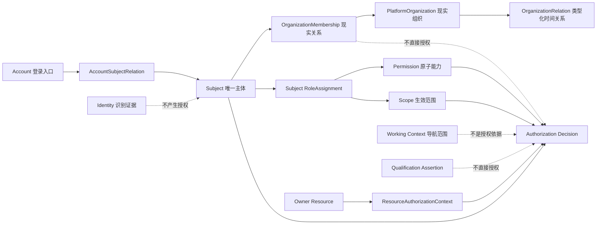

# 学生竞赛生态平台 V2 项目语义总览与对照指南

- 生成日期：2026-08-31（Asia/Shanghai）
- 审查对象：`/Users/wwang/Documents/ClaudeCode/deshi_competition_v2`
- 当前分支：`deshi_mac`
- 当前 HEAD：`93204ac05736c2643a1ae8e4293c2b95119a0084`
- 工作性质：只读语义梳理；未修改现行 Repository
- 主对照表：`V2-PROJECT-SEMANTIC-CROSSWALK.csv`（148 个概念）
- 证据索引：`V2-PROJECT-SEMANTIC-EVIDENCE-INDEX.csv`（26 类事实源）

## 1. 结论先行

本项目已经形成一套较完整的语义架构，核心不是“统一命名”，而是以下约束链：

> 一个业务概念只能由明确的 Fact Owner 定义；写操作通过 Owner Command 改变事实；读操作通过 Owner Query 或只读 Projection 组合；Controller、表名、前端页面和历史字段都不能反向创造新领域语义。

### 事实

当前可机械闭环的规模为：

| 项目 | 当前证据 |
|---|---:|
| Schema | `V2.40.700` |
| Forward-only Migration | 72 |
| 数据库表 | 429 |
| 数据库列 | 4,508 |
| Backend Maven 子模块 | 38 |
| Production Java 文件 | 619 |
| Controller | 52 |
| Controller operation | 627 |
| OpenAPI operationId | 202 |
| Capability | 48 |
| Canonical Fact | 56 |
| 主要 Application Command | 51 |
| 主要 Application Query | 46 |
| 已文档化状态 | 67 |
| Frontend typed API client 文件 | 31 |

`REPOSITORY-FACT-METRICS.json` 生成于 `ca02b564...`；从该版本到当前 HEAD 的差异只有后端说明文档和机械事实生成器，没有生产代码、Schema 或 Migration 变化，因此上述代码与数据库规模仍适用于当前 HEAD。

### 推理

1. 项目语义已经从早期“Identity + 单维 Context”演进为 **Subject-centered Root Model**。
2. 代码中仍保留历史兼容对象和表，因此人类程序员不能仅按字段名理解当前模型，必须先判断 `CURRENT / COMPATIBILITY / LEGACY / DERIVED`。
3. 数据库工程字典能够穷举物理结构，但不能单独解释业务含义；业务解释必须由 Fact Ownership、Capability、Command/Query 和代码共同闭合。
4. 前端的人类化术语不是数据库重命名。Level A/B/C 只是展示层映射，不能参与授权或事实所有权。

### 风险

1. `.ai/PROJECT_STATE.md` 更新时间仍为 2026-08-28，正文中的 `V2.38.400 / 58 migrations / 310 tables / 3326 columns` 已落后于当前 `V2.40.700 / 72 / 429 / 4508`。理解当前数据库必须使用 Schema Dictionary，而不是旧状态数字。
2. 627 个实际 Controller operation 中，只有 202 个匹配逐项 OpenAPI `operationId`；其余 425 个有 Controller 事实和稳定文档 ID，但属于 `CONTRACT_GAP`。不能宣称 OpenAPI 已完整覆盖全部接口。
3. `AuthorizationContext` 与 `ResourceAuthorizationContext` 同时存在；前者保留旧单维语义，后者才表达当前多维资源授权上下文。
4. `business_identity`、`organization`、`organization_membership`、`role_assignment` 等旧表仍存在迁移/兼容价值；它们不能覆盖 `Subject`、`platform_organization`、`platform_organization_membership`、`subject_role_assignment` 的当前语义。
5. `TechnicalReadinessController` 的早期阶段文案已经落后于当前模块规模；它是已知代码语义债，不能作为系统整体就绪状态的权威来源。

## 2. 程序员应怎样使用这套语义资料

遇到一个业务词时，按下面顺序追踪：

1. 在 `V2-PROJECT-SEMANTIC-CROSSWALK.csv` 查它是否为当前词、兼容词、派生词或禁止概念。
2. 在 `03-BACKEND-CAPABILITY-CATALOG.csv` 查所属 Capability 和 Human Purpose。
3. 在 `04-FACT-OWNERSHIP-MATRIX.csv` 查 canonical owner、主键语义、Tenant scope 和承载表。
4. 写操作查 `05-APPLICATION-COMMAND-CATALOG.csv`；读取查 `06-APPLICATION-QUERY-CATALOG.csv`。
5. 用 `07-API-OPERATION-CAPABILITY-MAP.csv` 找真实 method、path、Controller、授权和消费者。
6. 用 `13-CAPABILITY-PERSISTENCE-MAP.csv` 及 Schema Dictionary 落到表、列、约束和 Migration。
7. 前端显示查 `@deshi/experience`，不要在各页面重新发明同义词。

推荐的代码阅读方向是：

```text
页面/任务
  → frontend/packages/api-client
  → Controller（协议入口）
  → ApplicationService（用例/事务/授权编排）
  → Domain Policy / State Machine（业务规则）
  → Port / Repository（稳定边界）
  → Adapter / Mapper / Migration（物理实现）
```

## 3. Root Model 语义骨架



### 3.1 九组最重要的“不等于”

| 左侧概念 | 不等于 | 原因 |
|---|---|---|
| Account | Subject | Account 是入口；Subject 才是人和授权主体 |
| Identity | Subject / RoleAssignment | Identity 只负责识别与认证证据 |
| Tenant | Organization | Organization 是平台实体，不是 Tenant 子对象 |
| Membership | Authorization | 现实归属不自动授予可执行操作 |
| Qualification | Membership / Role | 资格断言既不是组织成员，也不是职责授权 |
| Working Context | Authorization | 切换工作范围只改变导航与投影 |
| Scope | Fact Ownership | 授权范围不决定谁拥有业务事实 |
| OrganizationRelation | Permission Tree | 行政关系图不自动传播权限 |
| Effective Membership | 新 Membership 记录 | 它是沿主行政关系即时计算的只读投影 |

### 3.2 兼容期词汇

| 兼容词/结构 | 当前解释 | 新代码边界 |
|---|---|---|
| `BusinessIdentity` / `business_identity` | 历史业务身份和 actor/affiliation 证据 | 不得成为新 principal 或 Role holder |
| `AuthorizationContext` | PLATFORM/TENANT/ORGANIZATION/ACTIVITY 单维值对象 | 新的复合资源授权使用 `ResourceAuthorizationContext` |
| `organization` | Legacy Organization | 新/current runtime canonical 为 `platform_organization` |
| `organization_membership` | Legacy Membership | 新/current 使用 `platform_organization_membership` |
| `role_assignment` | Identity-centric 历史授权 | 当前 holder 使用 `subject_role_assignment` |
| `identity_id` / `actor_identity_id` | 兼容或冻结历史证据 | 新业务 owner/reviewer/principal 优先使用 Subject |
| `v2-core-002a.ts` | 早期核心 API 兼容 client | 不得用其旧词汇重定义 Root Model |

## 4. 赛事主链语义

### 4.1 Competition、Edition、Activity、Definition Version

| 概念 | 回答的问题 | 不能替代 |
|---|---|---|
| Competition | 这是哪一个长期赛事？ | Edition、Activity |
| Competition Edition | 这是哪一届赛事？ | Competition Root、Activity |
| Competition Definition Version | 本届使用哪一版正式规则？ | 可变表单、当前草稿 |
| Activity | 具体业务在什么运行上下文执行？ | Competition Root |
| Activity Composition | 活动在结构上怎样组成？ | Flow |
| Activity Flow / Flow Node | 业务过程按什么节点推进？ | Composition、Runtime Session |
| Runtime Session | 现实中哪一次场次正在执行？ | Flow Node |

严禁把 `ParticipantCategory` 当作 Track、把名称当作 Stage、把 Flow Node 当作现场场次。SCB-004 已明确：Track、Stage/Advancement 在证据不足时保持 `DEFERRED_BY_EVIDENCE`。

### 4.2 报名到参赛

```text
Registration Case
  → Registration Revision（可补正的新版本）
  → SUBMITTED（已提交，不等于参赛）
  → Organization Approval（单位审核，不等于最终确认）
  → FINALIZED（报名最终确认）
  → Establish Participation
  → Participation（正式参赛事实）
  → Entitlement Revision（退出、取消资格、替换成员的版本链）
```

关键边界：

- `Registration != Participation`；
- `Approval != FINALIZED`；
- `FINALIZED` 才表达报名结果已确认，但正式参赛事实仍由 Participation Owner 建立；
- 团队 `Group` 不是 Organization；
- Participation Amendment/Disqualification 的完整跨域规则目前仍受架构决定约束，不能由下游自行推断。

### 4.3 材料、提交、评审、获奖

| 事实链 | 正确语义 |
|---|---|
| Artifact → Artifact Version | 逻辑材料与不可变内容版本分离 |
| Submission Requirement → Submission Revision | 要求与一次正式提交分离 |
| Submission Revision → Artifact Version | 正式提交冻结精确材料版本 |
| Evaluation Plan → Target → Task → Record → Result | 计划、对象、任务、记录、结果各自独立 |
| Evaluation Result → evidence for Award Decision | 评审结果只是获奖决定证据 |
| Award Decision → source evidence for Credential | 获奖与凭证仍属于不同 Owner |

## 5. 现场、到场与资源语义

| 概念 | 当前事实 | 历史/派生 |
|---|---|---|
| Runtime Focus | 现场执行当前焦点 | Runtime Event 是历史，不能反推 Focus |
| Attendance Record | Subject 当前到场事实 | Attendance Event 是操作历史 |
| Group attendance | 从 Subject Record 聚合 | 不创建 Group Attendance 表 |
| Execution Challenge | 短时轮换的签到执行证明 | 不是到场事实 |
| Availability Slot | 可预约时段 | 不代表 Reservation 已成立 |
| Reservation | 受容量与资格约束的预约事实 | 不等于 Runtime Assignment |

## 6. Credential、Learning、Exam、Mall 与 Finance

### 6.1 Credential 的语义层次

```text
Source Fact（Award / Learning Completion / Exam Result / Qualification Assertion）
  → Credential Definition Version
  → Issuer Authority Version / Delegation
  → Program Version / Issuance Policy
  → optional Issuance Entitlement
  → Credential Issue + immutable Lineage
  → Token / Wallet Projection
  → Trust / Recognition / Conversion（各自独立）
```

必须持续区分：

- `Verified != Trusted != Recognized != Converted`；
- Organization 不天然等于 Issuer Authority；
- Credential Program 不等于 Credential Definition；
- Credential 只证明持有人和来源，不授予 Role、Permission 或 Participation；
- Recognition 是某 consumer 在明确上下文中的决定，不能全局传播；
- Open Badges / CLR 当前为 `DEFERRED`，不能按已实现理解。

### 6.2 商城与资金

| 概念 | Owner | 不等于 |
|---|---|---|
| Mall Product / Offer | Mall | Learning/Credential/Exam 源事实 |
| Mall Order | Mall | Payment Order |
| Payment Order / Transaction | Commerce Finance | Fulfillment |
| Mall Fulfillment | Mall | Payment success |
| Credential Conversion Application | Credential | Credential Issue |
| Payable | Commerce Finance | 金额预览 |
| Refund Case | Commerce Finance | Invoice 红冲 |

关键公式：

```text
Payment success != Fulfillment success != Credential Issue
```

Provider 超时、5xx、无法解析或响应不完整进入 `UNKNOWN`。`UNKNOWN` 不是失败，也不是成功；资金类页面必须阻止用户盲目重复支付，并通过查询或可信回调收敛。

## 7. 沟通、反馈、问卷、CMS 与工作台

| 概念 | 语义 | 不等于 |
|---|---|---|
| Conversation / Message | 咨询与会话消息 | Feedback Case |
| Delivery | 消息送达 | 已读、已处理 |
| Feedback Case | 反馈、投诉、建议案件 | Conversation、报名/支付结果 |
| Survey Form Version | 已发布问卷结构版本 | Subject Profile schema |
| Survey Response | 一次答卷事实 | 人员主数据 |
| CMS Working Draft | 可编辑内容草稿 | Published Version |
| CMS Published Version | 对外发布的不可变内容版本 | 当前草稿 |
| Operational Composition Revision | 页面面板编排 | Competition/Activity Business Definition |
| Workspace Projection | 多 Owner 的只读任务聚合 | 新 canonical fact、授权事实 |

工作台按钮来自服务端投影，但按钮可见不等于操作已获授权；目标 API 必须重新校验 Subject、Permission、Scope、Resource Context 和 Owner 业务条件。

## 8. 数据库命名怎样表达语义

### 8.1 表名常见模式

| 模式 | 当前含义 | 使用注意 |
|---|---|---|
| `*_version` | 不可变或版本化定义/策略 | 34 张；发布后通常不能原地修改 |
| `*_revision` | 业务对象一次可追溯修订 | 15 张；通常由补正或重新提交产生 |
| `*_event` | 追加历史或跨域事件 | 22 张；不能反推当前状态 |
| `*_audit*` | 审计意图、条目或归档 | 10 张；不是业务状态 |
| `*_snapshot` | 当时输入、受众、Roster 等冻结快照 | 4 张；不可反向成为主数据 |
| `*_projection` | 只读派生结果 | 1 张显式命名；代码中还有非持久化 Projection |
| `*_command_claim` / `*_dedup` | Command 幂等认领 | 不能替代业务 Unique Constraint |
| `*_outbox_event` | 可靠事件发布 | 发布成功不等于 consumer 已完成 |
| `*_attempt` | 外部/任务尝试记录 | Attempt 不等于最终业务结果 |
| `*_case` | 有生命周期的案件/申请 | Case 通常包含多个 revision/decision/event |
| `*_decision` | 受策略和证据约束的决定 | Decision 与 Policy、Result 都要分开 |

### 8.2 列名常见模式

| 字段模式 | 正确理解 |
|---|---|
| `*_id` | 只表示引用；必须结合 FK、Owner 和代码确认对象身份 |
| `tenant_id` | Tenant-owned事实的隔离键，不表示对象从属于Tenant树 |
| `subject_id` | 当前主体引用，通常是授权、owner、reviewer、actor 的首选 |
| `identity_id` | 多数属于历史兼容、识别或冻结actor证据；不能默认是principal |
| `version` | 乐观锁或对象版本；更新必须校验影响行数 |
| `version_id` | 精确引用一个不可变版本，而不是“当前版本” |
| `revision_no` / `revision_id` | 修订序列和精确修订引用 |
| `state` / `status` | 必须由所属 Owner 状态机解释，不能建立全局字符串翻译器 |
| `effective_from/to` | 时间化关系或断言的有效区间 |
| `created_by_subject_id` / `actor_subject_id` | 操作者/创建者证据，不必等于事实holder或owner |
| `checksum` / `fingerprint` | 内容或请求同一性证据，不是业务ID |

数据库外键只证明物理引用，不自动证明领域聚合、权限继承或生命周期所有权。

## 9. 代码层命名语义

| 代码词 | 应承担的职责 | 不应承担 |
|---|---|---|
| `*Controller` | HTTP参数、认证主体、DTO与Application调用 | 业务状态机、直连Mapper |
| `*ApplicationService` | 用例、事务、授权、幂等、跨域Port编排 | 创建新领域Owner |
| `*Policy` / `*StateMachines` | 纯业务规则和允许迁移 | 基础设施访问 |
| `*Capability` / `*Port` | 模块公开的typed契约 | 暴露内部Service或Mapper |
| `*Adapter` | Port的跨域/外部实现 | 复制Owner事实 |
| `*Repository` | Domain/Application持久化抽象 | 跨域表访问 |
| `*Mapper` | MyBatis/SQL物理映射 | 公共领域API |
| `*Projection` / `*View` | 只读组合或展示模型 | canonical write model |
| `*Decision` | 一次可解释决定 | Policy定义本身 |
| `*Event` | 不可变历史/通知 | 当前事实 |
| `*Snapshot` | 当时输入冻结 | 当前主数据 |
| `*Provider` | 外部能力或内部typed evidence来源 | 生产就绪结论 |

当前生产代码分层文件分布约为：`api 151 / application 156 / domain 81 / infrastructure 167`。数量只证明工程结构，不证明每个类都满足语义；实际 Review 仍要检查依赖方向和注释中的“为什么”是否与实现一致。

## 10. API 路径、动词与错误语义

### 10.1 路径

| 形式 | 语义 |
|---|---|
| `/api/v1/public/**` | 公开读取或受控Provider回调；回调仍需签名/实例校验 |
| `/api/v1/**/me` | 当前 Session Subject 的本人投影，不接受客户端替代subjectId |
| `/api/v1/admin/**` | 治理/运营入口，仍需精确Permission与Scope |
| `POST /resource/{id}:publish` | 明确状态Command，不是任意字段CRUD |
| `GET .../history` | 历史版本/事件，不应返回经当前关系重解释后的结果 |

### 10.2 动词

| 动词 | 语义差异 |
|---|---|
| `create` | 创建新事实，通常从不存在进入初始状态 |
| `ensure` | 幂等保证事实存在，不表示每次都新建 |
| `submit` | 提交等待处理，不等于批准或最终完成 |
| `validate` | 校验规则通过，不等于发布 |
| `publish` | 版本正式生效，通常不可原地修改 |
| `activate` | 使配置/组织/Provider等进入可用状态 |
| `finalize` | 形成Owner定义的正式结果 |
| `approve` / `decide` | 某审批/决定事实，不自动替代下游终态 |
| `verify` | 验证证据真实性，不等于信任、认可或授权 |
| `recognize` | 某consumer在明确上下文认可 |
| `withdraw` | 主体主动撤回并保留历史 |
| `revoke` | 授权方正式撤销权利/链接/断言 |
| `suspend` | 暂停使用但事实仍存在 |
| `supersede` | 新版本替代旧版本，旧版本保留 |
| `replace` | 创建替代关系或新revision，不覆盖历史 |
| `refresh` | 查询/收敛外部结果，不能盲目重做收费动作 |
| `preview` / `analyze` | 只读或候选影响，不是正式写入 |

### 10.3 幂等、并发、错误

- `Idempotency-Key` 防止同一业务意图重复执行；它不能替代数据库唯一约束。
- `version` / `expectedVersion` 解决并发修改；它不能替代幂等。
- Event/Audit 解决历史可追溯；它们不能替代当前事实表。
- RFC7807 的稳定 `code` 由共享体验层映射成人类提示；未知枚举必须 `fail-visible`，不能默认为成功。
- `UNKNOWN`、`INDETERMINATE`、`RETRY_WAIT` 都要显示“确认中/等待处理”，不能用成功色。

## 11. 状态语义速查

| 状态 | 人类含义 | 不能误解为 |
|---|---|---|
| `DRAFT` | 可继续编辑、尚未正式生效 | PUBLISHED |
| `VALIDATED` | 已通过规则校验 | 已发布 |
| `PUBLISHED` | 正式生效的不可变版本 | 当前草稿 |
| `SUPERSEDED` | 已被新版本替代但历史保留 | DELETED |
| `SUBMITTED` | 已提交等待处理 | FINALIZED |
| `REVISION_REQUESTED` | 需要创建补正Revision | 原记录直接修改 |
| `FINALIZED` | Owner定义的流程正式确认 | 所有下游事实都已完成 |
| `WITHDRAWN` | 主体主动退出，历史保留 | 删除 |
| `REVOKED` | 权利或断言被正式撤销 | 暂停 |
| `SUSPENDED` | 暂时不可使用 | 永久撤销 |
| `UNKNOWN` | 证据不足、结果确认中 | FAILED / SUCCEEDED |
| `FAILED` | Owner已确认失败 | UNKNOWN |
| `COMPLETED` | 当前Owner流程完成 | 其他Owner也完成 |
| `FULFILLED` | Mall履约完成 | Payment succeeded |
| `DEAD` / DLQ | 异步任务停止自动重试 | 业务事实失败 |

完整67条状态见现行 `09-DOMAIN-STATE-SEMANTICS.csv`。

## 12. 人类展示语义

共享 `frontend/packages/experience/src/human-presentation.ts` 定义三个层级：

| Level | 读者 | 示例 |
|---|---|---|
| A | 普通用户 | Subject → 个人档案；Participation → 参赛资格；Artifact → 材料 |
| B | 业务运营人员 | Subject → 人员主体；Participation → 正式参赛关系 |
| C | 技术/治理人员 | 保留 Subject、Participation、Artifact 等精确术语 |

关键规则：

1. 普通用户页面禁止要求输入内部ID。
2. 人类化只是 presentation mapping，不修改 Domain、API 或数据库词汇。
3. Persona 只改变语言、优先级和布局，不参与授权。
4. 未知状态显示“暂不支持的状态”，保留 `owner:rawCode` 技术回退，不能使用万能字符串翻译器。
5. `formalResultImpact` 必须说明当前动作是否真的改变报名、评审、支付等正式结果。

## 13. 发现的语义债与冲突

| ID | 事实 | 影响 | 本报告处理 |
|---|---|---|---|
| SEM-01 | `PROJECT_STATE` Schema数字落后 | 人工可能误判当前表/迁移规模 | 当前数字以Schema Dictionary为准，历史正文不改写 |
| SEM-02 | 425/627 Controller operation没有正式OpenAPI operationId | 代码生成、发现和漂移治理不完整 | 全部可在API Map查询，但标记 `CONTRACT_GAP` |
| SEM-03 | 旧Identity/Organization/Role表与新Root Model并存 | 可能把兼容表误当current canonical fact | 对照表标记 `LEGACY_COMPAT` / `COMPATIBILITY` |
| SEM-04 | `AuthorizationContext` 与 `ResourceAuthorizationContext` 并存 | 新代码可能继续沿用旧单维授权模型 | 明确前者兼容、后者当前 |
| SEM-05 | `TechnicalReadinessController` 仍返回早期Phase 0语义 | 运维接口可能误导系统现状 | 登记为已知代码债，不将其作为权威状态源 |
| SEM-06 | Natural Identity只发现Fake Provider | 不能宣称真实实名认证可用 | 语义表只写识别边界，不升级Provider成熟度 |
| SEM-07 | CMB/NuoNuo/Webhook本地合同与生产证据分离 | Mock/Wire PASS可能被误读为生产可用 | 保留External Evidence Gate与UNKNOWN语义 |
| SEM-08 | 48个Capability中英文名仍需Human统一少量展示词 | 跨团队可能出现近义词漂移 | 稳定capability_id和Owner不变，展示名待Human Review |
| SEM-09 | Command/Query目录是51/46个主要用例，不是627 endpoint DTO复制 | 新人仍需回到API Map/源码 | 证据索引明确查阅顺序 |

## 14. 覆盖边界

本次“全面”采用闭环而不是逐行手工复述：

- **完整机械覆盖**：72 Migration、429表、4508列、38模块、52 Controller、627 operation。
- **受审语义目录覆盖**：48 Capability、56 Fact、51 Command、46 Query、67 State。
- **人工整合对照**：148个跨Root Model、领域、数据库、代码、API、状态和人类文案的核心概念。
- **明确排除为当前事实源**：`zipdoc/`、`transzipdoc/`、历史evidence patch、V1代码、旧原型、`build/`、`node_modules/`、`test-results/`。
- **未声称**：对每个DTO字段逐条赋予业务定义；真实Provider/生产环境语义就绪；所有OpenAPI完整；Human Acceptance或Production Release。

若某个具体字段在对照表中没有业务定义，应按以下顺序判断：当前 Migration → Schema Dictionary → Fact Owner → Application/Domain代码 → Controller/DTO → 前端映射；仍无法闭合时标记 `待Human确认`，不能从字段名猜测。

## 15. 交付文件

1. `V2-PROJECT-SEMANTIC-GUIDE.md`：给人阅读的总体指南。
2. `V2-PROJECT-SEMANTIC-CROSSWALK.csv`：148行语义对照，可筛选 `layer`、`status`、`canonical_owner`。
3. `V2-PROJECT-SEMANTIC-EVIDENCE-INDEX.csv`：当前完整事实目录及其用途、数量和限制。

这三份文件是理解现有代码的导航层，不替代现行 Repository 中的 Owner文档、源代码、Migration和Schema Dictionary，也不授权修改Root Model、API、数据库或生产状态。
