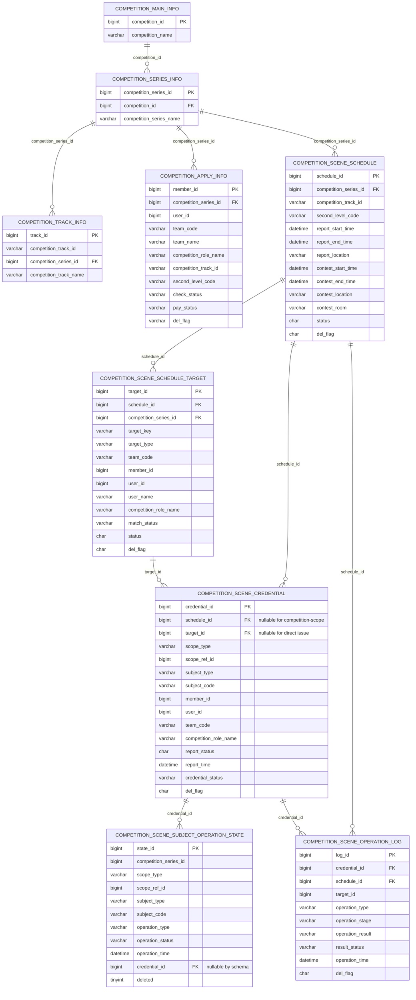
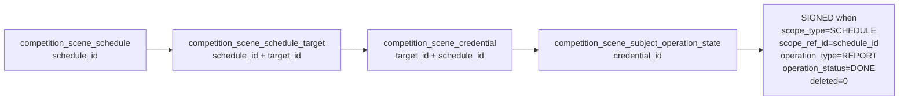

# 签到概览数据关系说明

## 1. 实体关系图

## 2. 签到统计采用的关联路径

首选路径：

辅助审计路径：

## 3. 主键与业务键

- 赛场卡片主键：`competition_scene_schedule.schedule_id`
- 应签到人员主键：优先 `schedule_id + target_id`
- 兼容键：`schedule_id + credential_id`
- 兜底业务键：`schedule_id + member_id` 或 `schedule_id + user_id`
- 禁止键：姓名、手机号、团队名。

## 4. 可能为空的关键字段

- `competition_scene_schedule.competition_track_id`、`second_level_code` 可为空。
- `competition_scene_credential.schedule_id` 对大赛级证件可为空。
- `competition_scene_credential.target_id` 对大赛级直发证件可为空。
- `competition_scene_subject_operation_state.credential_id` 表结构允许为空，但当前代码确认操作会写入。
- `competition_scene_schedule_target.target_type` 真实库大量为空。
- `competition_scene_schedule_target.member_id/user_id` 对团队、工作人员、手工对象可能为空，但真实库当前有效目标未发现三者都空且无团队编码的记录。

## 5. 可能产生重复统计的位置

- 同一 `target_key` 出现在多个 `schedule_id`：真实库已存在，这是多赛场参与的正常情况，必须带 `schedule_id` 统计。
- `competition_scene_operation_log` 同一操作有 `SCAN` 和 `CONFIRM` 两条流水，不能按流水条数计人数。
- `operation_result = DUPLICATE` 或 `operation_status = CANCELLED` 不能计为已签到。
- 大赛级 `scope_type = COMPETITION` 的 `REPORT` 是大赛范围状态，不能复用到各赛场。
- 同一团队如果按 `TEAM` 维度绑定，一条目标可能代表团队主体；首期人员统计应优先使用 PERSON 维度目标，或在团队维度下明确拆成员规则。
- 首期仅统计有效、已匹配的队员目标；`选手/PLAYER` 按队员处理，队长、教师和工作人员角色排除。

## 6. 真实库验证摘要

- `competition_scene_schedule`：64 行。
- `competition_scene_schedule_target`：2036 行。
- `competition_scene_credential`：3159 行。
- `competition_scene_subject_operation_state`：6 行。
- `competition_scene_operation_log`：40 行。
- 当前状态表同时存在 `COMPETITION/REPORT`、`SCHEDULE/REPORT`、`CANCELLED`，证明统计必须限定 scope 和状态。
- 当前赛场目标角色值包括 `队员`、`选手`、`MEMBER`、`CHECKIN_STAFF`、`MATERIAL_STAFF`、`VOLUNTEER`，未发现 `队长/CAPTAIN`。
- 已确认 `队员/MEMBER/选手/PLAYER` 计入首期应签到人数；当前无队长记录，首期去除队长相关统计。
