# Canvas LMS 核心 ER 图

说明：该 ER 图基于 Model、association 和 migration 证据反推，用于理解核心业务对象关系；字段只展示关键外键/状态，不是完整 schema。

```mermaid
erDiagram
  ACCOUNT ||--o{ ACCOUNT : "parent/sub account"
  ACCOUNT ||--o{ COURSE : "owns"
  ACCOUNT ||--o{ USER_ACCOUNT_ASSOCIATION : "links"
  ACCOUNT ||--o{ PSEUDONYM : "login namespace"
  ACCOUNT ||--o{ CONTEXT_EXTERNAL_TOOL : "configures"
  ACCOUNT ||--o{ SIS_BATCH : "imports"

  USER ||--o{ PSEUDONYM : "has login"
  USER ||--o{ COMMUNICATION_CHANNEL : "has channel"
  USER ||--o{ ENROLLMENT : "enrolls"
  USER ||--o{ CONVERSATION_PARTICIPANT : "participates"
  USER ||--o{ SUBMISSION : "submits"

  COURSE ||--o{ COURSE_SECTION : "contains"
  COURSE ||--o{ ENROLLMENT : "has"
  COURSE ||--o{ ASSIGNMENT : "has"
  COURSE ||--o{ QUIZ : "has"
  COURSE ||--o{ DISCUSSION_TOPIC : "has"
  COURSE ||--o{ WIKI_PAGE : "has"
  COURSE ||--o{ CONTEXT_MODULE : "organizes"
  COURSE ||--o{ ATTACHMENT : "context files"
  COURSE ||--o{ CALENDAR_EVENT : "schedules"

  COURSE_SECTION ||--o{ ENROLLMENT : "groups"
  ENROLLMENT }o--|| COURSE : "course role"
  ENROLLMENT }o--|| USER : "user role"

  ASSIGNMENT ||--o{ ASSIGNMENT_OVERRIDE : "differentiates"
  ASSIGNMENT ||--o{ SUBMISSION : "receives"
  ASSIGNMENT ||--o{ RUBRIC_ASSOCIATION : "assessed by"
  ASSIGNMENT }o--|| CONTEXT_EXTERNAL_TOOL : "may launch"

  SUBMISSION ||--o{ SUBMISSION_COMMENT : "feedback"
  SUBMISSION ||--o{ ATTACHMENT : "uploaded files"
  SUBMISSION ||--o{ ORIGINALITY_REPORT : "plagiarism result"

  RUBRIC ||--o{ RUBRIC_ASSOCIATION : "attached"
  RUBRIC ||--o{ RUBRIC_ASSESSMENT : "scores"
  LEARNING_OUTCOME ||--o{ RUBRIC_CRITERION : "measured by"
  LEARNING_OUTCOME ||--o{ OUTCOME_RESULT : "produces"

  QUIZ ||--o{ QUIZ_QUESTION : "contains"
  QUIZ ||--o{ QUIZ_SUBMISSION : "attempted by"
  ASSESSMENT_QUESTION_BANK ||--o{ ASSESSMENT_QUESTION : "stores"

  CONTEXT_MODULE ||--o{ CONTEXT_MODULE_ITEM : "contains"
  CONTEXT_MODULE ||--o{ CONTEXT_MODULE_PROGRESSION : "tracks"

  FOLDER ||--o{ ATTACHMENT : "contains"
  WIKI_PAGE ||--o{ ATTACHMENT : "embeds"
  DISCUSSION_TOPIC ||--o{ DISCUSSION_ENTRY : "has replies"

  CONTEXT_EXTERNAL_TOOL ||--o{ LTI_RESOURCE_LINK : "creates"
  CONTEXT_EXTERNAL_TOOL ||--o{ LTI_LINE_ITEM : "grades"
  LTI_RESOURCE_LINK ||--o{ LTI_ASSET : "processes"

  SIS_BATCH ||--o{ SIS_BATCH_ERROR : "records"
  SIS_BATCH ||--o{ SIS_BATCH_ROLLBACK_DATA : "rollback"

  CONVERSATION ||--o{ CONVERSATION_MESSAGE : "contains"
  CONVERSATION ||--o{ CONVERSATION_PARTICIPANT : "members"
```

## 核心表/模型确认

| 对象 | 证据 | 说明 |
| --- | --- | --- |
| Account | `app/models/account.rb` / `accounts` | 租户根与子账户。 |
| User / Pseudonym | `app/models/user.rb` / `pseudonyms` | 用户与登录身份。 |
| Course / Section / Enrollment | `app/models/course.rb` / `course_sections` / `enrollments` | 教学上下文和角色。 |
| Assignment / Submission | `app/models/assignment.rb` / `app/models/submission.rb` | 作业与提交主链路。 |
| Attachment / Folder | `app/models/attachment.rb` / `app/models/folder.rb` | 文件管理。 |
| Quiz / QuizSubmission | `app/models/quizzes/*` | 测验与作答。 |
| ContextExternalTool / LTI | `app/models/context_external_tool.rb` / `app/models/lti/*` | 外部工具集成。 |
| SisBatch | `app/models/sis_batch.rb` | SIS 导入批次。 |
