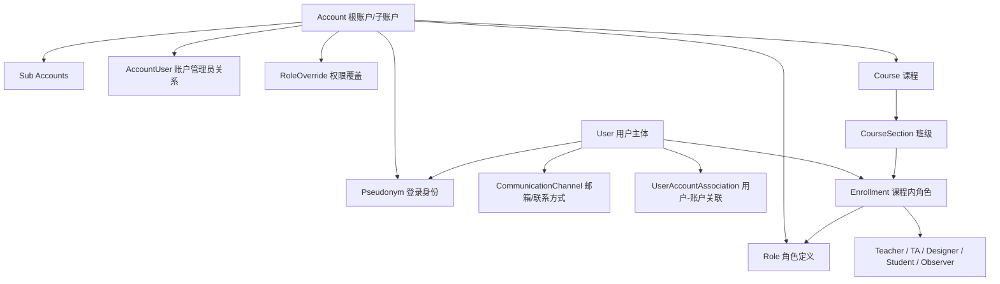
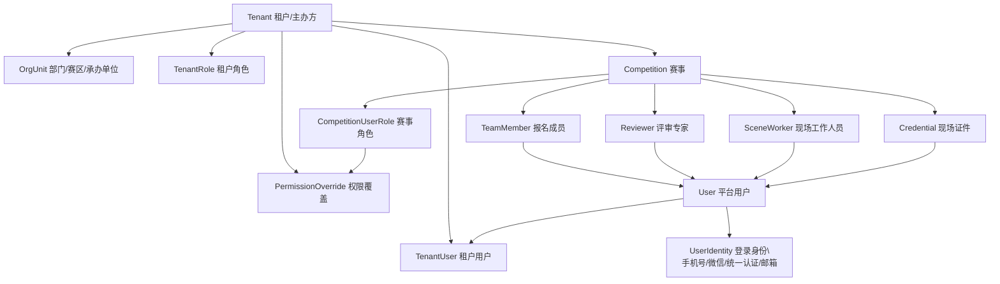

# Canvas LMS 多租户与用户管理专项参考

## 结论摘要

Canvas 的多租户和用户管理设计值得重点借鉴，但不建议照搬。它的核心价值在于：**把“用户是谁”“在哪个租户下登录”“在账户层有什么管理权限”“在课程层扮演什么角色”拆成不同模型**，避免一个用户表承载所有业务身份。

对当前赛事平台更有参考价值的是这几件事：

- 用 `tenant/root_account` 明确平台级租户边界。
- 把登录身份、用户主体、业务角色拆开。
- 把账户级管理员权限和业务域内角色分离。
- 用关联表维护“用户属于哪些租户/业务域”，避免到处冗余 `user_id` 语义。
- 所有权限判断都带上下文：账户、课程、班级、作业，而不是只看全局角色。

## 关键代码证据

| 设计点 | Canvas 代码证据 | 说明 |
| --- | --- | --- |
| 账户树 / 租户边界 | `canvas-lms-master/app/models/account.rb:21` | `Account` 是核心租户模型。 |
| 根账户与父账户 | `canvas-lms-master/app/models/account.rb:33` | `Account` 同时关联 `root_account` 和 `parent_account`。 |
| 子账户 | `canvas-lms-master/app/models/account.rb:71` | `sub_accounts` 表达机构层级。 |
| 根账户查询 | `canvas-lms-master/app/models/account.rb:2606` | `root_accounts` / `non_root_accounts` 明确区分根租户与子账户。 |
| 用户主体 | `canvas-lms-master/app/models/user.rb:21` | `User` 是自然人/平台用户主体。 |
| 登录身份 | `canvas-lms-master/app/models/pseudonym.rb:21` | `Pseudonym` 是登录标识，独立于 `User`。 |
| 登录身份必须属于根账户 | `canvas-lms-master/app/models/pseudonym.rb:58` | `Pseudonym` 校验 `must_be_root_account`。 |
| 账户管理员 | `canvas-lms-master/app/models/account_user.rb:21` | `AccountUser` 连接 `account`、`user`、`role`。 |
| 用户账户关联 | `canvas-lms-master/app/models/user_account_association.rb:21` | `UserAccountAssociation` 维护用户与账户树的关系。 |
| 课程内角色 | `canvas-lms-master/app/models/enrollment.rb:21` | `Enrollment` 是用户在课程里的角色事实。 |
| 选课角色类型 | `canvas-lms-master/app/models/enrollment.rb:23` | Teacher、TA、Designer、Student、Observer 分开建模。 |
| 权限覆盖 | `canvas-lms-master/app/controllers/role_overrides_controller.rb:173` | `RoleOverridesController` 管理账户/课程角色权限。 |

## 多租户部分的代码特点

### 1. 租户不是简单字段，而是账户树

Canvas 没有只用一个 `tenant_id` 解决多租户，而是用 `Account` 表达账户层级：

- 根账户：机构级租户边界。
- 子账户：机构内部学院、部门、业务单位。
- 站点管理员账户：特殊的全局管理域。
- 课程、用户登录、角色、SIS、LTI、报表等都挂靠到账户上下文。

这种设计适合教育平台，因为一个机构内往往有多级管理结构。

可借鉴点：

- 当前赛事平台如果未来服务多个机构、多个赛事主办方，不应只在业务表上散落 `org_id`。
- 可以建立明确的 `tenant` / `organization` / `business_unit` 层级。
- 所有赛事、报名、证件、资源、评审、文件、订单都应能追溯到租户根。

不建议照搬点：

- Canvas 的账户树非常复杂，当前系统数据量和组织复杂度没有必要一开始做到它的深度。
- 可以先采用两层：`tenant` + `department/account_scope`，后续再扩展。

### 2. 根账户是事实边界，子账户是管理范围

Canvas 大量模型有 `root_account_id`，用于把数据绑定到根租户；同时通过 `parent_account_id` 表达组织层级。这样可以同时满足：

- 数据隔离看根账户。
- 权限下放看账户链。
- 查询优化可直接按 `root_account_id` 过滤。
- 子账户变更不会丢失根租户边界。

可借鉴点：

- 新结构建议把 `tenant_id` 作为核心事实边界。
- 如果有部门/赛区/组织层级，另设 `account_scope_id` 或 `org_unit_id`。
- 不要把租户边界只放在 `create_by`、`school_id` 或 `competition_id` 上。

推荐映射：

| Canvas | 当前赛事平台可对应 |
| --- | --- |
| `root_account_id` | `tenant_id` / 主办方 / 平台租户 |
| `parent_account_id` | 部门、学院、赛区、承办单位 |
| `account_users` | 租户管理员、赛事管理员授权 |
| `role_overrides` | 租户级/赛事级权限配置 |

### 3. 租户初始化包含默认对象

Canvas 在新建根账户时创建默认对象，例如默认学期、认证方式、服务条款、内置角色。证据见 `Account#create_default_objects` 与 `create_built_in_roles`。

可借鉴点：

- 新租户创建后，应自动初始化：
  - 默认角色；
  - 默认文件策略；
  - 默认状态字典；
  - 默认证件能力码；
  - 默认支付/订单配置；
  - 默认资源预约规则；
  - 默认通知模板。

这样比人工配置更稳定，也便于迁移和测试。

## 用户管理部分的代码特点

### 1. User 是人，Pseudonym 是登录身份

Canvas 把 `User` 和 `Pseudonym` 拆开：

- `User`：真实用户主体，承载姓名、偏好、头像、时区、全局用户状态。
- `Pseudonym`：登录账号，属于某个根账户，可绑定认证提供商、SIS 用户 ID、登录名、密码状态。

这解决了一个用户可能在多个机构中有多个登录身份的问题。

可借鉴点：

- 当前系统不要继续把手机号、微信 openid、身份证、平台账号、学校身份全部塞进一个用户表。
- 建议拆成：
  - `user`：平台用户主体；
  - `user_identity`：登录身份，如手机号、微信、统一认证、邮箱；
  - `tenant_user`：用户在某租户下的账号状态；
  - `business_profile`：参赛者、教师、评审专家等业务资料。

### 2. 账户管理员和课程角色分离

Canvas 用 `AccountUser` 表示账户级管理员，用 `Enrollment` 表示课程内角色。二者不是一个概念：

- `AccountUser`：管理账户、子账户、权限、课程、报表等。
- `Enrollment`：用户在课程里的学生、教师、助教、设计者、观察者等身份。

这点非常值得借鉴。

当前赛事平台可以对应为：

| Canvas 概念 | 赛事平台可对应 |
| --- | --- |
| `AccountUser` | 平台管理员、租户管理员、赛事管理员 |
| `Enrollment` | 报名成员、指导教师、评审专家、现场工作人员、资源预约主体 |
| `Role` | 统一角色定义 |
| `RoleOverride` | 赛事级/租户级权限覆盖 |

建议：

- 不要用一个 `sys_role` 解决所有业务身份。
- 管理权限和业务身份应分离。
- 例如“某人是系统管理员”和“某人是某赛事评审专家”不应是同一层角色。

### 3. 用户和账户关系有单独索引表

`UserAccountAssociation` 专门维护用户与账户的关系，并同步 `root_account_ids`。这不是业务主表，而是为了权限、查询和缓存服务。

可借鉴点：

- 当前系统可建立类似的 `tenant_user_association`。
- 当用户报名、成为教师、成为评审、被授权为管理员时，都能更新该关联表。
- 查询“某租户有哪些用户”“某用户在哪些租户有身份”不必扫描报名表、证件表、评审表。

适合当前系统的表设计方向：

```text
user
user_identity
tenant
tenant_user
tenant_user_role
tenant_user_business_profile
```

其中：

- `tenant_user` 负责租户内账号状态；
- `tenant_user_role` 负责管理角色；
- `business_profile` 负责教师、学生、专家、工作人员等业务身份。

### 4. 角色有上下文，不是全局固定

Canvas 的权限判断依赖上下文：

- 在账户下判断账户权限；
- 在课程下判断课程权限；
- 在班级/作业/提交下继续细分；
- 角色可以被账户或课程覆盖。

可借鉴点：

- 当前系统应避免“全局角色一刀切”。
- 应引入上下文权限：
  - 平台级；
  - 租户级；
  - 赛事级；
  - 赛程级；
  - 评审场次级；
  - 现场证件/资源级。

例如：

- A 是赛事 1 的管理员，不代表是赛事 2 的管理员。
- B 是评审活动 1 的专家，不代表能看所有评审材料。
- C 是某团队指导教师，只能看自己指导团队/学生证件。

## Canvas 结构图



## 可借鉴到当前系统的目标结构



## 对当前系统的具体改造建议

### 短期可做

1. **先建立概念字典**
   明确这些概念不要混用：
   - 平台用户；
   - 登录身份；
   - 租户用户；
   - 管理角色；
   - 业务身份；
   - 业务授权。

2. **新增只读用户关系视图**
   从现有报名、团队、评审、证件、文件任务中归并出：
   - 用户在哪些赛事出现；
   - 用户在赛事中的身份；
   - 用户是否是管理员/教师/专家/参赛者；
   - 用户可访问哪些数据。

3. **教师查看学生证件专项建模**
   借鉴 Canvas Observer 模型，把“教师可看哪些学生”建成明确关系，而不是从多个业务字段临时推断。

推荐关系：

```text
teacher_student_scope
- tenant_id
- competition_id
- teacher_user_id
- student_user_id
- source_type
- source_id
- active_key
```

### 中期可做

1. **引入租户用户表**

```text
tenant_user
- id
- tenant_id
- user_id
- status
- display_name_snapshot
- source
- created_at
```

2. **引入上下文角色表**

```text
context_user_role
- id
- tenant_id
- context_type
- context_id
- user_id
- role_code
- status
- active_key
```

其中 `context_type` 可以是：

- `TENANT`
- `COMPETITION`
- `SCHEDULE`
- `REVIEW_SESSION`
- `SCENE`
- `RESOURCE`

3. **把业务身份和权限授权分开**

业务身份：

- 参赛队员；
- 队长；
- 指导教师；
- 评审专家；
- 评审秘书；
- 现场工作人员。

权限授权：

- 能看；
- 能改；
- 能评分；
- 能扫码；
- 能发证；
- 能预约；
- 能导出。

不要再用一个 `role_code` 同时表达身份和权限。

## 不建议照搬 Canvas 的地方

- 不建议直接做完整账户树、多 shard、多缓存策略；当前系统规模不需要。
- 不建议一开始就做 Canvas 级别的角色覆盖复杂度。
- 不建议把所有业务功能都挂到“课程”模型，因为当前系统的核心不是课程，而是赛事。
- 不建议复制 Canvas 的大单体结构；应借鉴它的领域分层思想，而不是代码组织体量。

## 最适合当前项目借鉴的五个点

1. **用户主体和登录身份分离。**
2. **租户边界和业务上下文分离。**
3. **账户级管理角色和业务内角色分离。**
4. **用户-租户关系单独维护，服务查询和权限。**
5. **所有权限判断都带上下文，不做全局角色泛化。**

## 建议下一步

如果要继续落地，可以先做两份设计：

1. `TENANT_AND_USER_IDENTITY_MODEL_PROPOSAL.md`
   设计当前系统的新用户/租户/身份模型。

2. `CONTEXTUAL_PERMISSION_MODEL_PROPOSAL.md`
   设计赛事、赛程、评审、现场、资源等上下文权限模型。

