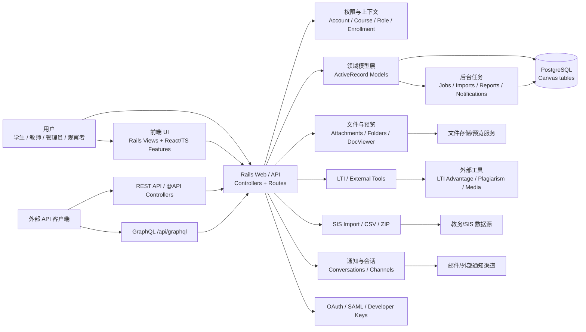
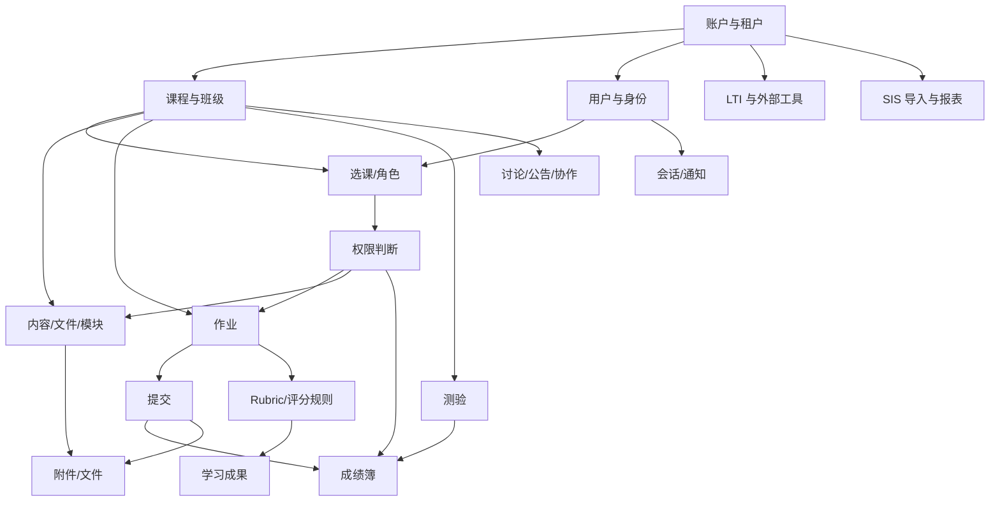

# Canvas LMS 系统结构图

## 总体结构

```mermaid
flowchart LR
  Users["用户
学生 / 教师 / 管理员 / 观察者"] --> Web["Rails Web / API
Controllers + Routes"]
  Users --> Frontend["前端 UI
Rails Views + React/TS Features"]
  Frontend --> Web
  APIClients["外部 API 客户端"] --> REST["REST API / @API Controllers"]
  APIClients --> GQL["GraphQL /api/graphql"]
  REST --> Web
  GQL --> Web

  Web --> Policy["权限与上下文
Account / Course / Role / Enrollment"]
  Web --> Domain["领域模型层
ActiveRecord Models"]
  Domain --> DB[("PostgreSQL
Canvas tables")]
  Domain --> Jobs["后台任务
Jobs / Imports / Reports / Notifications"]
  Jobs --> DB

  Web --> Files["文件与预览
Attachments / Folders / DocViewer"]
  Web --> LTI["LTI / External Tools"]
  Web --> SIS["SIS Import / CSV / ZIP"]
  Web --> Notify["通知与会话
Conversations / Channels"]
  Web --> OAuth["OAuth / SAML / Developer Keys"]

  LTI --> ExternalTools["外部工具
LTI Advantage / Plagiarism / Media"]
  SIS --> SISSource["教务/SIS 数据源"]
  Notify --> EmailSMS["邮件/外部通知渠道"]
  Files --> Storage["文件存储/预览服务"]
```

## 业务域依赖图

```mermaid
flowchart TD
  Account["账户与租户"] --> Course["课程与班级"]
  Account --> User["用户与身份"]
  Account --> LTI["LTI 与外部工具"]
  Account --> SIS["SIS 导入与报表"]
  User --> Enrollment["选课/角色"]
  Course --> Enrollment
  Course --> Content["内容/文件/模块"]
  Course --> Assignment["作业"]
  Course --> Quiz["测验"]
  Course --> Discussion["讨论/公告/协作"]
  Assignment --> Submission["提交"]
  Assignment --> Rubric["Rubric/评分规则"]
  Submission --> Gradebook["成绩簿"]
  Quiz --> Gradebook
  Rubric --> Outcomes["学习成果"]
  Submission --> Files["附件/文件"]
  Content --> Files
  User --> Conversations["会话/通知"]
  Enrollment --> Policy["权限判断"]
  Policy --> Assignment
  Policy --> Content
  Policy --> Gradebook
```
