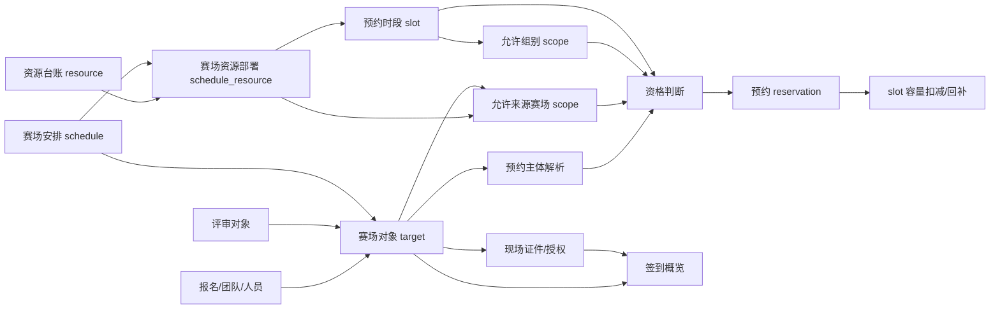
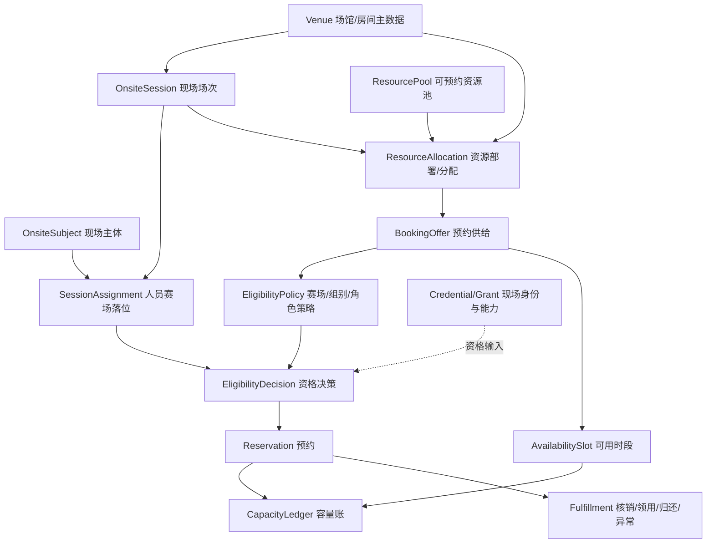

# 现场运行域开发复盘与架构评估

> 复盘范围：赛场管理、人员/团队与赛场匹配、设备资源管理、设备与赛场配置、可预约范围与时段、现场设备资源预约，以及与现场证件、签到概览、评审场次的必要衔接。  
> 复盘日期：2026-08-12  
> 评估角色：系统架构视角  
> 评估依据：当前代码、数据库迁移、阶段设计/交付/联调文档及定向测试结果。本文不以早期方案文档代替当前代码事实，也不把测试库数据等同于生产数据。

---

## 1. 执行摘要

本轮最大的成果，不是增加了若干后台页面，而是从原来的“现场证件 + 扫码签到”出发，初步形成了一个可运行的现场资源协同闭环：

```text
赛场安排
  -> 人员/团队/评审对象落位
  -> 资源台账
  -> 资源部署到赛场
  -> 配置允许预约的来源赛场与组别
  -> 生成可预约时段和容量
  -> 用户预约/查看/取消
  -> 管理端查看预约记录
```

这个闭环已经具备实际业务价值，尤其是预约侧在后期补上了事务、条件更新、数据库唯一键、幂等响应和并发冲突处理，工程质量明显高于最初版本。

但从体系化程度看，当前仍然属于“围绕交付快速长成的第一版现场运行系统”，还不是稳定、可复用的“现场运行平台”。主要判断如下：

1. **功能覆盖较完整，业务闭环尚未闭合。** 配置和预约链路已通，但资源核销、实际领用/归还、故障、运维确认、现场状态、通知和统计尚未形成履约闭环。
2. **核心抽象基本正确，但领域边界不够清晰。** `resource -> schedule_resource -> slot -> reservation` 的四层分解是本轮最重要的正确设计；与此同时，“赛场”“场次”“运行安排”“预约来源赛场”仍混在 `schedule` 一个概念中。
3. **数据快照意识已经形成，但事实源仍然分散。** target、credential、reservation 保存快照是合理的；问题在于人员身份、团队归属、组别、状态和赛场关系在多表重复出现，却没有统一的现场主体解析和一致性治理。
4. **预约并发模型已经从能用走向较可靠。** 当前采用“有效预约唯一键 + 幂等键 + 同事务插入和容量条件更新 + 冲突后新事务读取”的组合，方向正确；但容量账、状态机、历史 active key 和运维履约仍需继续治理。
5. **架构债务主要集中在可维护性和可解释性。** 赛场服务约 1,463 行、用户预约服务约 1,126 行、管理端赛场页面约 3,350 行。配置错误时用户常只看到空列表，管理员难以判断究竟被赛场范围、组别、时间、容量、状态还是主体解析过滤。

一句话结论：**本轮完成了从“零散现场功能”到“可运行现场资源闭环”的关键跨越；下一轮的重点不应继续横向堆功能，而应先统一领域语言、事实源、状态机和数据约束，再补齐履约闭环。**

---

## 2. 评估边界与证据

### 2.1 本次纳入评估的直接能力

- 赛场安排维护；
- 报到、比赛、候场、资料领取等时间地点配置；
- 报名团队/人员自动匹配；
- 评审对象、团队、人员和手工对象绑定；
- 赛场内顺序维护及同步评审场次；
- 资源台账；
- 资源部署到赛场；
- 预约开放窗口；
- 资源允许预约的来源赛场范围；
- 时段和允许组别；
- 团队/个人预约主体识别；
- 共享/非共享容量计算；
- 预约、查看、取消、后台查看记录；
- 签到概览以及现场证件对人员资格的支撑关系。

### 2.2 主要事实基线

- 核心后端位于 `teaching-competition` 模块；
- 直接相关的 9 个 Controller 共 59 个接口处理方法；
- 现场安排与资源预约的直接核心表共 8 张；
- 管理端、PC 端和小程序端均已有对应入口；
- 2026-08-12 复跑 5 个相关测试类，共 44 个测试，全部通过；
- 这些测试以 Mockito 单元测试为主，不等价于真实数据库并发集成测试；
- 历史联调报告记录了正式网关运行态的预约并发复测通过；
- 小程序历史验证以静态检查和接口对齐为主，缺少稳定的自动构建和真机回归基线；
- 本次没有连接生产库，因此所有数据量结论都明确标注为“文档记录的测试库快照”。

### 2.3 评估成熟度

| 维度 | 当前判断 | 说明 |
| --- | --- | --- |
| 功能覆盖 | 较好 | 核心配置与预约主流程已打通 |
| 领域建模 | 中等偏弱 | 四层资源模型正确，但赛场、场次、主体概念混杂 |
| 数据完整性 | 中等偏弱 | 有关键唯一键和快照，但无外键、部分范围表无业务唯一约束 |
| 并发与幂等 | 较好 | 已经历真实问题修复并完成运行态复测 |
| 状态治理 | 偏弱 | 多组状态可任意跳转，缺少统一状态机和影响分析 |
| 可维护性 | 偏弱 | 核心服务和页面过大，业务规则散落在 Service/Mapper/前端 |
| 可测试性 | 中等 | 后端单测有基础，真实数据库、前端、真机和全链路自动化不足 |
| 可运维性 | 偏弱 | 环境版本、运行实例、JWT 依赖曾影响联调；资源履约和监控缺失 |

---

## 3. 本轮实际形成的功能版图

### 3.1 赛场安排管理

已形成的能力：

- 按赛事系列、阶段、赛道、组别创建赛场安排；
- 同时维护报到、比赛、候场、资料领取相关时间和地点；
- 支持团队和个人两种配置维度；
- 支持启用、停用、编辑和逻辑删除；
- 为签到概览、证件、资源部署和评审场次提供上游安排数据。

评价：**作为“现场运行安排单”可用，作为“赛场主数据”不足。**

当前 `competition_scene_schedule` 同时承担了四类职责：

1. 一次比赛/活动场次；
2. 物理地点和房间快照；
3. 报到、候场、资料领取等运行节点；
4. 证件类型和人员配置维度。

因此系统目前并没有独立的“场馆/赛场/房间”主数据。相同地点在多个安排中只能重复录入文本，难以统一维护容量、地址、楼层、开放时间、场地冲突、导航信息和场地级设备清单。

### 3.2 人员、团队与赛场匹配

已形成的能力：

- 从报名信息自动匹配已审核、已缴费对象；
- 支持团队和个人 target；
- 支持绑定评审对象；
- 支持按团队编号、报名成员 ID 批量绑定；
- 支持手工对象；
- 支持自动排序、手工排序、按姓名名单排序；
- 支持把赛场 target 同步到评审 session object；
- `schedule_id + target_key` 唯一约束避免同一安排下重复对象；
- 逻辑删除后的相同 target 可恢复，而不是盲目插入新行。

评价：**业务适配能力强，但现场主体模型还没有定型。**

`competition_scene_schedule_target` 目前既是：

- 人员/团队与赛场的匹配关系；
- 报名和评审对象的对接层；
- 证件生成来源；
- 预约主体解析来源；
- 赛场顺序和工位信息载体；
- 大量人员、团队、学校、组别信息的现场快照。

这使 target 成为事实上的现场核心对象，但代码和数据字典尚未正式承认它的这一地位，导致 `target_type`、`config_dimension`、`team_code`、`member_id`、`user_id`、`review_object_id`、`source_biz_id` 多套身份并存。

### 3.3 设备资源台账

已形成的能力：

- 资源编号、名称、类型、状态；
- 品牌型号；
- 设备数量；
- 单台工位数；
- 默认时段长度；
- 默认共享占用；
- 运维联系人、安全须知、注意事项、使用说明、参数和图片；
- 启用、停用、维护中；
- 已部署资源不能直接删除。

评价：**当前是“可预约资源池/资源模板”，不是完整设备资产管理。**

资源类型包含 `ROOM/LAB/DEVICE/WORKSTATION/SERVER/SOFTWARE/OTHER`，说明该表承载的是广义现场资源，而非单台设备资产。它没有资产编号、序列号、归属单位、存放位置、生命周期、检修记录和单机状态。这一取舍在一期是合理的，但名称上应明确，避免后续业务误以为已经具备资产管理能力。

### 3.4 设备与赛场配置

已形成的能力：

- 把资源台账中的资源部署到某一赛场安排；
- 配置部署位置、部署数量、每台工位数、总工位数；
- 配置共享/非共享占用；
- 配置预约开放窗口和发布状态；
- 对安全须知、注意事项、使用说明做部署级覆盖；
- 额外配置允许预约该资源的“来源赛场范围”；
- 一个部署资源可以服务于其他赛场的参赛对象。

评价：**资源主数据与赛场配置分离是正确设计，但“部署”和“可预约供给”仍混在同一对象中。**

`competition_scene_schedule_resource` 既表示物理部署，又表示预约产品/供给，后续又通过 `competition_scene_resource_schedule_scope` 表示哪些来源赛场的人可以预约。由此出现两个不同的赛场语义：

- `schedule_resource.schedule_id`：资源部署到哪里；
- `schedule_scope.allowed_schedule_id`：哪些赛场来源的人可以预约。

这个扩展解决了实际问题，但也说明“部署位置”和“服务范围”应在领域模型中被明确命名，不能继续都叫赛场绑定。

### 3.5 时段、范围、组别和容量

已形成的能力：

- 单个创建和批量生成时段；
- 校验时段重叠；
- 配置设备容量和工位容量；
- 开放、关闭、满额、过期等状态；
- 配置某个时段允许的组别；
- 未配置组别时默认不限组别；
- 共享资源按人数占用工位；
- 非共享资源按整台设备占用工位；
- 取消时根据预约快照回补容量。

评价：**已经具备预约库存模型雏形，但容量事实仍使用“累计字段”而不是独立账本。**

当前 slot 同时保存总量、已占用量、剩余量以及状态，读性能较好，但任何一次异常写入都会造成多个字段之间不一致，需要配套对账与修复工具。

### 3.6 用户预约

已形成的能力：

- 查询可预约资源、资源详情和可预约时段；
- 从赛场 target 解析当前用户的团队/个人主体；
- 按来源赛场 scope 和 slot group scope 做资格过滤；
- 团队任一有效成员可代表团队预约；
- 后端自动计算人数、设备数和工位数；
- 用户不能自行篡改预约数量；
- 提交幂等；
- 同一有效主体唯一预约；
- 容量条件更新防超卖；
- 查询我的预约；
- 开始前取消并回补容量；
- 管理端查看预约列表和详情；
- PC 和小程序均已有用户入口。

评价：**预约创建和取消是本轮工程完成度最高的部分；不足主要在履约、规则弹性和可解释性。**

尚未形成：

- 管理端强制取消、改签、候补；
- 到场核销、领用、开始使用、归还、异常、爽约；
- 需要运维确认时的真实审批/确认；
- 短信/微信通知；
- 资源和时段利用率统计；
- 预约规则按赛事/资源类型配置；
- 自动过期和 active key 释放策略；
- 对用户解释“为什么不可预约”。

---

## 4. 当前实现架构还原



当前架构不是完全无序，而是形成了三个相互连接的子域：

1. **现场编排域**：schedule、target、sequence、review session sync；
2. **现场资源域**：resource、schedule_resource、scope、slot、group scope；
3. **预约交易域**：subject resolution、eligibility、reservation、capacity；

现场证件和签到属于相邻域，应提供资格和运行状态，但不应继续直接嵌入资源预约内部逻辑。

---

## 5. 数据模型评估

### 5.1 核心数据关系

| 数据对象 | 当前职责 | 评价 |
| --- | --- | --- |
| `competition_scene_schedule` | 一次现场安排及其多个运行节点 | 可用，但混合场次、场地和运行流程 |
| `competition_scene_schedule_target` | 现场对象及人员/团队/评审来源快照 | 核心价值高，但身份维度过多、语义易冲突 |
| `competition_scene_resource` | 广义资源池/模板 | 适合容量预约，不是设备资产表 |
| `competition_scene_schedule_resource` | 资源部署及预约供给配置 | 快照设计合理，部署与供给语义混合 |
| `competition_scene_resource_schedule_scope` | 允许预约的来源赛场 | 解决跨赛场共享，但缺业务唯一约束 |
| `competition_scene_resource_slot` | 时段、容量和剩余量 | 支撑高效预约，但冗余计数需要对账 |
| `competition_scene_resource_slot_group_scope` | 时段允许组别 | 简单有效，但选项来源和唯一性不足 |
| `competition_scene_resource_reservation` | 预约事实及容量/组别快照 | 当前设计中最成熟的事实表 |

### 5.2 值得保留的数据设计

1. **资源与赛场通过关联表解耦。** 没有把设备字段直接塞进 schedule，避免了赛场表无限膨胀。
2. **部署配置使用快照。** 工位数、共享规则、安全说明允许在具体赛场覆盖资源默认值，避免主数据变化改写已发布安排。
3. **预约保存关键快照。** `group_code/group_name`、占用人数、设备数、工位数、共享规则、每台工位数都保留预约时口径，便于取消回补和历史追溯。
4. **使用业务唯一键保护高风险事实。** `active_reservation_key` 和 `idempotency_key` 把并发正确性下沉到数据库兜底。
5. **操作流水与当前状态开始分离。** 现场证件方向形成 credential、grant、operation_state、operation_log 的分层经验，可复用到资源履约。

### 5.3 主要数据问题

#### A. 没有独立赛场/场馆主数据

地点、房间和安排绑在一起，无法稳定表达：

- 同一房间跨时段复用；
- 场地容量和设备基础配置；
- 场地冲突；
- 场馆、楼栋、楼层、房间层级；
- 地图导航和现场引导；
- 场地停用或变更对所有安排的影响。

#### B. 现场主体存在多套判定口径

已出现真实数据：`config_dimension=PERSON`，但 target 同时带 `team_code`；当前预约服务优先按 `team_code` 解析成 TEAM。结果会影响：

- 预约唯一键；
- 占用人数；
- 设备数；
- 谁可以查看和取消预约；
- 同队/同人的重复预约口径。

应确定唯一优先级，并把主体解析从预约服务中抽成统一领域能力。

#### C. 同义和派生字段较多

典型组合：

- `event_id` 与 `competition_series_id`；
- 部署 `schedule_id` 与预约来源 `reservation_source_schedule_id`；
- `device_capacity` 与 `total_device_count`；
- `workstation_capacity` 与 `total_workstation_count`；
- `covered_workstation_count` 与 `reserved_workstation_count`；
- `user_id` 与 `operator_user_id`；
- `status/del_flag/deleted/enabled` 多套状态表达。

部分字段是合理快照，部分是演进遗留。应逐字段标注“事实源、派生值、快照、兼容字段”，否则后续查询很容易选错。

#### D. 数据库关系主要靠代码维护

当前核心现场迁移中未定义外键。其直接影响不是“数据库看起来不够规范”，而是：

- 删除 schedule 时不会自动阻止或处理 target、deployment、slot、reservation；
- 删除 deployment 时当前服务未检查子 slot 和预约；
- 删除 target 会级联逻辑删除证件，但不会处理该主体的有效资源预约；
- 脚本补数据和历史迁移可以绕过 Service 校验；
- 必须依靠定期完整性检查发现孤儿数据。

若出于历史系统和导入性能考虑继续不使用物理外键，也应提供等价的应用级删除策略和数据库审计脚本。

#### E. 软删除唯一键存在边界问题

`competition_scene_resource` 使用 `(resource_code, deleted)` 唯一。该方案只允许同一编号存在一条已删除历史记录：资源删除、重建后再次删除可能撞上历史 `(code, 1)`。应改为 active key，或采用永不复用主编号的明确政策。

`schedule_target` 的 `(schedule_id, target_key)` 不包含删除状态，当前通过“恢复原记录”处理，逻辑上更一致，但需要把恢复策略作为正式约束写入设计。

#### F. 范围表缺少业务唯一约束

以下约束目前主要依赖 Service 先查后写：

- 同一 `schedule_resource_id + allowed_schedule_id + source_type`；
- 同一 `slot_id + allowed_group_code`。

并发操作、直接 SQL 或导入均可能产生重复。建议增加 active key/唯一索引，并在加索引前先做存量去重审计。

#### G. 旧预约未完全进入新唯一性模型

范围/容量迁移增加了 `active_reservation_key`，但历史有效预约如果该字段为空，就不在新唯一键保护范围内；当前查询有效预约也主要依赖 active key。必须在上线规则变更前明确：

- 哪些历史预约仍算有效；
- 如何生成并回填 key；
- 出现重复时保留哪一条；
- 是否允许过期预约释放 active key。

### 5.4 数据量观察

文档记录的测试库快照中：

- `competition_scene_schedule`：64 行；
- `competition_scene_schedule_target`：2,036 行；
- `competition_scene_credential`：3,159 行；
- `competition_scene_subject_operation_state`：6 行；
- `competition_scene_operation_log`：40 行。

这说明现场对象和证件已经达到需要治理的规模，不能再把 target 当作临时配置表。另一方面，状态表仅 6 行而证件 3,159 行，也说明新旧状态事实源仍处于过渡期。以上为历史测试库快照，不代表当前生产数据。

---

## 6. 核心业务规则评估

### 6.1 当前已经固化的规则

- 报名自动匹配只取审核通过且已支付数据；
- target 有 `team_code` 时预约服务优先识别为团队主体；
- 团队有效成员均可代队预约，不要求队长；
- 组别来自 target 快照；
- 资源必须先形成 schedule resource 才能预约；
- 用户来源赛场必须命中 resource schedule scope；
- slot 配置组别时必须命中，未配置时不限组别；
- slot 必须为 `OPEN` 且尚未开始；
- 共享占用按人数扣工位，不扣设备余量；
- 非共享占用按 `ceil(人数/单台工位数)` 扣整台设备和整台工位；
- 预约 key 当前是 `RESV:{competitionSeriesId}:{subjectType}:{subjectCode}`；
- `RESERVED` 才能取消，且必须在时段开始前；
- 取消使用预约快照回补容量；
- 过期主要在查询时动态计算，不自动改变预约状态。

### 6.2 需要业务重新确认的规则

1. “同一赛事一个主体只能预约一次”是否真的适用于所有资源和时段？当前 active key 没有 resource、schedule_resource 或 slot 维度。
2. 一个团队是否允许预约不同类型的多个资源？如果允许，唯一键至少需要加入资源类别或预约计划维度。
3. 已过时段的预约是否继续占用 active key？当前过期只是展示标识，active key 不会自动释放。
4. 团队成员变化后，已预约容量是否按原快照保持，还是需要重算？当前按原快照保持，这是历史一致性更好的选择。
5. `config_dimension` 和 `team_code` 冲突时，以哪个为准？当前代码以 `team_code` 优先。
6. 指导教师、带队老师、队长是否可以代队预约？当前主要按有效参赛成员判断，角色边界不够正式。
7. 资源 `MAINTENANCE/DISABLED` 后，已发布部署和未来时段如何处理？当前不会自动关闭。
8. 预约窗口关闭、slot 关闭、资源停用、赛场停用的优先级是什么？当前没有统一状态决策表。
9. “共享占用”是共享同一台设备工位，还是只共享同一资源池容量？两者在真实设备分配上不同。
10. 取消截止时间、爽约、改签、候补和管理员强制操作是否需要进入正式规则。

---

## 7. 本轮做得好的地方

### 7.1 从错误抽象中及时转向四层资源模型

没有继续向 schedule 堆设备字段，而是建立：

```text
资源台账 -> 赛场资源部署 -> 预约时段 -> 预约记录
```

这是本轮最值得保留的架构成果。它为同一资源跨赛场使用、部署级覆盖、时段容量和历史预约快照提供了基础。

### 7.2 逐步把业务判断移回后端

- 设备数由后端按团队人数计算；
- 用户不能自由提交设备数；
- 资格、范围、组别、时间和容量都由后端复核；
- 前端按钮状态不作为最终授权依据。

这避免了把关键规则留在 PC 或小程序中。

### 7.3 并发治理方向正确

最终形成了三层保护：

1. 应用层前置查询和业务提示；
2. 数据库唯一键兜底主体唯一预约和请求幂等；
3. slot 条件更新以 affected rows 判定容量是否成功扣减。

并发唯一键冲突最终通过新事务读取和短重试转成业务响应，没有继续向前端暴露 SQL 500。这是一次很有价值的工程闭环。

### 7.4 快照意识明显增强

部署和预约均保留发生时的容量、工位、共享规则、组别等关键口径。相比每次动态回查当前主数据，这更符合历史交易事实和取消回补要求。

### 7.5 开始用真实数据验证假设

多次问题并非代码语法错误，而是数据与规则不一致：

- TEAM 维度 target 缺 `team_code`；
- 证件 `valid_to` 为当天 `00:00:00`；
- slot 已过期；
- group scope 与用户组别不匹配；
- PERSON target 携带 team code。

使用真实测试数据逐层核对过滤链，帮助团队从“接口返回空就是后端 bug”的直觉，转向基于资格决策链定位问题。

### 7.6 过程性审计和联调报告有实际价值

本轮保留了前置检查、设计、开发结果、联调、失败复测和修复复测。虽然数量较多，但它们记录了运行实例、迁移状态、失败用例和最终结论，为本次复盘提供了可追溯依据。

---

## 8. 主要问题与架构债务

### 8.1 P0/P1：下一轮应优先处理

| 问题 | 当前表现 | 风险 | 建议 |
| --- | --- | --- | --- |
| 资源状态与预约状态脱节 | 资源停用/维护后，已有 OPEN 部署仍可能被用户查询和预约 | 维护中设备继续被预约 | 用户查询和提交均校验 resource status；停用时做影响分析并暂停未来供给 |
| 部署数量不受资源总量约束 | `deployed_device_count` 只要求大于 0，不校验全局 `device_quantity` | 同一资源可在多个赛场超量部署 | 建立分配口径；按时间重叠校验资源池可用量 |
| 删除缺少依赖保护 | schedule、schedule_resource 删除未统一检查 target/slot/reservation | 孤儿数据、有效预约无法取消或继续可见 | 建立删除策略矩阵：禁止、级联停用、归档；不允许简单逻辑删除穿透交易事实 |
| 主体判定冲突 | PERSON + team_code 被解析为 TEAM | 唯一键、人数和可见性错误 | 建立统一 `OnsiteSubjectResolver`，固化优先级并增加数据审计 |
| active key 维度可能过粗 | 同赛事主体只能有一个 active reservation | 无法预约不同资源；过期后仍可能被阻塞 | 把唯一范围做成规则；至少明确 SERIES/OFFER/RESOURCE/SLOT 四种口径 |
| 历史 active key 为空 | 新唯一约束不能覆盖旧有效预约 | 可能出现新旧两条有效预约 | 上线前回填、去重并生成审计报告 |
| 状态可任意跳转 | booking/slot 状态接口只校验枚举值 | CLOSED 可直接 OPEN，FULL/EXPIRED 可被人工误设 | 使用显式状态机和命令接口，校验前置条件和操作者权限 |
| 容量缺少对账机制 | 总量、已占、剩余多字段冗余 | 异常后长期不一致 | 增加 reconciliation job/report，以预约事实重算并告警 |

### 8.2 P1：结构性问题

#### A. 核心服务成为“大类”

- `CompetitionSceneScheduleServiceImpl` 约 1,463 行；
- `UserCompetitionSceneResourceServiceImpl` 约 1,126 行。

前者同时负责赛场 CRUD、报名匹配、target、评审对象适配、排序和评审同步；后者同时负责查询、资格、主体解析、容量算法、交易、异常分类、事务冲突重试和历史兼容。

这不是简单的“行数过多”，而是一个修改点会同时影响多个业务边界。建议先做包内模块化，不建议立刻拆微服务。

#### B. 管理端页面过度集中

`sceneSchedule/index.vue` 约 3,350 行，继续承担赛场、target、证件、操作流水和评审同步等功能。虽然资源 Tab 已拆出组件，但主页面仍然是高风险修改点。

建议按业务任务拆为：

- 赛场基本信息；
- 参赛对象与顺序；
- 现场证件；
- 资源供给与时段；
- 运行监控与流水。

#### C. 资格判断不可解释

用户端资源列表只在“有未来可用 slot 或已有预约”时展示；任一过滤条件不满足就静默消失。一次空列表可能由以下任一原因造成：

- 无 target；
- 主体解析失败；
- 来源赛场未授权；
- 资源未开放；
- 预约窗口未到/已关；
- 无未来 OPEN slot；
- 组别不匹配；
- 容量不足；
- 已有预约；
- 资源主状态异常。

建议返回统一 eligibility decision，包括 `eligible`、`reasonCode`、`reasonMessage`、命中的主体/赛场/组别和最近可用时间。用户端可只展示友好信息，管理端则显示完整诊断。

#### D. 权限粒度和服务边界偏粗

- 后台预约记录使用资源布置的 list 权限；
- 预约记录 Controller 直接调用 Mapper，绕过 Service；
- group options Controller 直接调用 target Mapper；
- 路由为兼容网关前缀同时注册多套路径，赛场 Controller 甚至有四套根路径。

这些做法短期提高联调成功率，长期会造成权限、审计、缓存和接口治理不一致。

#### E. 迁移基线分散

当前既有分阶段 migration，也有 2026-07-05 合并脚本；但最终范围/组别模型和评审绑定增强分别在 7 月 6 日、7 日继续演进。单独执行合并脚本不能得到最终结构。

建议明确唯一权威迁移链，建立：

- schema version；
- 执行顺序；
- checksum；
- 上线前检查；
- 执行后验证；
- 回滚/前滚策略。

### 8.3 P2：应纳入持续治理

- `version` 字段普遍只递增，更新 SQL 没有 `WHERE version = ?`，实际不是乐观锁；
- slot 重叠依赖“先查再插”，并发管理操作仍可能插入重叠时段；
- scope/group scope 缺少数据库唯一键；
- group options 从已匹配 target 中 distinct，尚未匹配或组别为空时无法配置；
- 当前代码仍保留未被主流程调用的现场证件校验方法和依赖，容易让维护者误判真实规则；
- 管理端发布 OPEN 未统一校验资源状态、未来时段、容量和预约窗口；
- slot 手工 OPEN 的校验按剩余设备数，未针对共享资源统一使用剩余工位口径；
- 自动过期只在展示层计算，数据库状态和 active key 仍需明确治理；
- 小程序缺稳定的工程化构建和自动回归；
- 后端测试以 mock 为主，无法验证真实事务隔离、唯一索引和 MySQL 更新语义。

---

## 9. 本轮踩过的坑及根因

### 9.1 “管理端有资源，用户端却看不到”

曾同时出现：

- 团队 target 缺少 `team_code`，主体解析失败；
- 证件结束时间是当天零点，白天已被判过期；
- 时段已经结束；
- 后续又出现所有未来 slot 的允许组别与学生组别不一致。

根因不是一个接口 bug，而是**可见性由多层隐式 AND 条件组成，却没有统一资格决策输出和诊断工具**。

经验：复杂列表不要只返回“有/无”，必须能够解释每一层过滤结果。

### 9.2 时间边界从 `end_time > now` 改为 `start_time > now`

最初逻辑允许已经开始但尚未结束的时段继续被预约，后续修正为必须尚未开始。

经验：时间规则要用业务语言描述为“可预约截止点”，不要只讨论 SQL 比较符。还应明确时区、边界是否包含等号、提前截止分钟数。

### 9.3 并发唯一键冲突没有造成超卖，却返回 SQL 500

第一轮修复虽然有唯一键和事务，冲突请求仍会向前端暴露数据库异常。原因包括：

- 唯一冲突后在原事务中读取；
- MySQL `REPEATABLE READ` 快照可能看不到并发事务刚提交的数据；
- MyBatis 异常文本包含完整字段列表，不能只靠字段名判断冲突类型。

最终通过“识别目标唯一索引 + 新只读事务读取 + 短重试 + 业务错误/幂等结果”完成修复。

经验：**数据库保证不重复只是正确性的一半，调用方得到稳定、无泄漏、可重试的业务响应才是完整幂等。**

### 9.4 MySQL UPDATE 赋值顺序导致 slot 过早 FULL

联调发现仍有容量的 slot 被提前标为 FULL。根因是单条 UPDATE 中后续表达式读取了前面已更新的字段值，又重复减了一次参数。

经验：对累计字段做原子更新时，要按数据库实际赋值语义验证；不能只从“看起来像同时赋值”的直觉判断。关键 SQL 必须进入真实数据库测试。

### 9.5 编译通过不等于正式运行态生效

多轮联调遇到：

- 正式 9205 未重启，新 Controller 返回 `No static resource`；
- 临时端口实例通过，但不能代表正式网关链路；
- 单模块启动因 common-core/common-security/JWT 实现不一致导致验签失败；
- IntelliJ 启动的进程与正式后台进程混淆。

经验：每次联调必须记录并校验：构建产物、进程来源、类加载时间、端口、网关路由、依赖版本和健康检查。不能用“代码已经提交”推断“运行实例已经加载”。

### 9.6 测试数据不是随便造几行即可

成功预约至少依赖主体、赛场 target、来源赛场 scope、组别、开放资源、未来 slot、容量和登录态。早期测试数据缺少其中一项就会产生误判。

经验：应维护可重复初始化的场景化测试夹具，而不是临时 SQL：

- 个人成功；
- 团队成功；
- 跨赛场 scope；
- 组别命中/不命中；
- 共享/非共享；
- 容量边界；
- 重复/并发；
- 取消/重复取消；
- 停用/维护/删除影响。

### 9.7 过程文档多，但事实基线容易漂移

早期规则要求有效现场证件，后续预约主流程已不再依赖 credential grant；当前服务仍保留未调用的证件校验私有方法。历史交接文档、阶段报告和当前代码之间存在时间差。

经验：设计文档要保留历史，但必须有一份“当前架构与规则基线”，并标明废弃规则和生效版本。

---

## 10. 本轮形成的可复用工程经验

### 10.1 正确性靠组合机制，不靠单点技巧

高并发预约应同时具备：

```text
稳定业务键
+ 数据库唯一约束
+ 同事务写预约和扣容量
+ 条件 UPDATE
+ affected rows 判定
+ 应用层幂等响应
+ 可观测日志和对账
```

单独使用前端防抖、`synchronized`、先查后插或数据库唯一键，都不能独立完成业务正确性。

### 10.2 快照与事实源必须同时设计

主数据用于当前规则，快照用于历史还原。有效模式是：

- resource 保存当前默认能力；
- deployment 保存本场采用的配置；
- slot 保存本时段容量；
- reservation 保存预约时占用快照。

但快照字段必须明确标识，不能让后续开发误把快照当主数据回写。

### 10.3 多态主体必须先统一，再进入业务交易

团队、个人、评审对象、手工对象、用户和证件不应由每个业务服务各自猜测。应统一输出：

```text
subject_type
subject_id / subject_code
source_schedule_id
competition_series_id
group_code
member_user_ids
role_codes
resolution_source
resolution_warnings
```

资源预约、证件、签到、通知和统计都只消费这一结果。

### 10.4 配置型系统必须把“为什么”作为产品能力

范围、组别、时间、状态和容量越多，越需要资格解释器和配置预览。管理端应能选择某个用户/团队进行“预约资格试算”，直接展示命中与未命中的规则。

### 10.5 先模块化单体，再考虑拆服务

目前所有事务仍在同一 competition 数据库和模块内，直接拆微服务会增加分布式一致性成本。下一阶段更合适的是：

- 包边界；
- 应用服务接口；
- 领域对象；
- 事件接口；
- Repository 隔离；
- 读模型隔离。

等边界和调用量稳定后，再判断是否需要物理拆分。

---

## 11. 建议的目标领域模型



### 11.1 建议的领域边界

#### 现场编排

- Venue；
- OnsiteSession；
- OnsiteSubject；
- SessionAssignment；
- Sequence；
- ReviewSessionAdapter。

#### 资源供给

- ResourcePool；
- ResourceAsset（确有单机管理需要时再启用）；
- ResourceAllocation；
- BookingOffer；
- AvailabilitySlot；
- EligibilityPolicy。

#### 预约交易与履约

- Reservation；
- CapacityLedger；
- CancellationPolicy；
- Fulfillment；
- ReservationEvent；
- NotificationOutbox。

#### 现场身份

- Credential；
- Grant；
- OperationState；
- OperationLog。

现场身份可为预约资格提供输入，但资源预约不应直接理解证件表的所有历史兼容字段。

### 11.2 不建议立即做的事

- 不建议马上拆成多个微服务；
- 不建议删除所有快照字段；
- 不建议直接把历史 target、credential 和 reservation 重写成新表；
- 不建议用前端规则替代后端资格判断；
- 不建议为了“表少”把 scope、slot、reservation 再合并回 schedule；
- 不建议在没有存量数据审计前直接增加唯一索引或强制外键。

---

## 12. 推荐改造路线

### 阶段 A：止血与规则定稿（1～2 个迭代）

1. 建立现场领域术语表，明确 venue、session、target/subject、deployment/allocation、offer、slot、reservation；
2. 确认预约唯一范围和过期 active key 处理；
3. 统一主体解析优先级；
4. 用户查询和提交都增加 resource status 校验；
5. 为 schedule、target、deployment、slot 建删除/停用影响矩阵；
6. 为 schedule scope 和 slot group scope 做重复审计并补 active 唯一约束；
7. 审计并回填历史 active reservation key；
8. 增加容量对账查询，不自动修复，先报告差异；
9. 明确唯一 migration 链和部署清单；
10. 清理未生效的旧预约证件校验代码或加清晰的弃用说明。

### 阶段 B：包内架构重构（2～4 个迭代）

建议把现有大服务拆成以下应用能力：

- `ScheduleApplicationService`；
- `ScheduleTargetService`；
- `ReviewSessionSyncService`；
- `OnsiteSubjectResolver`；
- `ResourceCatalogService`；
- `ResourceAllocationService`；
- `AvailabilityService`；
- `EligibilityDecisionService`；
- `ReservationCommandService`；
- `ReservationQueryService`；
- `CapacityService`。

同时把 Controller 直接访问 Mapper 的路径改为 Service，统一权限、审计和异常处理。

### 阶段 C：补齐履约闭环（2～4 个迭代）

- 管理端预约详情和强制取消；
- 核销/到场；
- 设备领用；
- 使用中；
- 归还；
- 异常/故障；
- 爽约；
- 运维确认；
- 通知；
- 现场利用率和异常看板。

预约状态与核销状态不宜继续双字段自由组合，应设计显式状态机或聚合状态 + 事件流水。

### 阶段 D：场地与资源平台化

当多赛事复用需求明确后，再引入：

- 场馆/楼栋/房间主数据；
- 场地时间冲突；
- 资源池跨场次分配；
- 单机资产或设备批次；
- 维护窗口；
- 自动生成 availability；
- 策略化资格和预约限额。

---

## 13. 建议新增的数据审计清单

每次上线前至少检查：

1. 启用 target 是否引用有效 schedule；
2. `config_dimension`、`target_type`、`team_code/member_id/user_id` 是否冲突；
3. 同一 schedule 下 target key 是否符合统一生成规则；
4. deployment 是否引用有效且 ENABLED 的 resource；
5. 同一资源在时间重叠的场次中部署数量是否超过资源池数量；
6. schedule scope 是否重复或跨赛事；
7. slot group scope 是否重复或引用不存在的组别；
8. slot 是否重叠；
9. slot 总量、已占和剩余量是否守恒；
10. slot 计数与有效 reservation 汇总是否一致；
11. active reservation key 是否为空、重复或维度错误；
12. 已取消预约的 active key 是否已释放；
13. 已过时段预约是否符合当前 active key 政策；
14. 逻辑删除父记录是否仍有有效子记录；
15. OPEN offer 是否具备有效资源、预约窗口和至少一个未来可用 slot。

建议输出机器可读 CSV 和面向管理员的摘要，不要只输出 SQL 日志。

---

## 14. 建议测试基线

### 14.1 后端

- 单元测试：规则和错误码；
- Mapper 集成测试：真实 MySQL、唯一键、deleted/del_flag、时间条件；
- 并发集成测试：同主体、同幂等键、多主体共享、多主体非共享、并发取消；
- 状态机测试：每个允许和禁止的状态迁移；
- 数据迁移测试：空库、旧库、重复执行、部分执行；
- 契约测试：网关带/不带前缀的最终统一契约；
- 对账测试：预约事实与容量计数一致。

### 14.2 前端与终端

- 管理端关键路径自动冒烟；
- PC 端预约、重复、取消和错误解释；
- 小程序开发者工具自动化或最小真机回归清单；
- 相同错误码在三端展示一致；
- 权限角色矩阵回归；
- 页面超长组件拆分后的组件测试。

### 14.3 环境

- 启动时输出构建版本、Git SHA、配置版本和公共依赖版本；
- 健康检查包含数据库 schema version；
- 网关能够查询后端实例版本；
- 联调报告必须绑定实际运行实例版本，避免“代码已更新、进程未加载”。

---

## 15. 下一轮验收标准建议

下一轮不应只以“页面能点、接口 200”作为验收。建议至少包含：

| 类别 | 验收标准 |
| --- | --- |
| 规则 | 主体、范围、组别、时间、状态、容量均有明确规则表和错误码 |
| 数据 | 关键审计项为 0，或每一条例外都有豁免记录 |
| 并发 | 同主体和同幂等键并发只产生一条预约，容量不超扣，响应不泄漏 SQL |
| 状态 | 禁止非法跳转；停用资源不能新预约；取消只回补一次 |
| 删除 | 有交易事实的父对象不能直接删除；影响范围可预览 |
| 可解释性 | 管理员可看到用户不可预约的明确原因 |
| 测试 | 后端真实库集成、管理端冒烟、PC 浏览器、小程序真机/模拟器均有记录 |
| 运维 | 能确认正式实例加载的版本、迁移版本和依赖版本 |
| 文档 | 只有一份当前规则基线，历史方案明确标记已废弃/已替代 |

---

## 16. 最终结论

本轮开发虽然需求来源细碎、时间紧，但并非只留下了一堆孤立功能。团队已经形成了几个很有价值的基础：

- 赛场安排与现场对象；
- 资源主数据与部署配置分离；
- 时段、范围、组别和容量；
- 团队/个人预约主体；
- 预约快照；
- 幂等和并发控制；
- 多端入口；
- 基于真实数据和正式运行态的联调方法。

真正的问题是，这些能力是在交付压力下逐层叠加出来的，缺少一开始就约定好的统一领域语言、事实源、状态机和删除/变更策略。因此下一轮最有价值的动作不是继续新增更多配置项，而是把已经验证有效的能力收拢成稳定内核：

```text
统一现场主体
+ 明确场次与场地
+ 统一资源供给模型
+ 可解释资格决策
+ 预约与容量一致性
+ 履约状态机
+ 数据审计和自动化测试
```

完成这一步后，当前系统才会从“可以完成本届赛事任务的功能集合”，升级为“可以持续承载不同赛事、不同场地和不同资源规则的现场运行平台”。

---

## 附录：关键证据索引

- 现场运行初始交接：`docs/competition_scene_handoff_20260630.md`
- 资源实现基线：`docs/competition-scene-resource/SCENE_RESOURCE_CURRENT_IMPLEMENTATION_HANDOFF.md`
- 资源数据库设计：`docs/competition-scene-resource/SCENE_RESOURCE_DB_DESIGN.md`
- 范围/组别/容量模型：`docs/competition-scene-resource/SCENE_RESOURCE_RESERVATION_SCOPE_GROUP_CAPACITY_MODEL_DESIGN.md`
- 主流程审计：`docs/competition-scene-resource/SCENE_RESOURCE_RESERVATION_P2_FLOW_AUDIT.md`
- 并发冲突最终复测：`docs/competition-scene-resource/SCENE_RESOURCE_RESERVATION_SCOPE_GROUP_CAPACITY_P2_FIX2_INTEGRATION_RESULT.md`
- 不可见问题诊断：`docs/competition-scene-resource/SCENE_RESOURCE_RESERVATION_VISIBLE_ONLY_ONE_DIAGNOSIS.md`
- 赛场与评审绑定：`scene_schedule_review_binding_report.md`
- 签到数据关系：`checkin_overview_data_relationship.md`
- 数据库域优化建议：`docs/database/DATABASE_DOMAIN_OPTIMIZATION_PROPOSAL.md`
- 唯一性审计：`docs/database/DATABASE_UNIQUE_CONSTRAINT_AUDIT.md`
- 事务与并发审计：`docs/code-audit/TRANSACTION_AND_CONCURRENCY_AUDIT.md`
- 测试质量审计：`docs/code-audit/TEST_QUALITY_AUDIT.md`
