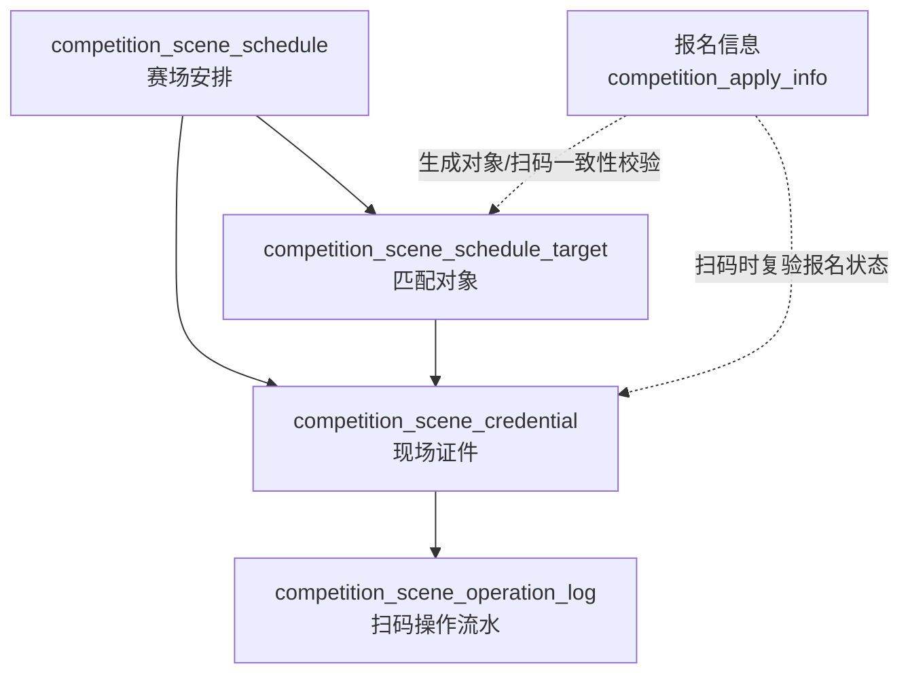

# 参赛证发证与扫码核验当前实现总结

生成时间：2026-07-02  
适用范围：当前代码库中已经实现的现场证件、参赛证展示、扫码核验、报道签到、资料领取、候场确认相关功能。  
本文件只总结参赛证/现场证件和扫码相关逻辑，不包含设备资源管理与预约设计。

## 1. 当前结论

当前系统已经形成一套“赛场安排 -> 匹配对象 -> 现场证件 -> 二维码扫码 -> 现场操作流水”的基础链路。

现场证件是赛场安排和参赛人员、团队、教师、专家之间的现场运行凭据。证件生成时会把赛场时间地点、人员信息、团队信息、赛道组别、座位号、候场分组、资料领取地点等信息快照到 `competition_scene_credential`。扫码时以证件二维码令牌定位证件，再进行证件有效性、赛场状态、报名一致性、身份信息和扫码角色矩阵校验。

当前扫码不是单纯“查验真伪”，而是已经具备现场操作入口能力：报道签到、资料领取、候场确认、专家评审入口提示。确认类操作会更新证件状态并写入操作流水。

## 2. 相关数据表

当前现场证件与扫码功能主要依赖 4 张表：

```text
competition_scene_schedule
competition_scene_schedule_target
competition_scene_credential
competition_scene_operation_log
```

Migration 文件：

```text
db/migration/20260629_competition_scene_credential.sql
db/migration/20260701_competition_scene_target_credential_type.sql
```

### 2.1 赛场安排 competition_scene_schedule

定位：维护某个赛事现场安排的时间、地点和适用对象配置。

与参赛证直接相关的字段：

| 字段 | 当前含义 |
| --- | --- |
| `schedule_id` | 赛场安排 ID |
| `schedule_name` | 安排名称 |
| `competition_series_id` | 赛事系列 ID |
| `competition_name` | 赛事名称快照 |
| `competition_stage_id/name` | 阶段快照 |
| `competition_track_id/name` | 赛道快照 |
| `second_level_code/name` | 组别快照 |
| `credential_type` | 证件类型口径 |
| `config_dimension` | 配置维度：团队或个人 |
| `report_start_time` | 报道开始时间 |
| `report_end_time` | 报道结束时间 |
| `report_location` | 报道地点 |
| `contest_start_time` | 赛场开始时间 |
| `contest_end_time` | 赛场结束时间 |
| `contest_location` | 赛场地点 |
| `contest_room` | 赛场/考场 |
| `waiting_start_time` | 候场开始时间 |
| `waiting_end_time` | 候场结束时间 |
| `waiting_location` | 候场地点 |
| `waiting_group_code/name` | 候场分组 |
| `material_location` | 资料领取地点 |
| `notice` | 注意事项 |
| `status` | 启用/停用 |
| `del_flag` | 逻辑删除 |

### 2.2 匹配对象 competition_scene_schedule_target

定位：某个赛场安排匹配到的团队、个人、教师、专家或工作人员对象。

这张表是发证的对象来源，也是证件与人员/团队的直接桥梁。

关键字段：

| 字段 | 当前含义 |
| --- | --- |
| `target_id` | 安排对象 ID |
| `schedule_id` | 所属赛场安排 |
| `competition_series_id` | 赛事系列 ID |
| `credential_type` | 该对象要生成的证件类型 |
| `config_dimension` | 团队/个人维度 |
| `target_key` | 对象唯一键 |
| `target_source` | 来源：报名、导入、手工 |
| `team_code` | 团队编号 |
| `team_name` | 团队名称 |
| `member_id` | 报名成员 ID |
| `user_id` | 用户 ID |
| `user_name` | 姓名 |
| `phone` | 手机号 |
| `id_card_hash` | 证件号 hash |
| `id_card_suffix` | 证件号后六位 |
| `school_name` | 学校 |
| `org_name` | 机构 |
| `competition_role_name` | 现场/参赛角色 |
| `competition_track_id/name` | 赛道快照 |
| `second_level_code/name` | 组别快照 |
| `leader_teacher_id` | 带队老师 ID |
| `leader_teacher` | 带队老师 |
| `guide_teacher` | 指导教师 |
| `seat_no` | 座位号/工位号 |
| `waiting_group_code/name` | 候场分组 |
| `target_snapshot_json` | 匹配对象快照 |
| `match_status` | 匹配状态 |
| `status` | 有效/停用 |

### 2.3 现场证件 competition_scene_credential

定位：实际可展示、下载、扫码核验的证件实例。

证件生成后会保存来自赛场安排和匹配对象的快照，因此后续赛场安排或对象变化不会自动回写到已生成证件。

核心字段分组：

| 分组 | 字段 |
| --- | --- |
| 证件身份 | `credential_id`、`credential_no`、`credential_token`、`qr_content`、`qr_code_url`、`credential_file_url`、`credential_image_url` |
| 关联关系 | `schedule_id`、`target_id`、`competition_series_id` |
| 证件分类 | `credential_type`、`config_dimension`、`subject_type` |
| 赛道组别 | `competition_track_id/name`、`second_level_code/name` |
| 团队人员 | `team_code`、`team_name`、`member_id`、`user_id`、`user_name`、`phone`、`id_card_suffix`、`school_name`、`org_name` |
| 角色信息 | `competition_role_name`、`leader_teacher`、`guide_teacher` |
| 现场安排 | `report_start_time/end_time/location`、`contest_start_time/end_time/location/room`、`seat_no`、`waiting_start_time/end_time/location/group`、`material_location`、`notice` |
| 有效性 | `valid_from`、`valid_to`、`credential_status` |
| 扫码状态 | `verify_count`、`last_verify_time` |
| 报道状态 | `report_status`、`report_time`、`report_operator_id/name` |
| 资料领取 | `material_status`、`material_time`、`material_receiver_name/phone/id_suffix`、`material_operator_id/name` |
| 候场确认 | `waiting_status`、`waiting_time`、`waiting_operator_id/name` |

### 2.4 操作流水 competition_scene_operation_log

定位：记录扫码核验、确认操作、失败、重复、异常等现场操作。

当前会记录：

- 扫码阶段：`operation_stage = SCAN`。
- 确认阶段：`operation_stage = CONFIRM`。
- 操作类型：`VERIFY`、`REPORT_SIGN`、`MATERIAL_RECEIVE`、`WAITING_CHECK_IN`、`EXPERT_REVIEW_ENTRY`。
- 操作结果：`PASS`、`FAIL`、`DUPLICATE`、`EXCEPTION`。
- 报名一致性校验结果。
- 赛场安排校验结果。
- 身份校验结果。
- 操作人、扫码 IP、设备信息。
- 请求参数和响应结果 JSON。
- 当前报名快照 JSON。

注意：`confirm` 接口内部会先调用 `scan`，因此一次确认操作通常会产生一条 `SCAN` 流水和一条 `CONFIRM` 流水。

## 3. 证件、赛场和人员的关系

当前关系可以概括为：



业务含义：

1. 一个赛场安排可以匹配多个对象。
2. 一个匹配对象可以生成一张当前有效证件。
3. 重新生成时，旧的有效证件会被置为 `REVOKED`，再生成新证件。
4. 证件直接绑定 `schedule_id` 和 `target_id`。
5. 证件保存赛场和人员快照，不实时依赖 schedule/target 展示。
6. 扫码流水绑定 `credential_id`，并冗余保存当时证件上的团队、人员、赛道、组别信息。

## 4. 证件类型和角色口径

### 4.1 证件类型

当前常量支持：

```text
PARTICIPANT 参赛证
TEACHER 教师证
EXPERT 专家证
STAFF 工作人员证
COMPETITOR 历史参赛证枚举，兼容旧数据
```

管理端页面目前主要展示：

```text
参赛证 PARTICIPANT
教师证 TEACHER
专家证 EXPERT
历史兼容 COMPETITOR
```

后端发证服务可以根据角色推导 `STAFF`，用于签到工作人员、资料工作人员等现场操作身份。

### 4.2 配置维度

```text
TEAM 团队
PERSON 个人
```

### 4.3 证件主体

```text
TEAM 团队主体
PERSON 个人主体
EXPERT 专家主体
```

当前主体推导规则：

- 证件类型是 `EXPERT` 时，`subject_type = EXPERT`。
- 配置维度是 `TEAM` 时，`subject_type = TEAM`。
- 其他情况为 `PERSON`。

### 4.4 当前角色

当前扫码角色矩阵识别以下角色：

```text
TEACHER 教师
MEMBER 队员
CAPTAIN 队长
EXPERT 专家
MATERIAL_STAFF 资料工作人员
CHECKIN_STAFF 签到工作人员
STAFF 现场工作人员
UNKNOWN 未配置
```

角色来源优先取证件上的 `competition_role_name`，如果为空或无法识别，则按 `credential_type` 推导。

## 5. 发证流程

管理端接口：

```text
POST /competition/sceneCredential/generate
```

请求对象：

```text
scheduleId
targetIds
regenerate
```

发证流程：

1. 校验 `scheduleId` 必填。
2. 查询赛场安排。
3. 如果传入 `targetIds`，只给所选对象生成证件。
4. 如果不传 `targetIds`，给该赛场安排下全部对象生成证件。
5. 过滤非当前 schedule 的对象。
6. 跳过 `status != 0` 的对象。
7. 如果该 target 已有有效证件且 `regenerate != true`，跳过。
8. 如果该 target 已有有效证件且 `regenerate = true`，旧证件置为 `REVOKED`。
9. 生成新证件编号、令牌和二维码内容。
10. 将 schedule 和 target 快照写入证件。
11. 初始状态写入 `EFFECTIVE`、未报道、未领资料、未候场。

证件编号规则：

```text
CS + yyyyMMdd + "-" + scheduleId + "-" + sequence
```

日期来源：

1. 优先取 `contestStartTime`。
2. 否则取 `reportStartTime`。
3. 否则取当前时间。

二维码内容：

```text
credential_token = 32 位 UUID 去横线
qr_content = "csc_" + credential_token
```

当前后端只生成 token 和二维码内容。`qr_code_url`、`credential_file_url`、`credential_image_url` 字段存在，页面支持展示或下载，但文件生成能力不是当前这段发证服务的核心逻辑。

## 6. 证件快照规则

证件生成时会复制以下信息。

来自赛场安排：

- 赛事名称、阶段、赛道、组别。
- 报道时间、报道地点。
- 赛场时间、赛场地点、赛场/考场。
- 候场时间、候场地点、候场分组。
- 资料领取地点。
- 注意事项。

来自匹配对象：

- 团队编号、团队名称。
- 报名成员 ID、用户 ID、姓名、手机号、邮箱。
- 证件号 hash 和后六位。
- 学校、机构。
- 参赛角色。
- 带队老师、指导教师。
- 座位号/工位号。
- 候场分组覆盖值。

有效期：

```text
valid_from = reportStartTime，如果为空则取生成时间
valid_to = contestEndTime，如果为空则取 reportEndTime
```

当前扫码校验只检查 `valid_to` 是否过期，没有检查 `valid_from` 是否未开始。这一点如果业务上要求“未到有效开始时间不能扫码”，需要修订。

## 7. 管理端现有能力

管理端页面：

```text
old-code-admin/src/views/tournament/sceneSchedule/index.vue
```

API 封装：

```text
old-code-admin/src/api/tournament/sceneSchedule.js
```

管理端在“赛场安排”页面内已有以下 Tab：

- 赛场安排。
- 匹配对象。
- 现场证件。
- 操作流水。

### 7.1 匹配对象 Tab

与发证相关能力：

- 配置或维护对象的证件类型。
- 配置团队/个人维度。
- 维护对象人员、团队、角色、赛道、组别、座位、候场分组等信息。
- 从匹配对象触发生成证件。

### 7.2 现场证件 Tab

能力：

- 按赛场安排、证件号、团队名、姓名、证件状态查询。
- 查看证件编号、主体、证件类型、赛道组别、证件状态。
- 如存在 `credentialFileUrl`，提供下载链接。
- 维护证件状态和备注。
- 删除证件。

### 7.3 操作流水 Tab

能力：

- 查询扫码/确认流水。
- 维度包括证件编号、操作类型、操作结果等。
- 用于追踪报道、资料领取、候场等现场动作。

## 8. 用户端现有能力

### 8.1 PC 端参赛证

相关文件：

```text
old-code-pc/src/api/personal/index.js
old-code-pc/src/views/personal/personaltabs/Competition.vue
```

接口：

```text
GET /competition/userCompetition/sceneCredential/myList
```

当前能力：

- 在个人中心竞赛列表中展示“参赛证”入口。
- 查询当前用户相关现场证件。
- 按赛事或团队/个人维度匹配证件。
- 弹窗展示证件详情和二维码。
- 展示证件类型、证件编号、状态、团队/人员、赛道组别、时间地点等信息。

### 8.2 小程序我的参赛证

相关文件：

```text
old-code-mini/api/sceneCredential.js
old-code-mini/pages/my-credential/index.vue
```

接口：

```text
GET /competition/userCompetition/sceneCredential/myList
```

当前能力：

- 展示“我的参赛证”。
- 按赛事或团队分组。
- 一组内可切换多张证件。
- 使用 `qrContent` 或 `credentialToken` 绘制二维码。
- 展示报道、赛场、候场、资料领取、注意事项等信息。
- 展示证件状态。

### 8.3 我的证件查询规则

后端方法：

```text
CompetitionSceneCredentialServiceImpl.selectMyCompetitionSceneCredentialList
```

当前查询规则：

1. 先查询 `user_id = 当前用户` 的证件。
2. 再根据当前用户报名信息查出其参与过的 `teamCode`。
3. 追加查询这些 `teamCode` 对应的团队证件。
4. 用 `credentialId` 去重。

这意味着用户可以看到：

- 自己名下的个人证件。
- 自己所在团队的团队证件。

## 9. 扫码接口

扫码核验 Controller：

```text
CompetitionSceneVerifyController
```

映射：

```text
@RequestMapping({"/sceneVerify", "/competition/sceneVerify"})
```

接口：

| 方法 | 路径 | 说明 |
| --- | --- | --- |
| POST | `/competition/sceneVerify/scan` | 扫码核验，返回证件信息和可执行动作矩阵 |
| POST | `/competition/sceneVerify/confirm` | 对扫码结果执行确认动作 |
| GET | `/competition/sceneVerify/log/list` | 管理端操作流水列表 |

请求对象：

```text
credentialToken
qrContent
operationType
receiverName
receiverPhone
receiverIdSuffix
operatorOpenId
operatorPhone
scanIp
deviceInfo
```

二维码内容解析支持：

- 直接传 `credentialToken`。
- 传 `qrContent`。
- 传 `csc_` 前缀内容。
- 传 URL query 中的 `credentialToken=`。
- 传 JSON，字段可以是 `credentialToken`、`token` 或 `qrContent`。

## 10. 扫码核验流程

入口：

```text
POST /competition/sceneVerify/scan
```

当前流程：

1. 解析二维码 token。
2. token 为空则失败。
3. 按 token 查询 `competition_scene_credential`。
4. 证件不存在则失败。
5. 进行赛场/证件有效性校验。
6. 进行报名一致性校验。
7. 进行身份信息校验。
8. 解析扫码操作人的现场角色。
9. 生成该操作人对该证件可执行的动作矩阵。
10. 返回证件信息、校验结果、目标角色、操作人角色、可执行动作。
11. 无论成功失败，写入 `SCAN` 阶段操作流水。

### 10.1 证件和赛场校验

当前校验：

- `credential_status = EFFECTIVE`。
- `valid_to` 为空或不早于当前时间。
- `schedule_id` 对应的赛场安排存在。
- 赛场安排 `status = 0`。

当前没有检查：

- `valid_from` 是否已经开始。
- 当前扫码地点是否与报道地点、资料领取地点、候场地点或赛场地点一致。
- 当前时间是否落在报道、资料领取、候场、比赛时间窗口内。

### 10.2 报名一致性校验

当前跳过报名校验的情况：

- 专家证。
- 工作人员证。
- 证件快照中 target 来源为 `MANUAL`。
- 证件快照中 target 来源为 `IMPORT`。

需要报名校验的情况：

- 参赛证。
- 教师证。
- 来源为报名数据的对象。

校验逻辑：

- 有 `memberId` 时，按报名成员 ID 查报名。
- 没有 `memberId` 但有 `teamCode` 时，按团队编号查团队报名列表，只要存在一条与证件一致的报名即通过。

报名通过条件：

- 报名未删除。
- 审核状态为通过。
- 支付状态为已支付。
- 赛事系列一致。
- 证件有赛道时，赛道一致。
- 证件有组别时，组别一致。

### 10.3 身份信息校验

当前逻辑：

- 专家证跳过身份校验。
- 如果证件没有姓名且没有团队名，则失败。
- 非资料领取操作下，如果请求传入 `receiverIdSuffix`，且证件上有 `idCardSuffix`，两者不一致则失败。

注意：

- `MATERIAL_RECEIVE` 资料领取操作不会用 `receiverIdSuffix` 做身份一致性拦截，只会把领取人信息写入证件和流水。
- 如果业务要求“资料领取必须核对领取人身份”或“允许代领但必须记录代领人”，这里需要重新确认。

## 11. 扫码角色矩阵

扫码后会返回：

```text
operatorRole
operatorRoleLabel
targetRole
targetRoleLabel
availableActions
reviewEntryAvailable
reviewEntryMessage
matrixMessage
```

### 11.1 被扫对象角色 targetRole

根据被扫证件的 `competition_role_name` 或 `credential_type` 推导。

被扫对象只有以下角色会进入现场操作矩阵：

```text
CAPTAIN
MEMBER
TEACHER
```

如果被扫对象是专家或工作人员，目前不会产生报道、资料领取、候场动作。

### 11.2 扫码操作人角色 operatorRole

系统会按当前登录用户和请求中的 `operatorPhone` 查找操作人自己的有效现场证件。

查询范围：

1. 同一 `schedule_id`。
2. 同一 `competition_series_id`。

候选证件状态必须为：

```text
credential_status = EFFECTIVE
```

如果查到多个操作人证件，会按角色优先级和是否同一赛场安排打分选择主角色。

当前角色优先级：

```text
CHECKIN_STAFF / MATERIAL_STAFF > STAFF > EXPERT > TEACHER / CAPTAIN / MEMBER
```

### 11.3 当前动作矩阵

| 操作人角色 | 被扫对象角色 | 可执行动作 |
| --- | --- | --- |
| `STAFF` | 队长/队员/教师 | 报道签到、候场确认、资料领取 |
| `CHECKIN_STAFF` | 队长/队员/教师 | 报道签到、候场确认 |
| `MATERIAL_STAFF` | 队长/队员/教师 | 资料领取 |
| `EXPERT` | 队长/队员 | 专家评审入口提示 |

专家评审入口当前只是提示动作：

```text
actionKind = PROMPT
```

不会在 confirm 中真正执行状态变更。

## 12. 扫码确认流程

入口：

```text
POST /competition/sceneVerify/confirm
```

当前流程：

1. 内部先执行一次 `scan`。
2. 如果扫码不通过，直接返回扫码失败结果。
3. 根据 `operationType` 查找当前角色矩阵中的动作。
4. 找不到动作则失败，提示当前扫码角色不可执行该操作。
5. 如果动作是 `PROMPT`，返回失败，提示该动作无需确认。
6. 如果动作状态已完成，返回 `DUPLICATE`。
7. 如果动作不可用，返回失败。
8. 再次判断证件当前状态是否重复。
9. 根据操作类型更新证件状态。
10. 重新查询证件，刷新动作矩阵。
11. 写入 `CONFIRM` 阶段操作流水。

### 12.1 报道签到

操作类型：

```text
REPORT_SIGN
```

更新字段：

```text
report_status = 1
report_time = 当前时间
report_operator_id = 当前登录用户
report_operator_name = 当前用户名
verify_count + 1
last_verify_time = 当前时间
```

重复确认：

- 如果 `report_status = 1`，返回 `DUPLICATE`。
- 不再次更新状态。

### 12.2 资料领取

操作类型：

```text
MATERIAL_RECEIVE
```

更新字段：

```text
material_status = 1
material_time = 当前时间
material_receiver_name = 请求传入领取人
material_receiver_phone = 请求传入领取人手机号
material_receiver_id_suffix = 请求传入领取人证件后六位
material_operator_id = 当前登录用户
material_operator_name = 当前用户名
verify_count + 1
last_verify_time = 当前时间
```

重复确认：

- 如果 `material_status = 1`，返回 `DUPLICATE`。
- 不再次更新状态。

### 12.3 候场确认

操作类型：

```text
WAITING_CHECK_IN
```

更新字段：

```text
waiting_status = 1
waiting_time = 当前时间
waiting_operator_id = 当前登录用户
waiting_operator_name = 当前用户名
verify_count + 1
last_verify_time = 当前时间
```

重复确认：

- 如果 `waiting_status = 1`，返回 `DUPLICATE`。
- 不再次更新状态。

### 12.4 纯核验 VERIFY

操作类型：

```text
VERIFY
```

当前 `scan` 接口本身就是核验。

如果调用 `confirm` 且不传 `operationType`，默认是 `VERIFY`，但动作矩阵中没有确认类 `VERIFY` 动作，因此会失败。

## 13. 小程序扫码页面

相关文件：

```text
old-code-mini/api/scan.js
old-code-mini/pages/scan/result.vue
```

当前页面能力：

- 兼容旧签到接口和新的现场证件扫码接口。
- 调用 `/competition/sceneVerify/scan` 获取证件核验结果。
- 展示证件主体、证件编号、证件类型、扫码角色、被扫对象角色。
- 展示赛道组别、学校/机构。
- 展示报道、资料、候场完成状态。
- 展示报道时间地点、赛场时间地点、候场地点、资料领取地点。
- 根据 `availableActions` 展示可确认操作。
- 点击确认后调用 `/competition/sceneVerify/confirm`。
- 资料领取确认时会把当前证件的姓名、手机号、证件后六位作为领取人信息提交。

## 14. 当前已知边界和待修订点

以下不是 bug 结论，而是当前实现和真实现场规则可能不一致的点，建议作为下一轮人工修订重点。

1. 证件使用范围目前主要靠 `credential_status`、`valid_to`、赛场安排启用状态控制，没有按报道/资料/候场/比赛各自时间窗口控制。
2. 扫码没有校验 `valid_from`，证件未到有效开始时间也可能通过。
3. 扫码没有校验扫码地点、设备或工作人员岗位位置。
4. 报道签到、资料领取、候场确认目前都作用在同一张证件上，未区分团队证件和个人成员是否需要逐人确认。
5. 团队证件被一个成员扫码确认后，是否代表全队报道、全队领资料、全队候场，目前需要业务确认。
6. 教师证当前可以作为被扫对象进入报道、资料、候场矩阵，这是否符合现场规则需要确认。
7. 专家证当前主要用于操作人角色或专家评审入口提示，被扫专家证不产生报道、资料、候场动作。
8. 工作人员证当前可作为扫码操作人身份，但管理端证件类型选项主要展示参赛证、教师证、专家证。
9. 资料领取目前记录领取人信息，但不强制身份一致性；如果防代领纠纷要求更严格，需要调整。
10. 报道签到和候场确认当前没有记录额外确认人信息，只记录操作人。
11. 扫码角色矩阵依赖操作人本人也有有效现场证件；如果现场工作人员不在证件体系中，会显示“当前账号未配置本赛事现场操作角色”。
12. 操作人角色可以在同一赛事系列内匹配，不一定必须同一 `schedule_id`，只是同一 schedule 加分更高。
13. 证件生成后保存快照，赛场安排调整不会自动同步已生成证件。
14. 重新生成证件会作废旧证件，但二维码文件、证件图片或下载文件是否同步重生，目前不是后端发证服务保证项。
15. 报名一致性校验对 `MANUAL` 和 `IMPORT` 来源会跳过，这对手工导入专家/工作人员合理，但对手工参赛对象是否合理需要确认。
16. 当前 `valid_to` 如果保存为某天 `00:00:00`，当天白天会被判定过期。

## 15. 建议后续修订优先级

建议先围绕以下问题做人工定稿：

1. 每种证件类型的使用范围：参赛证、教师证、专家证、工作人员证分别能被谁扫、能做什么。
2. 每种扫码确认事项的对象范围：报道签到、资料领取、候场确认、赛场入场、专家评审入口。
3. 团队证件和个人成员的关系：团队证件一次确认是否代表全队，还是需要成员级确认。
4. 教师证是否参与报道、资料领取、候场确认。
5. 专家证是否需要签到、入场、评审入口、资料领取等独立动作。
6. 资料领取是否允许代领，若允许，需要记录哪些信息；若不允许，如何校验身份。
7. 扫码操作人是否必须有工作人员证，还是可以用后台权限或小程序角色判断。
8. 操作人角色是否必须和被扫证件在同一个 `schedule_id`。
9. 每个操作是否需要独立时间窗口和地点约束。
10. 证件有效期是否按日期结束日自动扩展到 23:59:59。

## 16. 主要代码位置

后端发证：

```text
old-code/teaching-modules/teaching-competition/src/main/java/com/teaching/competition/service/impl/CompetitionSceneCredentialServiceImpl.java
old-code/teaching-modules/teaching-competition/src/main/java/com/teaching/competition/controller/CompetitionSceneCredentialController.java
old-code/teaching-modules/teaching-competition/src/main/resources/mapper/competition/CompetitionSceneCredentialMapper.xml
```

后端扫码：

```text
old-code/teaching-modules/teaching-competition/src/main/java/com/teaching/competition/service/impl/CompetitionSceneVerifyServiceImpl.java
old-code/teaching-modules/teaching-competition/src/main/java/com/teaching/competition/controller/CompetitionSceneVerifyController.java
old-code/teaching-modules/teaching-competition/src/main/resources/mapper/competition/CompetitionSceneOperationLogMapper.xml
```

核心领域对象：

```text
old-code/teaching-modules/teaching-competition/src/main/java/com/teaching/competition/domain/CompetitionSceneSchedule.java
old-code/teaching-modules/teaching-competition/src/main/java/com/teaching/competition/domain/CompetitionSceneScheduleTarget.java
old-code/teaching-modules/teaching-competition/src/main/java/com/teaching/competition/domain/CompetitionSceneCredential.java
old-code/teaching-modules/teaching-competition/src/main/java/com/teaching/competition/domain/CompetitionSceneVerifyReq.java
old-code/teaching-modules/teaching-competition/src/main/java/com/teaching/competition/domain/CompetitionSceneVerifyResult.java
old-code/teaching-modules/teaching-competition/src/main/java/com/teaching/competition/domain/CompetitionSceneScanAction.java
old-code/teaching-modules/teaching-competition/src/main/java/com/teaching/competition/domain/CompetitionSceneOperationLog.java
old-code/teaching-modules/teaching-competition/src/main/java/com/teaching/competition/contant/CompetitionSceneConstants.java
```

管理端：

```text
old-code-admin/src/views/tournament/sceneSchedule/index.vue
old-code-admin/src/api/tournament/sceneSchedule.js
```

PC 端：

```text
old-code-pc/src/views/personal/personaltabs/Competition.vue
old-code-pc/src/api/personal/index.js
```

小程序：

```text
old-code-mini/pages/my-credential/index.vue
old-code-mini/pages/scan/result.vue
old-code-mini/api/sceneCredential.js
old-code-mini/api/scan.js
```

