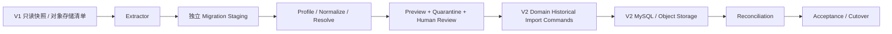

# V1 核心数据向 V2 复用迁移设计方案

设计日期：2026-08-17  
V1 来源：`deshi_competition_2` 当前代码、数据库盘点与未提交开发  
V2 来源：`V2-202608171046核心代码包.zip` 只读分析  
方案版本：v1.1（核心业务履历收敛版）  
方案状态：设计稿，不执行迁移，不修改 V1/V2 数据库  

## 1. 执行结论

V1 与 V2 都约有 240 张业务表，但它们不是同一模型的两个版本：

- V1 历史盘点为 242 张表、4,134 个字段，围绕赛事、用户、团队、现场证件、评审、文件和支付逐步演进。
- V2 当前基线为 MySQL 8.4、41 个 Flyway migration、248 张业务表、2,593 个字段，领域事实被重新拆分为 Platform Core、Activity、Competition Registration、Artifact、Evaluation、Runtime、Attendance、Credential、Resource、Commerce、CMS、Communication、Privacy 和 Data Exchange。
- V2 明确禁止把 V1 的表结构和语义直接复制进去，尤其禁止复制万能 schedule/target、一证多权 grant、Credential 中的到场状态、永久文件 URL 和旧权限模型。

因此推荐方案是：**保留 V1 原始快照，通过独立迁移暂存区完成身份解析、清洗和旧 ID 映射，再调用 V2 各领域的受控导入 Command 重建业务事实。**

不建议：

- 用 `INSERT ... SELECT` 跨库整表复制。
- 把 V1 SQL 加入 V2 Flyway 历史。
- 保留 V1 主键作为 V2 主键。
- 为兼容 V1 修改 V2 已冻结领域语义。
- 把手机号、姓名或 `team_code` 单独作为自动合并主体的依据。
- 将 V1 `credential_scope_grant` 转换成 V2 RoleAssignment。

本期迁移范围收敛为：**用户与组织关系、赛事参与履历、报名团队、正式材料、评审成绩、获奖证书、财务流水。** 现场签到、现场 Runtime、现场证件操作状态、资源台账和资源预约不进入本期 V2 运行模型，只做只读归档、来源计数和完整性校验。

收敛后的迁移准备度评估：**约 70%，目标模型基本具备，但专用历史导入合同和主体解析仍未实现。** V2 已有 Data Exchange Preview/Commit/Receipt 基础设施以及报名导入合同；本期仍需补齐身份组织、历史报名状态、正式材料、评审、获奖证书和财务历史导入能力。

## 2. 迁移目标

本次数据复用的目标不是“V2 能查到 V1 的所有行”，而是：

1. 用户能在 V2 延续身份、组织归属、历史赛事、报名、参赛、成绩、获奖和证书记录。
2. 运营人员能继续查询历史赛事、团队、评审、支付、发票、正式材料和获奖证书。
3. V2 的 Tenant、Subject、Activity、Participation、Artifact Version、Evaluation、Attendance 等事实边界不被旧模型污染。
4. 每条迁移记录都能追溯到 V1 来源表、来源主键、来源快照和迁移批次。
5. 无法可靠映射的数据进入隔离清单，不静默丢弃、不猜测合并。
6. 迁移可预演、可重复、可对账，正式切换前可整体回退到 V1。
7. 现场签到和资源预约只保留在 V1 归档中，不参与 V2 权限、状态、统计和业务计算。

## 3. V2 迁移相关能力评估

### 3.1 已具备

- Flyway 11.20.3，41 个 forward-only migration，Schema 和 checksum 可验证。
- 248 张表、2,593 个字段的机器可读数据字典。
- Tenant、Account、Subject、Business Identity、Organization、RoleAssignment 基础模型。
- Activity、Composition、Registration、Participation、Group 模型。
- Competition Publication、报名政策版本、报名 Revision 和 Finalization 模型。
- Artifact、Artifact Version、File Object、Derivative 模型。
- Evaluation、Runtime、Attendance、Credential、Resource、Commerce 等领域模型。
- Data Exchange Job、Input、Preview、Row Result、Commit Batch、Receipt 机制。
- Data Exchange 已支持 `COMPETITION_REGISTRATIONS 1.0`，具备 Preview、行校验、聚合原子 Commit、幂等 Receipt。
- 审计、Outbox、Task、Dead Letter、隐私分类和保留策略基础。

### 3.2 迁移阻塞项

| 阻塞项 | 当前情况 | 迁移前要求 |
| --- | --- | --- |
| Tenant 归属 | V1 没有统一 `tenant_id` | 人工冻结 V1 数据到 V2 Tenant 的归属矩阵 |
| 统一 Subject | V1 用户、报名人、团队成员、专家等主体分散 | 建立主体解析、冲突和未认领 Subject 规则 |
| 账号迁移 | V2 使用手机号 HMAC 指纹和短信认证，不直接承接 V1 密码模型 | 建立受控账号导入/认领合同，不迁移旧密码 |
| 组织层级 | V2 当前 Organization 只有组织本体和 Membership | 层级关系延期或新增经批准模型，不能塞入名称/编码 |
| 通用存量导入 | Data Exchange 当前仅元数据与报名导入 | 为本期身份、材料、评审、证书和财务增加领域专用历史导入合同 |
| 迁移来源映射 | V2 业务表没有通用 legacy ID 字段 | 建立独立迁移 sidecar，不污染业务表 |
| 历史状态导入 | V2 正常 Command 按当前规则和时间运行 | 设计保留历史时间、状态、actor 和来源证据的 Historical Import Command |
| 课程学习域 | V2 当前没有独立 Course/Learning 模型 | 暂存或只读归档，等待领域设计 |
| 文档状态一致性 | V2 根 README 保留早期 `VALIDATION_PENDING` 描述，而最新 Schema 审计已到 V2.34.100 | 迁移前冻结唯一发布基线、版本和 Release Gate 状态 |

## 4. V1 数据价值分级

### 4.1 A 类：必须进入 V2 运行模型

| 数据资产 | 价值 | 典型 V1 来源 |
| --- | --- | --- |
| 用户与主体 | 登录连续性、历史业务归属 | `sys_user`、报名/成员中的匿名人员 |
| 实名与身份 | 身份去重、资格和历史归属 | `auth_info`、`identity_info` |
| 组织和成员关系 | 租户隔离、学校/企业归属 | `sys_org`、`sys_user_org`、`nationwide_college_info` |
| 赛事与赛道结构 | 所有历史业务的上游主轴 | `competition_main_info`、`competition_series_info`、stage/track/config |
| 报名、团队和正式参赛 | 用户核心履历 | `competition_apply_info`、`team_manager_info`、`team_member_rela`、晋级表 |
| 作品和正式材料 | 报名、评审、获奖证据 | `competition_works`、file task/upload、review material |
| 评审规则、评分和结果 | 成绩、评审审计、获奖依据 | `review_*`、`competition_grade_info`、`user_grade_info` |
| 获奖与证书 | 用户长期权益和履历 | award、user certificate、cert 相关表 |
| 订单、支付、退款、发票 | 财务与法律留存 | `order_info`、支付记录、invoice、statement |

### 4.2 B 类：选择性进入 V2，完整原始数据归档

| 数据资产 | 处理方式 |
| --- | --- |
| CMS 内容、公告、Banner | 有公开价值且仍在使用的内容进入 V2 CMS；旧版本完整归档 |
| 通知发送记录 | 有业务审计价值的公告/通知进入 Communication；低价值消息只归档 |
| IM 会话与聊天 | 默认不导入运行模型；确认合规依据和用户需求后再迁移 |
| 操作日志、登录日志、审核日志 | 汇总或归档为不可变证据，不伪装成 V2 新产生的审计事件 |
| Flowable 已完成流程 | 迁移最终业务结论和关键审批证据，不迁移引擎运行表 |
| 历史快照字段 | 随正式 Revision、Record、Event 保存；不覆盖 V2 当前主数据 |
| 原始导入 Excel 和离线匹配结果 | 保存为受控 Artifact Version，用于审计，不成为当前事实 |
| 收藏、浏览、学习记录 | 在对应 V2 能力存在并确认产品价值后迁移，否则归档 |
| 现场签到、核验和运行日志 | 本期只读归档，不进入 Runtime、Attendance 或 Credential 现场状态 |
| 资源台账、时段和预约 | 本期只读归档，不进入 Resource/Reservation 运行模型 |

### 4.3 C 类：不进入 V2 业务模型

- Redis Token、Session、验证码、缓存键。
- `sys_menu`、`sys_role_menu` 等旧菜单权限配置的直接复制。
- Flowable `act_*`、`flw_*` 运行表和 Seata `undo_log`。
- `sys_job_log`、临时错误日志、构建和运行日志。
- `offline_v3_*`、`offline_v4_*`、`*_copy1` 等中间表的运行态数据。
- `gen_table`、`gen_table_column` 等代码生成配置。
- V1 `competition_scene_credential_scope_grant` 作为授权事实。
- scene schedule/target、operation state/log、`wx_sign_in_info` 的运行态重建。
- scene resource、slot、reservation、capacity 的运行态重建。
- V1 永久文件 URL、对象存储公开 URL。
- V1 软删除行作为 V2 活跃事实。
- 无来源证明、无法解释含义的 `status` 数值。

这些数据可以进入加密、只读、限期保留的迁移归档，但不能影响 V2 授权、状态和业务计算。

## 5. 核心领域映射

### 5.1 Platform Core

| V1 来源 | V2 目标 | 转换原则 |
| --- | --- | --- |
| `sys_user` | `subject`、`account`、`account_subject_relation` | Subject 与登录 Account 分开生成，旧 ID 只存 sidecar |
| `sys_user.user_name/nick_name` | `business_identity.display_name` | 选择经业务确认的展示名，保留来源快照 |
| `sys_user.phonenumber` | `authentication_phone_identity.phone_fingerprint` | 使用 V2 相同规范化和 HMAC secret 通过应用服务生成；不直接存明文 |
| `auth_info`、`identity_info` | `identity_verification` | 仅迁移有可靠批准证据的记录；身份证存 fingerprint 和 masked identifier |
| `sys_org`、`nationwide_college_info` | `organization` | 先去重学校/企业编码和名称，再分配 Tenant |
| `sys_user_org` | `organization_membership` | 只迁移能解析到 Subject/Business Identity 的有效成员关系 |
| 专家、教师等身份 | `qualification` 或 `role_assignment` | 资格与授权分开；教师/专家标签不能自动产生权限 |
| `sys_role`、`sys_menu.perms` | `role_definition`、`permission_catalog`、`role_assignment` | 只按批准的权限映射表转换，不迁旧主键和菜单结构 |

#### Account/Subject 处理

1. 所有被业务事实引用的自然人先生成 Subject，即使没有登录账号。
2. 有唯一、有效、已验证手机号的 V1 活跃用户可生成 Account 和手机号指纹绑定。
3. V1 密码 Hash、Token、Session 不迁移；首次进入 V2 使用短信验证或账号认领。
4. 手机号重复、复用、共享或与实名冲突时，只生成未认领 Subject，不自动生成唯一 Account 绑定。
5. V1 当前新增的教师赛匿名报名人员应迁为未认领 Subject；后续通过 V2 Invitation/Binding 流程认领，不使用跨赛事手机号自动绑定。

### 5.2 赛事、活动、报名和团队

| V1 来源 | V2 目标 | 转换原则 |
| --- | --- | --- |
| `competition_main_info` | 顶层 `activity` 或赛事产品主对象 | 作为赛事品牌/主活动候选，需冻结映射粒度 |
| `competition_series_info` | `activity` + `competition_publication` | 通常对应一届可报名赛事活动 |
| stage/track/group 配置 | 子 `activity`、`activity_composition`、participant category、政策版本 | 不创建新的 Stage/Track 核心表；显示名称可进入 Metadata Taxonomy |
| `competition_config`、check package | competition policy/category/qualification/material requirement 版本 | 按实际生效配置生成冻结 Policy Version |
| `team_manager_info` | `activity_group` | 团队编码和名称保留为业务码与历史快照 |
| `team_member_rela` | `activity_group_member`、`competition_registration_team_member` | 队长/队员映射为受控角色；指导教师走单独表 |
| `competition_apply_info` | `activity_registration`、`competition_registration_case`、Revision/Member/Teacher | 按一次报名聚合，不按人员行逐条创建独立团队报名 |
| 审核通过且满足最终条件 | `registration_finalization`、`activity_participation` | Participation 只能从可证明的正式 Finalization 产生 |
| 晋级数据 | 子 Activity 的新 Registration/Participation 或明确关系 | 不能只转换为父报名的状态字段 |
| 报名快照字段 | `competition_registration_revision*` | 姓名、学校、组别、角色等保留为提交时证据，不反写主数据 |

V2 已有的 `COMPETITION_REGISTRATIONS 1.0` Data Exchange 可以复用于团队/个人报名聚合导入，但当前合同只接受：

```text
aggregateKey, participantMode, teamName, subjectId, memberRole
```

它适合迁移成员结构，不足以完整表达 V1 历史审核、付款、提交 Revision、指导教师、材料和 Finalization。建议新增 `LEGACY_COMPETITION_REGISTRATIONS 1.0` 历史导入合同，内部仍调用 Registration Command，不直接写表。

### 5.3 文件和材料

| V1 来源 | V2 目标 | 转换原则 |
| --- | --- | --- |
| `sys_file`、upload/download、file task | `file_object` | 根据真实二进制重新计算 SHA-256、大小和 MIME |
| 有业务语义的作品/材料 | `artifact` | 同一文件可服务多个 Artifact，但业务语义分别保留 |
| 文件历史版本 | `artifact_version` | 正式材料冻结 exact Version，不使用 Current |
| 预览图/转换件 | `file_derivative` | 不作为 Artifact 新版本 |
| 作品/报名材料 | activity submission 或 registration material 明确引用 | 禁止通用 owner_type/owner_id |
| 评审材料 | evaluation input 到 exact Artifact Version | 不能迁移永久 URL 或本地路径 |

文件迁移必须同时读取数据库元数据和实际对象存储。只迁数据库 URL 会造成 V2 记录存在但文件不可用。

### 5.4 评审、成绩和获奖

| V1 来源 | V2 目标 | 转换原则 |
| --- | --- | --- |
| `review_activity`、round/rule | `evaluation_plan`、scoring scheme/version | Round 不直接成为 V2 核心对象；按 Flow Node 和计划重建 |
| `review_criteria` | `evaluation_scoring_criterion` | 保留评分项名称、满分、排序和版本快照 |
| `review_object` | `evaluation_target` | 只允许映射 Participation、Subject、Artifact 或批准类型 |
| assignment/panel/reviewer | `evaluation_task` + Activity Context RoleAssignment | 专家证或旧角色不自动产生 Reviewer 授权 |
| `review_record` | `evaluation_record` | 保留 reviewer、提交时间、意见和 exact input/scheme |
| `review_score_detail` | `evaluation_record_score` | 使用 Decimal 精度，逐项和必须等于总分 |
| `review_result` | `evaluation_result`、`evaluation_result_record` | 结果引用明确 Record 和规则版本 |
| `competition_grade_info`、`user_grade_info` | Evaluation Result 或历史成绩投影 | 与 Review Result 对账后选唯一事实源，禁止重复导入 |
| award publicity/details | competition award decision/version/recipient/publication receipt | 以正式发布版本作为获奖事实 |

如果 V1 Review 与成绩表不一致，默认优先级不能由程序自行决定。应按赛事配置产生“Review 结果优先 / 成绩导入优先 / 人工裁决”的赛事级规则。

### 5.5 获奖证书与现场数据边界

| V1 来源 | 本期处理 | 转换原则 |
| --- | --- | --- |
| user certificate/award certificate | 迁移 | award decision → entitlement → credential issue；先确认获奖事实 |
| 证书模板和正式证书文件 | 迁移 | 形成 Artifact/Artifact Version，并与签发事实明确关联 |
| `competition_scene_credential` | 不迁移现场实例 | 不能把现场参赛证、签到、候场和材料状态当作获奖证书 |
| `credential_scope_grant` | 禁止迁移为授权 | 仅保留加密审计归档 |
| scene schedule/target | 本期归档 | 不创建 Runtime Session/Assignment |
| operation state/log、`wx_sign_in_info` | 本期归档 | 不创建 Attendance Record/Event，不参与 V2 当前状态 |

获奖证书迁移只处理具有长期权益和履历价值的正式证书。临时参赛证、现场通行证、二维码和现场授权不进入 V2 Credential 运行模型。

### 5.6 资源与预约本期处置

以下数据不进入本期 V2 Resource/Reservation：

- `competition_scene_resource`。
- `competition_scene_schedule_resource`。
- `competition_scene_resource_slot` 及 scope/group scope。
- `competition_scene_resource_reservation`。
- 相关容量、取消、履约和操作流水。

处置方式：生成表级行数、主键范围、状态分布和导出文件 checksum，保存在 V1 只读归档。未来只有出现资源历史查询、审计或分析需求时，再独立设计迁移，不阻塞本期核心业务履历上线。

### 5.7 Commerce、CMS 和 Communication

| V1 来源 | V2 目标 | 转换原则 |
| --- | --- | --- |
| order/goods/payment record | commerce billing/payable/payment order/transaction/allocation | 金额、币种、付款主体、渠道流水和来源合同必须完整 |
| refund | refund application/execution/allocation/work order | 退款只能关联原 payment allocation |
| invoice profile/info | invoice profile/application/document/adjustment | 已开票事实与申请状态分离 |
| statement/reconciliation | reconciliation run/item/resolution | 保留 V1 对账结果和例外项 |
| content/news/notice/banner/page | CMS article/page/channel/navigation/published version | 仅迁移仍有效内容，富文本先净化和文件替换 |
| system notice/message/notification | communication announcement/notification/delivery/read state | 只迁移具备业务价值和合规依据的记录 |
| IM conversation/message | 默认归档 | 若业务确认迁移，必须先处理成员同意、敏感内容和保留期 |

### 5.8 当前没有可靠目标模型的数据

V1 课程、章节、视频、学习记录不应为了“能迁”而强行映射到 Activity 或 CMS。建议：

1. 完整导出为加密只读归档。
2. 保留用户、课程、章节、学习进度的独立旧 ID 映射。
3. 待 V2 Learning/Course 领域冻结后另立迁移项目。

## 6. 主体解析和去重设计

主体迁移是整个项目最高风险环节，错误合并比未合并更难恢复。

### 6.1 证据等级

| 等级 | 条件 | 自动处理 |
| --- | --- | --- |
| A | 同一 V1 `user_id` 且有一致的已批准实名记录 | 自动映射一个 Subject |
| A | 相同有效身份证 fingerprint、姓名兼容、无冲突证明 | 可自动合并，保留证据 |
| B | 同手机号、同姓名、同组织，但没有可靠实名 | 生成合并候选，不自动合并 |
| B | 报名成员与 team member 通过稳定 `member_id/team_code` 对上 | 同一赛事范围内聚类，不扩展为全平台同一自然人 |
| C | 只有手机号相同 | 禁止自动合并；手机号可能共享、回收或录错 |
| C | 只有姓名/学校相同 | 禁止自动合并 |
| D | 身份证、手机号、姓名互相冲突 | 隔离并人工裁决 |

### 6.2 未认领主体

无法绑定现有 Account 的历史参赛者、指导教师、专家仍需拥有 V2 Subject，建议：

- 创建 Subject 和 tenant-scoped Business Identity。
- 不创建手机号登录绑定，或仅保存经过批准的不可逆候选指纹到迁移 sidecar。
- 通过一次性 Invitation + channel proof 认领。
- 认领成功后绑定 Account 与既有 Subject，不新建第二个历史主体。
- 冲突时进入 Subject Merge 人工流程，不能由登录自动覆盖。

## 7. 字段转换通用规则

| 字段类型 | 规则 |
| --- | --- |
| V1 主键 | 不复用；生成 V2 ID，sidecar 保存 `(source_table, source_pk, target_type, target_id)` |
| Tenant | 所有业务记录必须先命中人工批准的 Tenant 归属表 |
| Organization | 使用标准编码优先；名称只作为候选，不直接全局去重 |
| created/updated time | 保留原始时间；无法确定时标记 `time_confidence`，不伪造精确历史 |
| created_by/updated_by | V2 写入专用 Migration Actor；原 V1 actor 保存到来源证据 |
| version | V2 从 0 或领域命令生成，不复制 V1 version |
| deleted/del_flag | 删除行默认不进入活跃模型；保留在归档和来源计数中 |
| status/check_status | 按“表 + 字段 + 赛事配置”映射，不建立全局数字状态映射 |
| 快照文本 | 进入 Revision/Event/Record 快照，不更新 Subject/Organization 当前值 |
| 手机号 | 规范化后通过 V2 HMAC 服务生成 fingerprint；原文限时加密暂存 |
| 身份证 | 仅保存 fingerprint、masked identifier 和可信 provider evidence |
| 金额 | Decimal 原精度迁移，禁止浮点；币种、正负方向和退款关系必须明确 |
| 文件 URL | 仅作为查找输入；下载、哈希、扫描后生成 File Object |
| JSON | 解析、Schema 校验、字段白名单后转换；不能原样塞入 V2 业务表 |

## 8. 状态映射原则

### 8.1 报名

- V1 删除或无效行：归档，不创建活跃 Case。
- 明确草稿：V2 `DRAFT`。
- 已提交待审核：`SUBMITTED`。
- 要求修改：`REVISION_REQUESTED`。
- 明确拒绝：`REJECTED`。
- 明确取消/退款后撤销：`CANCELLED`。
- 只有审核、组织批准、支付要求等全部满足时才能 `FINALIZED` 并创建 Participation。
- V1 `pay_status` 不能直接决定报名状态，Payment 事实属于 Commerce。

### 8.2 评审和获奖

- 只有正式提交记录迁移为 Evaluation Record。
- 草稿分数默认不进入正式 Record，可作为加密归档。
- 已发布获奖结果形成不可变 Award Decision Version。
- 未发布结果不能产生 Credential Entitlement。

### 8.3 现场与资源

- 本期不做状态转换。
- 仅统计来源行数、状态分布、主键范围和归档 checksum。
- 不创建 Runtime、Attendance、Resource、Reservation、Capacity Ledger 数据。

## 9. 迁移技术架构



### 9.1 独立迁移 Sidecar

Sidecar 使用独立 Schema 或独立数据库，不进入 V2 业务 Flyway，不被运行时代码查询。建议对象：

| 对象 | 用途 |
| --- | --- |
| `migration_run` | 批次、V1 快照、V2 schema version、状态、checksum |
| `source_snapshot_manifest` | 每张源表行数、最大更新时间、导出文件 Hash |
| `legacy_id_map` | 来源表/主键到 V2 类型/ID 的稳定映射 |
| `tenant_assignment` | V1 业务对象到 V2 Tenant 的人工批准映射 |
| `identity_candidate` | 主体候选、证据等级、冲突状态 |
| `normalized_record` | 清洗后的最小中间数据，不作为长期业务事实 |
| `quarantine_record` | 无法映射、冲突、非法状态和文件缺失记录 |
| `file_manifest` | URL、provider、storage key、hash、size、MIME、迁移状态 |
| `reconciliation_metric` | 源/目标/隔离计数和金额、Hash 对账结果 |
| `migration_audit` | 人工裁决、重跑、豁免和批准记录 |

Sidecar 中的明文 PII 应加密、最小授权并设置删除期限。迁移验收后保留不可逆 fingerprint、ID map 和审计，删除不再需要的明文暂存。

### 9.2 写入方式

优先顺序：

1. 复用 V2 Data Exchange Job/Preview/Row Result/Receipt。
2. 新增领域专用 `HistoricalImportCommand`，调用领域 Application Service。
3. 只在批量性能确有必要时使用受控 Repository 批处理，但仍执行同等约束、审计和 Receipt。
4. 禁止直接对 V2 业务表执行无审计批量 SQL。

历史导入 Command 必须支持：

- `migrationRunId`、`sourceSystem=V1`、`sourceTable`、`sourcePk`。
- `sourceFingerprint` 和幂等键。
- 明确 Tenant、Migration Actor、原业务时间。
- Preview/Validate 与 Commit 分离。
- 相同来源重复执行返回原结果，不创建第二份事实。
- 冲突进入 quarantine，不覆盖已有 V2 人工数据。

## 10. 迁移波次与依赖顺序

### Wave 0：决策与快照

- 冻结 V2 目标 schema version 和发布状态。
- 批准 Tenant 划分、状态映射、隐私和保留策略。
- 建立 V1 数据库一致性快照、对象存储清单和 checksum。
- 建立 Migration Actor、sidecar 和对账框架。

### Wave 1：平台基础

1. Tenant。
2. Metadata taxonomy 和受控字典。
3. Organization。
4. Subject、Business Identity、Account、Authentication Phone Identity。
5. Organization Membership。
6. 经批准的 RoleAssignment。

### Wave 2：文件与活动主数据

1. File Object、Artifact、Artifact Version。
2. Activity、Composition、Flow/Node。
3. Competition policy/category/material/qualification version。
4. Competition Publication 和公开 Revision。

### Wave 3：报名与团队草稿/提交事实

1. Group/Group Member。
2. Registration Case、成员、指导教师、材料和 Revision。
3. 历史报名 Revision、组织确认和材料引用。
4. 暂不生成付费报名的 Finalization/Participation，等待 Commerce 对账。

### Wave 4：财务事实和正式参赛

1. Billing Case、Payable、Payment Order/Transaction/Allocation。
2. Refund Application/Execution/Allocation。
3. Invoice Profile/Application/Document/Adjustment。
4. 财务对账和历史例外项。
5. 满足审核和收费条件的 Registration Finalization、Participation。
6. 晋级到子 Activity 的新参与关系。

### Wave 5：评审、获奖和证书

1. Evaluation Scheme/Version/Criterion。
2. Plan、Target、Task。
3. Input Set、Record、Score、Result。
4. Award Decision/Version/Recipient/Publication。
5. Credential Entitlement、Issue、Token/View 的可迁移部分。

### Wave 6：总对账与切换

- 完成身份、组织、赛事、报名、材料、评审、证书和财务总对账。
- 现场和资源数据只验证 V1 归档清单与 checksum，不验证 V2 目标数量。
- CMS、通知、课程、IM 等非核心数据继续留在只读归档，后续单独决策。
- 执行用户历史履历、团队、材料、成绩、证书和财务抽样验收。

## 11. 数据质量和对账

### 11.1 总账公式

每个迁移数据集必须满足：

```text
V1 eligible source count
= V2 committed count
+ quarantined count
+ explicitly archived-only count
```

任何“忽略”都必须有原因码，不允许以程序日志代替对账结果。

### 11.2 核心对账指标

| 领域 | 对账指标 |
| --- | --- |
| Subject | V1 被业务引用自然人数、V2 Subject 数、合并数、未认领数、冲突数 |
| Account | 活跃账号数、唯一手机号数、指纹绑定数、无法迁移登录数 |
| Organization | 有效组织数、去重数、Membership 数、跨 Tenant 冲突数 |
| Competition | 赛事/届/子活动数量、Composition 完整率、发布状态 |
| Registration | 报名聚合数、成员数、教师数、状态分布、Participation 数 |
| File | 文件数、总字节、Hash 一致数、缺失数、MIME 拒绝数 |
| Evaluation | 计划/任务/记录/分项分数/结果数量，总分与分项和一致率 |
| Award | 发布版本数、获奖人/团队数、证书权益和签发数 |
| Commerce | 订单应收、成功支付、退款、开票和未对账金额，按币种分别核对 |
| 现场/资源归档 | V1 表行数、状态分布、主键范围、导出 checksum；无 V2 目标计数 |

### 11.3 验收门槛

- P0/P1 数据集源行去向覆盖率 100%。
- 所有 V2 外键、唯一约束和 Check Constraint 通过。
- 身份冲突不自动合并，人工裁决记录完整。
- 财务金额差异为 0；无法解释的渠道差异全部进入 reconciliation item。
- 正式评审分项和总分差异为 0，或有赛事级批准的历史例外。
- 文件 Hash 一致；缺失文件有业务确认和替代展示策略。
- 迁移重复执行不增加目标事实数量。
- V2 隐私扫描不出现禁止的明文手机号、身份证和永久 URL。

## 12. 预演、切换和回滚

### 12.1 建议至少三次演练

1. **结构演练**：小样本验证字段、状态、外键和 Command。
2. **全量演练**：完整 V1 快照，测量耗时、隔离率和文件吞吐。
3. **准生产演练**：生产同构环境，执行全量 + 增量 + 业务验收。

### 12.2 增量策略

V1 的 `update_time` 和软删除并非所有表都可靠，不建议仅靠时间戳做长期双写同步。推荐：

- 全量快照后保持较短迁移窗口。
- 可用时使用 MySQL binlog CDC 捕获增量并转换成迁移事件。
- 对无法可靠 CDC 的表在最终切换时短暂停写并重新导出主键/Hash 差异。
- 不做 V1/V2 双向双写，避免两套状态机产生分叉事实。

### 12.3 切换窗口

1. V1 进入只读或关键写入冻结。
2. 应用最后增量。
3. 执行全量对账和抽样业务验收。
4. 切换读流量到 V2。
5. 在正式开放 V2 写入前保留技术回退点。
6. 开放 V2 写入后，V1 仅作只读历史，不再接受业务回写。

### 12.4 回滚

- Schema 不做 down migration；V2 Flyway 保持 forward-only。
- 正式切换前保存 V2 数据库和对象存储快照。
- 在 V2 尚未开放写入时，失败可恢复 V2 快照并将流量切回 V1。
- V2 开放写入后不能简单切回 V1，否则会丢失 V2 新事实；此时采用 forward-fix 或先导出 V2 增量再由人工批准回退。
- 每个迁移 run 必须可通过 sidecar 定位目标记录，但不建议在生产库直接按 run 批量删除；优先恢复隔离环境快照。

## 13. 主要风险与控制

| 等级 | 风险 | 控制 |
| --- | --- | --- |
| P0 | 主体错误合并导致他人历史、证书或订单归属错误 | 强证据分级、默认不合并、认领和人工 Merge |
| P0 | V1 无 Tenant 导致跨租户泄露 | Tenant 归属人工冻结、未命中即拒绝迁移 |
| P0 | 支付/退款/发票关系错误 | 按原流水和 allocation 对账，金额差异为 0 才验收 |
| P0 | 文件数据库迁移成功但对象缺失 | 二进制 Hash/大小/MIME 迁移和缺失隔离 |
| P1 | 旧状态数值误映射 | 表级状态注册表、赛事级例外、未知值隔离 |
| P1 | 旧 schedule/credential 污染 V2 事实边界 | 拆分到 Runtime/Attendance/Credential，不做整表映射 |
| P1 | 正常业务 Command 无法表达历史时间和状态 | 专用 Historical Import Command，不绕过约束 |
| P1 | 重跑产生重复数据 | source fingerprint、idempotency key、receipt、sidecar ID map |
| P1 | 迁移脚本进入 Flyway 造成环境漂移 | 迁移作业与 DDL 分离，Flyway 只维护 V2 schema |
| P2 | 文档和代码基线状态漂移 | 切换前冻结 tag、schema checksum、migration checksum 和发布决议 |

## 14. 迁移前需要业务方冻结的决策

1. V1 全量数据属于一个 V2 Tenant，还是按运营主体/学校/赛事拆分多个 Tenant。
2. V1 哪个身份审核状态可以被认定为 V2 已验证 Identity Verification。
3. 手机号相同但无实名证据时是否只允许邀请认领，不自动合并。
4. 每类赛事的 Series/Stage/Track 到 Activity Composition 的映射模板。
5. V1 报名状态数字、支付状态和 Finalized/Participation 的明确映射。
6. Review Result、competition grade、user grade 冲突时的权威事实源。
7. 哪些历史证书来自正式获奖，哪些只是普通资格/培训证书。
8. 历史聊天、通知、日志、原始身份证和文件的保留期限。
9. 课程/学习数据是继续留在 V1 只读，还是先设计 V2 Learning 域。
10. 现场与资源归档的保留期限，以及未来是否允许独立补迁。
11. 切换后 V1 的访问、归档、审计和最终下线周期。

## 15. 后续设计产物清单

在真正开发迁移程序前，应继续生成：

1. `V1_V2_TENANT_ASSIGNMENT.xlsx`：租户归属和批准人。
2. `V1_V2_TABLE_FIELD_MAPPING.xlsx`：字段级来源、目标、转换、状态和责任人。
3. `V1_STATUS_ENUM_REGISTRY.xlsx`：每张表每个状态值的业务含义。
4. `V1_SUBJECT_RESOLUTION_RULES.md`：主体匹配、冲突、认领和 Merge。
5. `V1_V2_HISTORICAL_IMPORT_CONTRACTS.md`：各领域导入 Command/API。
6. `V1_V2_RECONCILIATION_CATALOG.md`：数量、金额、Hash 和业务不变量。
7. `V1_V2_CUTOVER_RUNBOOK.md`：演练、冻结、增量、切流和回退步骤。
8. `V1_V2_DATA_RETENTION_PLAN.md`：V1 归档、PII 暂存删除和法律保留。

## 16. 最终建议

V1 本期最值得迁移的不是旧表结构，而是用户和组织关系、赛事参与履历、报名团队、正式材料、评审成绩、获奖证书和财务流水。现场签到、现场运行和资源预约不再进入本期迁移主链，只保留可验证的只读归档。这一收敛能够减少主体错配、状态重建和容量账本迁移风险，也能显著缩短 Pilot 和正式切换周期。

建议先用一个代表性赛事做 Pilot：选择同时包含团队报名、正式材料、评审、支付和获奖证书的完整赛事，跑通 Subject、Organization、Activity、Registration、Artifact、Evaluation、Commerce 和 Award/Credential 全链路。Pilot 不迁现场签到和资源预约。对账和人工验收通过后，再按赛事批次扩展，而不是一次性全库切换。
