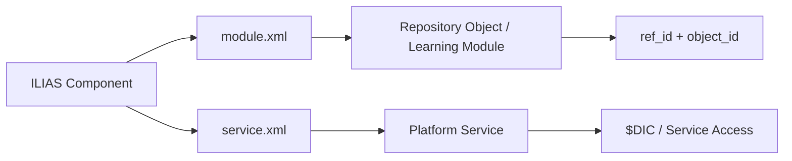

# ILIAS 组件与插件扩展模型

## 1. 组件目录机制

ILIAS 的核心扩展单元是 `components/ILIAS/<ComponentName>`。组件可以包含：

| 文件 | 反推含义 |
|---|---|
| `<Component>.php` | 组件入口类或主声明文件 |
| `module.xml` | 学习对象/仓库模块声明 |
| `service.xml` | 平台服务组件声明 |
| `maintenance.json` | 维护责任和治理元数据 |
| `README.md` | 组件说明 |
| `PRIVACY.md` | 隐私数据说明 |
| `ROADMAP.md` | 演进计划 |
| `classes/`、`src/` | 业务类、GUI、服务、模型 |
| `templates/` | 页面模板 |
| `LuceneObjectDefinition.xml` | 搜索索引声明 |

## 2. 典型组件

| 组件 | 业务域 | PHP文件 | module.xml | service.xml | README |
|---|---|---|---|---|---|
| UI | 界面与前端 | 1300 | False | False | True |
| TestQuestionPool | 测试评估 | 676 | True | False | False |
| MetaData | 内容与元数据 | 653 | False | True | True |
| Test | 测试评估 | 499 | True | False | False |
| Export | 其他组件 | 433 | False | True | True |
| GlobalScreen | 界面与前端 | 286 | False | False | True |
| COPage | 内容与元数据 | 264 | False | True | True |
| ResourceStorage | 平台服务 | 248 | False | True | True |
| Refinery | 其他组件 | 195 | False | False | True |
| Exercise | 课程与学习资源 | 194 | True | False | True |
| LegalDocuments | 其他组件 | 192 | False | True | True |
| Mail | 沟通协作 | 190 | False | True | True |
| DataCollection | 其他组件 | 145 | True | False | False |
| StudyProgramme | 其他组件 | 145 | True | False | False |
| Calendar | 沟通协作 | 141 | False | True | True |
| Skill | 测试评估 | 139 | False | True | True |
| AdvancedMetaData | 内容与元数据 | 137 | False | True | True |
| Survey | 测试评估 | 135 | True | False | True |
| User | 用户与权限 | 130 | False | True | True |
| Certificate | 测试评估 | 128 | False | True | True |
| Style | 界面与前端 | 124 | False | True | False |
| Container | 仓库与对象 | 120 | False | True | True |
| OrgUnit | 用户与权限 | 115 | True | False | False |
| WebServices | 平台服务 | 115 | False | True | False |
| ILIASObject | 仓库与对象 | 112 | False | True | True |

## 3. module 与 service 的设计差异

- `module.xml` 更偏仓库对象和学习对象，例如 Course、Group、Folder、Test、Survey、Exercise、File、Blog、Wiki。
- `service.xml` 更偏基础服务，例如 AccessControl、Authentication、Calendar、Database、Repository、ResourceStorage、WebDAV、Logging、Mail。

## 4. 插件扩展

README 与 composer 配置显示 ILIAS 支持 `public/Customizing/global/plugins` 插件目录。与核心组件相比，插件更像外部扩展；核心组件则是系统内建模块。

## 5. 对本项目的启发

ILIAS 的组件治理值得借鉴：每个模块不只应该有代码，还应该有维护责任、隐私说明、路线图、权限说明、服务声明和对象类型声明。当前赛事系统可以先做“模块说明文件”，不必立即做完整插件加载机制。
