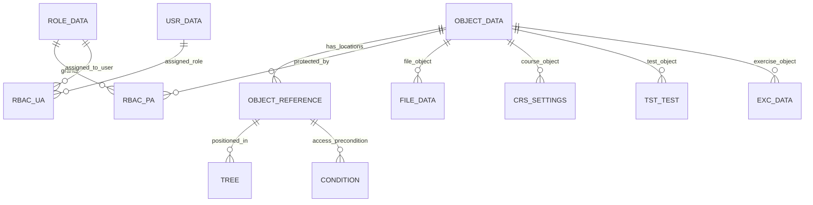

# ILIAS 数据模型与 ER 反向文档

## 1. 数据模型总览

ILIAS 的关键数据模型围绕仓库对象展开。`AccessControl/permission-handling.md` 明确说明：对象由 Object-ID 标识，在仓库树中由 Reference-ID 标识位置；一个对象可以有多个 Reference-ID。

## 2. 表域分布

| 数据域 | 表数量 |
|---|---|
| 其他 | 344 |
| 平台服务 | 226 |
| 测试、评估与证书 | 206 |
| 仓库、课程与学习资源 | 98 |
| 沟通协作 | 71 |
| 用户、对象与权限 | 62 |
| 内容、元数据与作品集 | 59 |

## 3. 核心 ER 图



## 4. 核心建模方式

1. `object_id` 表示对象本体。
2. `ref_id` 表示对象在仓库树中的一个位置。
3. `tree` 表示仓库层级路径。
4. 权限基于对象位置和 RBAC 角色授权。
5. 对象类型还可以提供自己的 Access 类判断状态，例如 offline、前置条件、对象可用性。

## 5. 对赛事系统的启发

赛事系统中很多对象也存在“同一个业务对象在多个位置/上下文出现”的问题，例如证件、资源、评审任务、赛事材料。可借鉴 ILIAS 的思路，把对象本体和展示/组织位置分开：

```text
biz_object_id = 对象本体
scope_ref_id = 对象在赛事/赛场/团队/流程中的位置
scope_tree = 层级路径
permission = 对位置授权
status_check = 对象状态检查
```

完整表清单见 `ILIAS_TABLE_INVENTORY.csv`。
