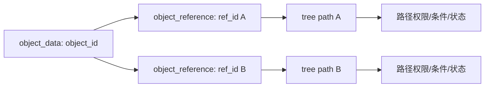

# ILIAS 权限、仓库对象与课程模型

## 1. 权限模型

ILIAS 权限检查由 `ilAccessHandler::checkAccess(permission, cmd, ref_id, type, obj_id)` 统一入口完成。根据项目内文档，检查包括：

1. RBAC 权限。
2. 父路径读权限。
3. 前置条件。
4. 对象状态。

这比简单 `user.role_code` 更严格，也比单纯“对象权限表”更贴近层级仓库系统。

## 2. ref_id 与 object_id

## 3. 仓库对象模型

Course、Group、Folder、File、Test、Survey、Exercise、LearningModule、Wiki、Blog 等都作为仓库对象进入统一树和权限模型。对象类型通过组件/module 声明和类型特定 GUI/Access 类承接差异。

## 4. 对赛事系统的启发

如果未来要支持同一团队/证件/资源在多个赛事、赛场或流程节点中出现，不建议只用一个外键硬连。更稳的方式是：对象本体表 + 位置引用表 + 权限路径 + 状态检查。
