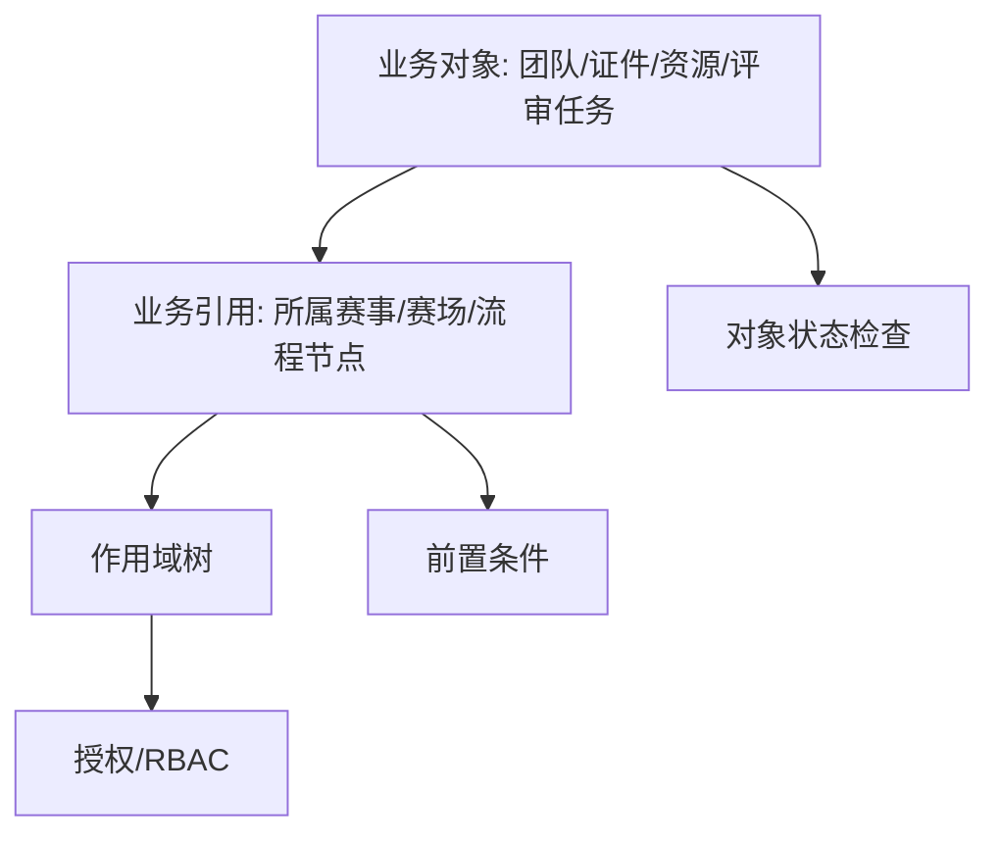

# ILIAS 对当前赛事系统的可借鉴点

## 1. 最值得借鉴

1. **对象本体和位置引用分离**：`object_id/ref_id/tree` 模型非常适合复杂层级和多位置对象。
2. **权限检查分层**：RBAC、路径、前置条件、对象状态一起判断，适合赛事现场和评审场景。
3. **组件治理元数据**：每个模块配套维护、隐私、路线图、服务/模块声明。
4. **学习对象 module 与平台 service 区分**：对赛事系统可类比“业务对象模块”和“平台基础服务”。

## 2. 可映射到赛事系统的模型

## 3. 需要避坑

- 不要照搬历史全局容器模式，当前系统应优先使用清晰的服务注入和模块边界。
- 不要让 GUI/Controller 类无限膨胀，复杂流程应先抽象流程节点和状态事实源。
- 不要只做组件目录，必须有组件说明、权限、数据表、文件区域和事件清单。
- ILIAS 的仓库树模型适合复杂对象层级，如果业务只是简单列表，不必过度设计。

## 4. 建议落地

短期：为赛事、赛场、团队、证件、资源、评审任务建立统一 `scope_ref` 思路。

中期：权限检查从“角色字段”升级为“作用域授权 + 路径可见 + 对象状态”。

长期：形成业务对象模块和平台服务模块两类治理清单。
