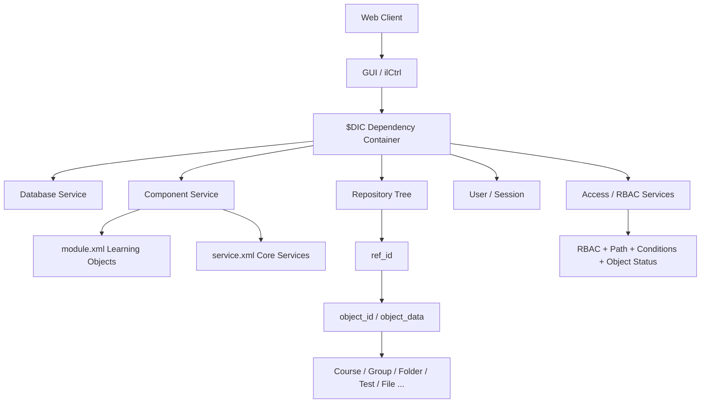

# ILIAS 反向设计总体概览

## 1. 总体判断

ILIAS 是 PHP/Composer 体系下的大型开源 LMS。它与 Moodle 同为 PHP LMS，但组织方式不同：ILIAS 把核心能力拆成 `components/ILIAS/*` 组件目录，每个组件可声明 `module.xml`、`service.xml`、`maintenance.json`、README、PRIVACY、ROADMAP 等治理信息。

从代码证据看，ILIAS 的核心主轴是：仓库对象、Repository Tree、Reference-ID/Object-ID、RBAC 权限、组件服务、DIC 容器、GUI 控制器、学习对象模块、测试评估、文件资源和 WebServices。

## 2. 扫描规模

| 指标 | 数量 |
|---|---:|
| PHP 文件 | 12157 |
| 组件目录 | 193 |
| 类/接口 | 11574 |
| GUI/Controller 类 | 1825 |
| module.xml | 53 |
| service.xml | 75 |
| 数据表候选 | 1066 |

## 3. 组件域分布

| 组件域 | 组件数量 |
|---|---|
| 其他组件 | 58 |
| 课程与学习资源 | 24 |
| 平台服务 | 22 |
| 仓库与对象 | 22 |
| 用户与权限 | 18 |
| 界面与前端 | 14 |
| 沟通协作 | 13 |
| 测试评估 | 13 |
| 内容与元数据 | 9 |

## 4. 系统结构图

## 5. 关键结论

1. ILIAS 的仓库对象模型很强：对象可有 `object_id`，在仓库树中通过一个或多个 `ref_id` 出现。
2. 权限检查不只是 RBAC，还包括父路径可读、前置条件、对象状态检查。
3. 组件治理信息较完整，`maintenance.json`、README、PRIVACY、ROADMAP 对长期维护有价值。
4. 组件有 module/service 两类声明，学习对象和平台服务被区分治理。
5. `$DIC` 是系统级依赖入口，替代大量历史全局变量，但仍保留全局入口风格。
6. 对当前项目最值得借鉴的是“对象引用 + 树位置 + 权限路径 + 对象状态”组合模型。
