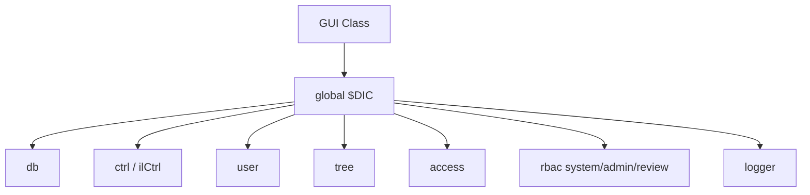

# ILIAS UI、服务与前端模型

## 1. UI 模型

ILIAS 传统 UI 以 PHP GUI 类和模板为主，常见类名包含 `GUI`，扫描识别出 1825 个 GUI/Controller 类。`ilCtrl` 是控制流的重要对象，`$DIC->ctrl()` 提供控制器访问。

## 2. DIC 服务入口

`components/ILIAS/DI/README.md` 明确说明 `$DIC` 是全局依赖容器，可以访问 db、ctrl、user、tree、language、access、tabs、toolbar、rbac、logger 等核心服务。

## 3. 前端资源

根目录存在 `templates/default`、`package.json`、LESS/JS 资源，组件内也有模板。ILIAS 的前端不是现代纯 SPA，而是 PHP 服务端渲染和 UI 组件库逐步演进的混合形态。

## 4. 风险

- 全局 `$DIC` 方便但容易形成隐式依赖。
- GUI 类数量大，若没有严格路由和职责划分，维护成本较高。
- 组件数量多，必须依赖维护元数据和组件边界治理。
