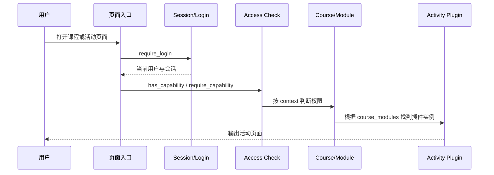
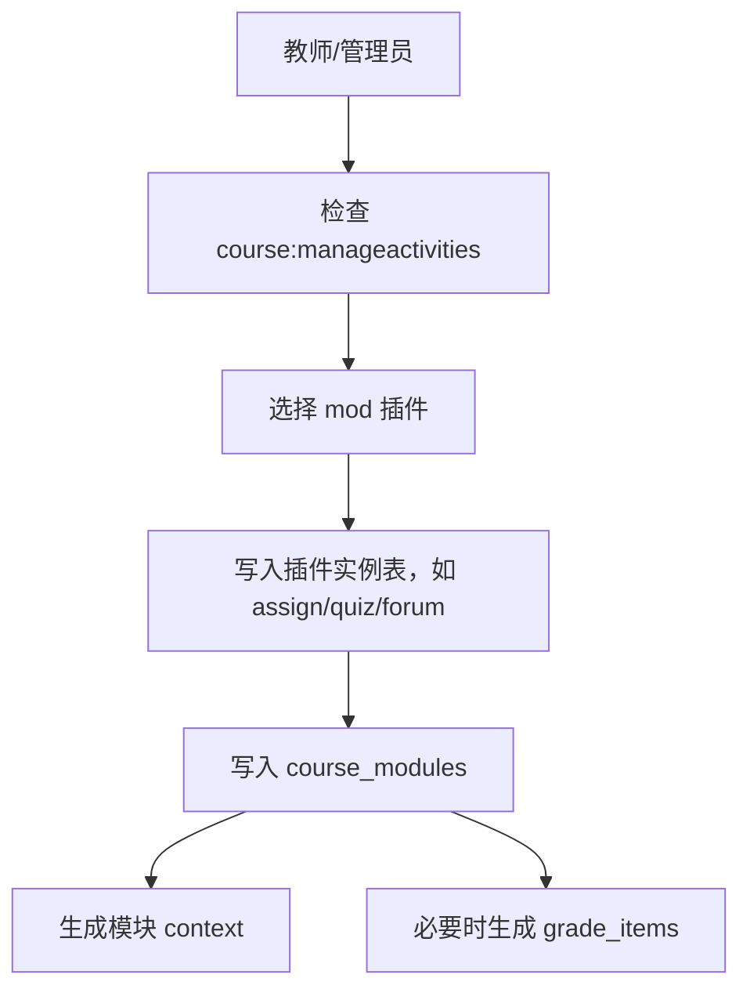
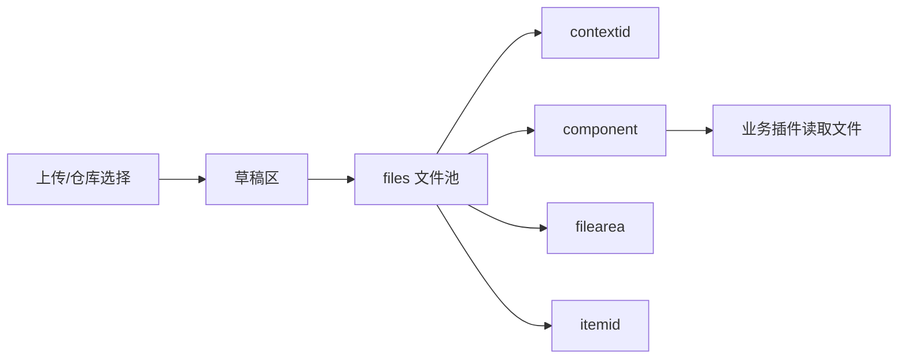

# Moodle 核心业务流程反向文档

## 1. 用户访问课程活动

## 2. 用户进入课程

反向需求：课程参与资格不是直接写在课程成员字段中，而是由选课实例和用户选课事实表达。角色分配再补充教师、学生、助教、管理者等权限差异。

## 3. 课程活动创建

## 4. 作业/测验评分

## 5. 文件处理流程

## 6. 外部服务调用

## 7. 关键代码证据

| 机制 | 证据示例 |
|---|---|
| 登录要求 | `require_login` 在入口、文件、课程、仓库等脚本中出现 |
| 权限判断 | `has_capability`、`require_capability` 结合 `context_*::instance()` 使用 |
| 课程模块缓存 | `get_fast_modinfo` 在课程页面和模块处理中使用 |
| 文件池 | `get_file_storage` 在文件、仓库、能力等模块中使用 |
| 服务注册 | `db/services.php` 与 `external_services`、`external_functions` 表 |
