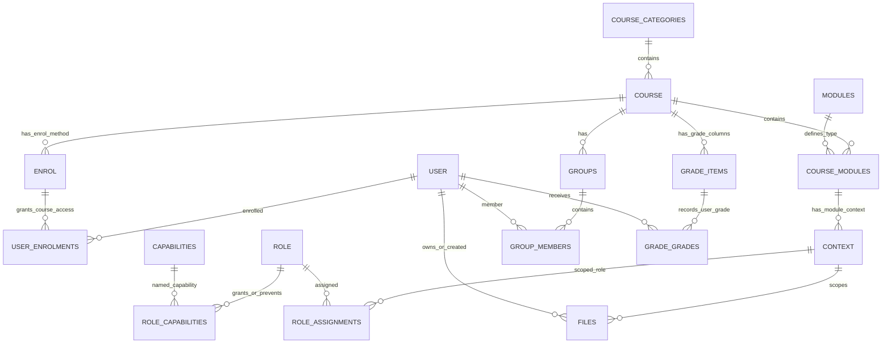

# Moodle 数据模型与 ER 反向文档

## 1. 数据模型总体判断

Moodle 的数据模型以“课程”为业务容器，以“上下文”为权限边界，以“插件实例”为课程内行为，以“文件池、成绩册、日志”为跨业务公共事实。核心表不试图保存所有业务细节，而是把插件实例挂接到统一骨架上。

## 2. 表域分布

| 业务域 | 表数量 | 说明 |
|---|---:|---|
| 活动与资源 | 137 | 课程内活动、资源、测验、作业、论坛、LTI、SCORM 等插件表 |
| 其他/插件扩展 | 94 | 插件或专项能力表 |
| 用户与身份 | 47 | 用户、登录、认证、会话、外部令牌、消息接收关系等 |
| 站点配置与升级 | 38 | 站点配置、插件配置、升级日志、缓存/任务等平台运维表 |
| 课程与分类 | 37 | 课程、分类、上下文、课程模块、文件等核心骨架 |
| 日志与分析 | 37 | 日志、分析、报表、徽章、能力等学习过程数据 |
| 题库与测验 | 23 | 题目版本、题库条目、题型配置、测验相关表 |
| 选课与群组 | 22 | 选课实例、用户选课、群组、班级/群体、角色分配 |
| 消息与日历 | 16 | 插件或专项能力表 |
| 成绩与完成 | 15 | 成绩册、成绩项、个人成绩、完成状态 |
| 权限与上下文 | 9 | 角色、能力点、角色覆盖、上下文权限 |
| 文件与内容仓库 | 8 | 文件池、仓库引用、内容银行、H5P |
| 隐私与合规 | 4 | 插件或专项能力表 |

## 3. 核心 ER 图

## 4. 核心表清单

| 表 | 业务域 | 反推含义 | 主要键/索引 | 证据 |
|---|---|---|---|---|
| `config` | 站点配置与升级 | Moodle configuration variables | primary(id); unique(name);  | `public/lib/db/install.xml` |
| `config_plugins` | 站点配置与升级 | Moodle modules and plugins configuration variables | primary(id); unique(plugin, name);  | `public/lib/db/install.xml` |
| `user` | 用户与身份 | One record for each person | primary(id); U(mnethostid, username); I(deleted); I(confirmed); I(firstname) | `public/lib/db/install.xml` |
| `course` | 课程与分类 | Central course table | primary(id); foreign(originalcourseid)->course; I(category); I(idnumber); I(shortname); I(sortorder) | `public/lib/db/install.xml` |
| `course_categories` | 课程与分类 | Course categories | primary(id); foreign(parent)->course_categories;  | `public/lib/db/install.xml` |
| `context` | 课程与分类 | one of these must be set | primary(id); U(contextlevel, instanceid); I(instanceid); I(path) | `public/lib/db/install.xml` |
| `role` | 权限与上下文 | moodle roles | primary(id); U(sortorder); U(shortname) | `public/lib/db/install.xml` |
| `capabilities` | 权限与上下文 | this defines all capabilities | primary(id); unique(name);  | `public/lib/db/install.xml` |
| `role_assignments` | 选课与群组 | assigning roles in different context | primary(id); foreign(roleid)->role; foreign(contextid)->context; foreign(userid)->user; I(sortorder); I(roleid, contextid); I(userid, contextid, roleid); I(component, ite | `public/lib/db/install.xml` |
| `role_capabilities` | 权限与上下文 | permission has to be signed, overriding a capability for a particular role in a particular context | primary(id); foreign(roleid)->role; foreign(contextid)->context; foreign(modifierid)->user; foreign(capability)->capabilities; U(roleid, contextid, capability) | `public/lib/db/install.xml` |
| `enrol` | 选课与群组 | Instances of enrolment plugins used in courses, fields marked as custom have a plugin defined meaning, core does not touch them. Create a new linked table if you need even more custom fields. | primary(id); foreign(courseid)->course; foreign(roleid)->role; I(enrol) | `public/lib/db/install.xml` |
| `user_enrolments` | 用户与身份 | Users participating in courses (aka enrolled users) - everybody who is participating/visible in course, that means both teachers and students | primary(id); foreign(enrolid)->enrol; foreign(userid)->user; foreign(modifierid)->user; U(enrolid, userid) | `public/lib/db/install.xml` |
| `groups` | 选课与群组 | Each record represents a group. | primary(id); foreign(courseid)->course; I(idnumber) | `public/lib/db/install.xml` |
| `cohort` | 选课与群组 | Each record represents one cohort (aka site-wide group). | primary(id); foreign(contextid)->context;  | `public/lib/db/install.xml` |
| `modules` | 活动与资源 | modules available in the site | primary(id); I(name) | `public/lib/db/install.xml` |
| `course_modules` | 课程与分类 | course_modules table retrofitted from MySQL | primary(id); foreign(groupingid)->groupings; I(visible); I(course); I(module); I(instance) | `public/lib/db/install.xml` |
| `files` | 课程与分类 | description of files, content is stored in sha1 file pool | primary(id); foreign(contextid)->context; foreign(userid)->user; foreign(referencefileid)->files_reference; I(component, filearea, contextid, itemid); I(contenthash); U(p | `public/lib/db/install.xml` |
| `files_reference` | 课程与分类 | Store files references | primary(id); foreign(repositoryid)->repository_instances; U(referencehash, repositoryid) | `public/lib/db/install.xml` |
| `grade_items` | 成绩与完成 | This table keeps information about gradeable items (ie columns). If an activity (eg an assignment or quiz) has multiple grade_items associated with it (eg several outcomes or numerical grades), then there will be a corresponding multiple number of rows in this table. | primary(id); foreign(courseid)->course; foreign(categoryid)->grade_categories; foreign(scaleid)->scale; foreign(outcomeid)->grade_outcomes; I(locked, locktime); I(itemtyp | `public/lib/db/install.xml` |
| `grade_grades` | 成绩与完成 | grade_grades  This table keeps individual grades for each user and each item, exactly as imported or submitted by modules. The rawgrademax/min and rawscaleid are stored here to record the values at the time the grade was stored, because teachers might change this for an activity! All the results are normalised/resampled for the final grade value. | primary(id); foreign(itemid)->grade_items; foreign(userid)->user; foreign(rawscaleid)->scale; foreign(usermodified)->user; unique(userid, itemid); I(locked, locktime) | `public/lib/db/install.xml` |
| `question` | 题库与测验 | This table stores the definition of one version of a question. | primary(id); foreign(parent)->question; foreign(createdby)->user; foreign(modifiedby)->user; I(qtype) | `public/lib/db/install.xml` |
| `question_bank_entries` | 题库与测验 | Each question bank entry. This table has one row for each question that appears in the question bank. | primary(id); foreign(questioncategoryid)->question_categories; foreign(ownerid)->user; U(questioncategoryid, idnumber) | `public/lib/db/install.xml` |
| `question_versions` | 题库与测验 | A join table linking the different question version definitions in the question table to the question_bank_entires. | primary(id); foreign(questionbankentryid)->question_bank_entries; foreign(questionid)->question; U(questionbankentryid, version) | `public/lib/db/install.xml` |
| `quiz` | 活动与资源 | The settings for each quiz. | primary(id); I(course) | `public/mod/quiz/db/install.xml` |
| `assign` | 活动与资源 | This table saves information about an instance of mod_assign in a course. | primary(id); I(course); I(teamsubmissiongroupingid); I(gradepenalty) | `public/mod/assign/db/install.xml` |
| `forum` | 活动与资源 | Forums contain and structure discussion | primary(id); I(course) | `public/mod/forum/db/install.xml` |
| `external_services` | 其他/插件扩展 | built in and custom external services | primary(id); U(name) | `public/lib/db/install.xml` |
| `external_functions` | 其他/插件扩展 | list of all external functions | primary(id); U(name) | `public/lib/db/install.xml` |
| `badge` | 日志与分析 | Defines badge | primary(id); foreign(courseid)->course; foreign(usermodified)->user; foreign(usercreated)->user; I(type) | `public/lib/db/install.xml` |
| `competency` | 日志与分析 | This table contains the master record of each competency in a framework | primary(id); foreign(scaleid)->scale; foreign(usermodified)->user; U(competencyframeworkid, idnumber); I(ruleoutcome) | `public/lib/db/install.xml` |
| `message` | 消息与日历 | Stores all unread messages | primary(id); I(useridfrom, useridto, timeuserfromdeleted, timeusertodeleted); I(useridfrom, timeuserfromdeleted, notification); I(useridto, timeusertodeleted, notificatio | `public/lib/db/install.xml` |
| `notifications` | 消息与日历 | Stores all notifications | primary(id); foreign(useridto)->user; I(useridfrom); I(timecreated); I(timeread) | `public/lib/db/install.xml` |

## 5. 关键建模方式

### 5.1 课程与活动实例分离

`course` 只描述课程级属性。`modules` 注册活动类型，`course_modules` 连接课程、活动类型和具体插件实例。具体活动如 `assign`、`quiz`、`forum` 分别有自己的业务表。

### 5.2 权限和业务对象通过 context 连接

`context` 表用 `contextlevel + instanceid + path + depth` 建立权限树。角色分配、文件、课程模块等都可以落到对应 context 上。

### 5.3 选课方式和选课事实分离

`enrol` 表表示课程中的选课方式，例如 manual/self/guest/cohort；`user_enrolments` 表表示某个用户通过某个选课实例成为课程参与者。

### 5.4 文件池模型

`files` 表不直接依赖某个业务表，而是通过 `contextid + component + filearea + itemid + filepath + filename` 定位文件归属。文件内容由 `contenthash` 指向文件池。

### 5.5 成绩册模型

`grade_items` 是课程成绩列，`grade_grades` 是用户在成绩列上的事实记录。该设计允许活动插件统一接入成绩册。

## 6. 对本项目的启发

- 如果业务对象越来越多，建议建立统一“业务对象上下文”或“资源作用域”概念，减少权限和文件逻辑重复。
- 如果赛事活动类似课程活动，可以借鉴 `course_modules` 的挂接方式，形成统一赛事模块实例表。
- 文件管理建议参考 Moodle 的 `component/filearea/itemid` 思路，而不是每张业务表各写一套附件字段。
