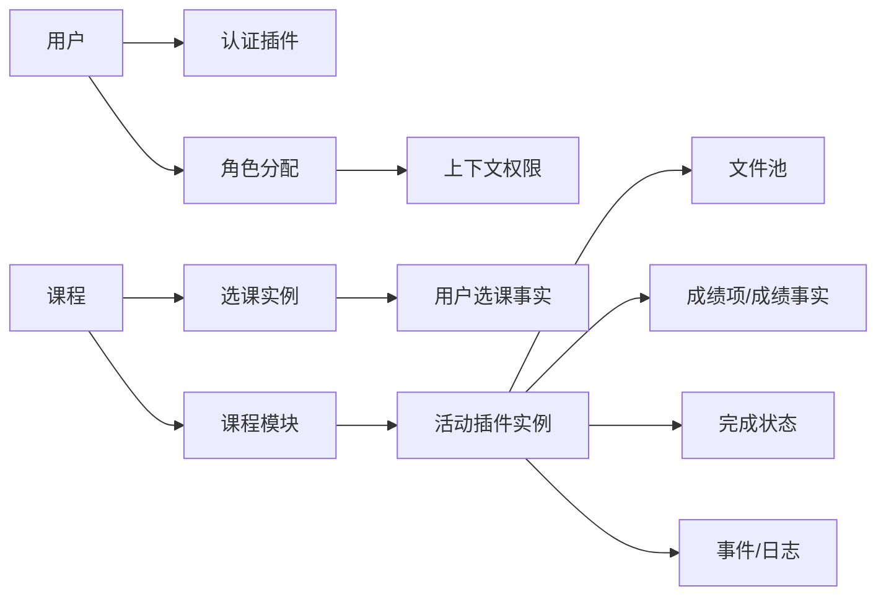

# Moodle 功能需求反向确认

## 1. 说明

本文件不是从产品说明书整理，而是基于数据库定义、插件目录、权限注册、服务注册和关键调用反向确认系统需求。每条需求都对应到源码或结构证据。

## 2. 需求清单

| 编号 | 业务域 | 反向需求描述 | 代码证据 |
|---|---|---|---|
| R01 | 用户与认证 | 系统应支持多种认证来源，包括手工账号、邮箱、LDAP、OAuth2、LTI、Shibboleth、WebService 等。 | auth 插件目录与 `auth/*/db` 文件 |
| R02 | 用户与认证 | 系统应维护用户状态，包括 confirmed、deleted、suspended、lastaccess、auth、mnethostid 等字段。 | `user` 表 |
| R03 | 权限 | 系统应支持按上下文分配角色和覆盖权限。 | `context`、`role_assignments`、`role_capabilities`、`capabilities` 表 |
| R04 | 课程 | 系统应支持课程分类、课程可见性、课程格式、日期、完成设置、主题和语言设置。 | `course_categories`、`course` 表 |
| R05 | 选课 | 系统应支持多种选课方式，并把课程内选课方式与用户选课事实分离。 | `enrol`、`user_enrolments` 表及 enrol 插件 |
| R06 | 群组 | 系统应支持课程内群组、分组、群体/cohort。 | `groups`、`group_members`、`groupings`、`cohort` 表 |
| R07 | 活动与资源 | 系统应支持课程内可插拔活动，包括作业、测验、论坛、资源、页面、SCORM、LTI、Workshop 等。 | `mod/*` 插件与 `modules`、`course_modules` 表 |
| R08 | 题库与测验 | 系统应支持题库、题目版本、题型插件、测验尝试和测验报表。 | `question*`、`quiz*` 表与 qtype/qbank/quizreport 插件 |
| R09 | 成绩 | 系统应将活动成绩抽象为成绩项，并记录每个用户的成绩事实和快照字段。 | `grade_items`、`grade_grades` 表 |
| R10 | 文件 | 系统应支持统一文件池和外部仓库来源，业务插件通过 component/filearea/itemid 关联文件。 | `files`、`files_reference` 表与 repository 插件 |
| R11 | 内容呈现 | 系统应支持主题、模板和前端模块化资源。 | theme 插件、`templates`、`amd/src` |
| R12 | 服务接口 | 系统应将外部服务函数集中注册，并支持移动端服务能力。 | `db/services.php`、`external_services`、`external_functions` |
| R13 | 日志与分析 | 系统应记录学习和管理行为，并支持分析、报表、徽章、能力等扩展域。 | logstore、analytics、report、badge、competency 表/插件 |
| R14 | 隐私合规 | 系统应支持数据隐私、政策、回收站、MFA 等管理能力。 | admin/tool/dataprivacy、policy、recyclebin、mfa |

## 3. 需求之间的主线关系

## 4. 需求表达特点

- Moodle 把教育业务能力拆成扩展点，每种能力都有目录级约定，例如 `mod`、`enrol`、`auth`、`repository`、`qtype`。
- 数据结构中大量使用 `component`、`itemid`、`contextid`、`filearea` 这类通用定位字段，降低核心表和插件表的耦合。
- 业务权限不直接写死在页面，而是通过 `require_login`、`has_capability`、`require_capability` 等函数在上下文中判断。
- API 能力不是散落暴露，而是由 `db/services.php` 注册，再进入外部服务表。
