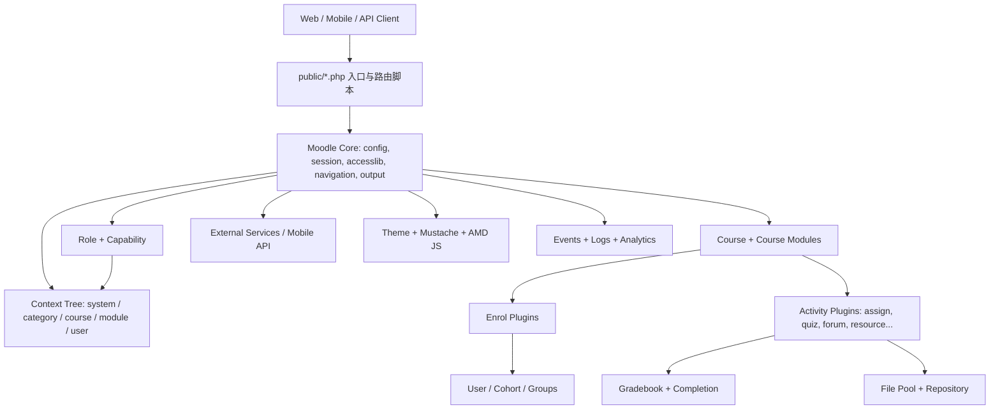

# Moodle 反向设计总体概览

## 1. 总体判断

该代码集是一个成熟的教育平台型系统，整体形态不是简单课程应用，而是“模块化单体 + 插件生态 + 上下文权限模型 + XMLDB 数据定义”的平台架构。代码中的核心业务主轴为：站点配置、用户、课程分类、课程、选课、课程活动、文件、成绩、题库、消息、日志、分析、移动端/外部服务。

从源码证据看，Moodle 的核心设计不是围绕一个固定业务流程写死，而是把教育业务拆成稳定内核和大量可插拔组件：认证插件负责用户来源，选课插件负责进入课程，活动插件负责教学行为，题型插件负责测评表达，仓库插件负责文件来源，主题插件负责界面呈现。

## 2. 规模与证据

| 指标 | 数量 | 证据 |
|---|---:|---|
| 可识别插件目录 | 358 | `MOODLE_PLUGIN_INVENTORY.csv` |
| XMLDB 表定义 | 487 | `MOODLE_TABLE_INVENTORY.csv` |
| 权限点 | 774 | `*/db/access.php` |
| 外部服务注册 | 521 | `*/db/services.php` |
| PHP 文件 | 14739 | 源码扫描 |
| Mustache 模板 | 1272 | 源码扫描 |

## 3. 系统结构图

## 4. 业务域分布

| 业务域 | 表数量 | 说明 |
|---|---:|---|
| 活动与资源 | 137 | 课程内活动、资源、测验、作业、论坛、LTI、SCORM 等插件表 |
| 其他/插件扩展 | 94 | 插件或专项能力表 |
| 用户与身份 | 47 | 用户、登录、认证、会话、外部令牌、消息接收关系等 |
| 站点配置与升级 | 38 | 站点配置、插件配置、升级日志、缓存/任务等平台运维表 |
| 课程与分类 | 37 | 课程、分类、上下文、课程模块、文件等核心骨架 |
| 日志与分析 | 37 | 日志、分析、报表、徽章、能力等学习过程数据 |
| 题库与测验 | 23 | 题目版本、题库条目、题型配置、测验相关表 |
| 选课与群组 | 22 | 选课实例、用户选课、群组、班级/群体、角色分配 |
| 消息与日历 | 16 | 插件或专项能力表 |
| 成绩与完成 | 15 | 成绩册、成绩项、个人成绩、完成状态 |
| 权限与上下文 | 9 | 角色、能力点、角色覆盖、上下文权限 |
| 文件与内容仓库 | 8 | 文件池、仓库引用、内容银行、H5P |
| 隐私与合规 | 4 | 插件或专项能力表 |

## 5. 核心设计结论

1. Moodle 采用强插件化架构，插件不是附属代码，而是业务建模的一等机制。
2. 用户权限不是简单角色字段，而是“上下文 + 角色 + 能力点 + 覆盖规则”的组合。
3. 课程是业务容器，活动插件是课程内的业务实例，`course_modules` 将课程和插件实例连接起来。
4. 选课是独立域，`enrol` 表表示课程中的选课方式，`user_enrolments` 表表示用户参与课程的事实。
5. 文件不是直接挂在业务表字段中，而是通过 `contextid + component + filearea + itemid` 形成统一文件池引用。
6. 成绩是独立事实模型，活动通过成绩项和成绩更新机制接入成绩册。
7. 外部服务、移动端接口、插件服务统一通过 `db/services.php` 注册，天然支持 API 能力治理。
8. Moodle 对“多租户”的支持更接近站点内组织隔离和上下文权限隔离，不是典型 SaaS 租户库隔离模型。

## 6. 后续阅读顺序

建议先读架构与插件模型，再读数据模型，之后根据关心点阅读用户权限、多租户、流程和接口文档。
