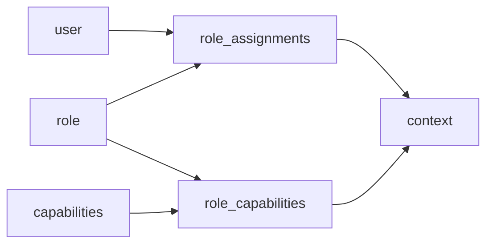

# Moodle 用户、权限与多租户特征反向文档

## 1. 用户管理特征

Moodle 的用户模型是平台级用户模型。`user` 表保存账号、认证来源、个人资料、状态、登录时间和偏好字段。用户不是绑定到某个课程或组织后才存在，而是先作为站点用户存在，再通过选课、角色分配、群组、cohort 进入具体业务范围。

关键字段包括：`auth`、`confirmed`、`deleted`、`suspended`、`mnethostid`、`username`、`email`、`firstaccess`、`lastaccess`、`lastlogin`、`timezone`、`theme` 等。

## 2. 认证插件

源码中存在 9 类 `auth` 插件：email、ldap、lti、manual、nologin、none、oauth2、shibboleth、webservice。由此可反推需求：系统需要支持本地账号、目录服务、第三方身份、学习工具互操作和服务账号等多来源身份。

## 3. 权限模型

Moodle 权限不是“用户表里一个角色字段”，而是四层组合：

1. `capabilities` 定义能力点。
2. `role` 定义角色。
3. `context` 定义作用域。
4. `role_assignments` 和 `role_capabilities` 把用户、角色、能力、作用域连接起来。

这种模型允许同一个人在系统级、分类级、课程级、活动级拥有不同权限。例如一个用户可以是 A 课程教师、B 课程学生、某课程分类管理员。

## 4. 多租户特征判断

Moodle 不是典型 SaaS 多租户架构。当前代码证据中没有发现以 tenant/account/org 为第一层隔离主轴的统一租户表。它更像“单站点多组织/多课程空间”：

- 通过 `course_categories` 做课程组织。
- 通过 `context` 做权限隔离。
- 通过 `cohort` 做跨课程人群管理。
- 通过 `groups` 做课程内分组。
- 通过主题、语言、课程分类可见性实现局部差异化。
- 通过角色能力控制不同范围的管理权。

因此，Moodle 的可借鉴点不是租户库隔离，而是“一个平台内按上下文做精细授权”。

## 5. 和 Canvas 型多租户的差异

| 维度 | Moodle | Canvas 常见思路 |
|---|---|---|
| 顶层隔离 | 站点为主，课程分类/上下文分域 | account/sub-account 组织树更强 |
| 用户归属 | 用户为站点用户，可进入多个课程/组织范围 | 用户与账号/课程关系更强调组织层级 |
| 权限表达 | context + role + capability | account/course 权限体系 |
| 插件生态 | 强插件目录约定 | 强 LTI/API/引擎式扩展 |
| 适合借鉴 | 细粒度权限、课程内活动插件、统一文件池 | 组织租户层级、SaaS 管理边界 |

## 6. 对本项目的建议

如果当前系统重点是赛事平台，不建议直接照搬 Moodle 的完整权限体系。但可以借鉴三点：

1. 建立统一作用域模型，例如平台、赛事、赛程、赛场、团队、证件、资源。
2. 权限不要只靠用户角色字段，至少支持“同一用户在不同赛事/赛场拥有不同角色”。
3. 用户主数据、业务参与事实、证件/资格/授权事实要分离。
