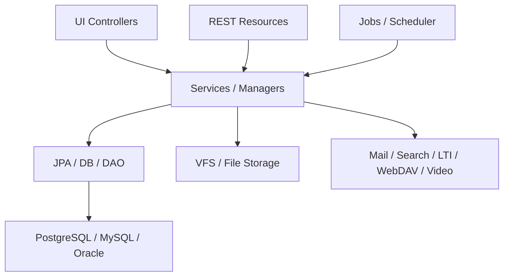

# OpenOLAT 架构与分层模型

## 1. 技术栈

基于 `pom.xml` 和项目内架构文档，OpenOLAT 是 Java 17 + Maven WAR 应用。核心依赖包括 Spring、Hibernate/JPA、Apache CXF、Velocity、Infinispan、Lucene、JMS/Artemis、数据库驱动等。

| 层次 | 技术/代码证据 | 反推职责 |
|---|---|---|
| Web 入口 | `OpenOLATServlet`、多环境 `web.xml` | 接收请求、进入分发框架 |
| 分发层 | `DispatcherModule`、`AuthenticatedDispatcher`、`DMZDispatcher`、`RESTDispatcher` | 区分登录区、未登录区、REST、静态资源、Mapper |
| UI 层 | `BasicController`、`FormBasicController`、Velocity 模板 | 服务端组件树、事件处理、局部渲染 |
| 服务层 | Manager/Service 类、Spring XML/注解 | 承载业务逻辑与事务边界 |
| 持久化层 | JPA 实体、Hibernate、DB Facade | 数据访问、实体关系、事务 |
| 资源层 | Repository、VFS、OlatResource | 学习资源、文件、课程资源统一管理 |
| API 层 | REST/JAX-RS 类、CXF | 外部系统集成 |

## 2. 分层依赖

## 3. 与 Moodle 的架构差异

| 维度 | OpenOLAT | Moodle |
|---|---|---|
| 技术栈 | Java / Spring / Hibernate / Velocity | PHP / XMLDB / Mustache / AMD |
| UI 模型 | 服务端状态 UI，组件树在服务器 | 服务端页面 + 插件渲染 + 局部 JS |
| 扩展组织 | Java 包、Spring Bean、课程节点、模块服务 | 插件目录 `mod/auth/enrol/qtype` 等 |
| 数据模型 | JPA 实体 + SQL 初始化脚本 | XMLDB install.xml + plugin install.xml |
| 业务主轴 | RepositoryEntry、Course、CourseNode、Assessment | Course、CourseModules、Activity Plugin |
| 运行特征 | 会话状态重、UI 生命周期强 | 插件生态强、PHP 部署直观 |

## 4. 架构特点

- 强服务端控制：安全、状态和渲染主要在服务端完成。
- 高内聚功能包：业务包附近同时存在 UI、服务、模型、模板和语言资源。
- 课程引擎复杂：`org.olat.course` 和 `org.olat.course.nodes` 是核心大模块。
- 资源仓库中心化：课程、文件、内容、访问控制都围绕 Repository/OlatResource 建模。
- 企业化集成多：LTI、QTI、SCORM、BigBlueButton、Teams、SharePoint、WebDAV 等能力较多。
