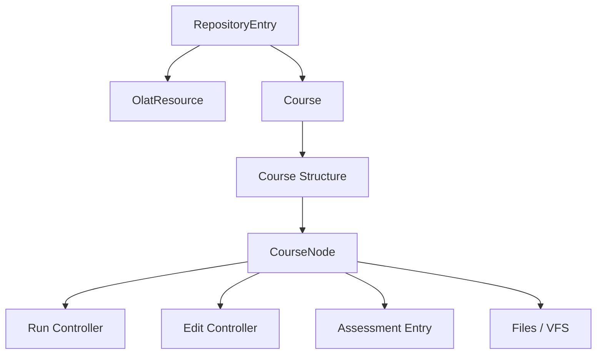

# OpenOLAT 课程、资源仓库与测评模型

## 1. RepositoryEntry 是资源入口

OpenOLAT 把课程和学习资源统一放到 Repository 体系下。`RepositoryService` 和 `RepositoryServiceImpl` 是核心服务，`o_repositoryentry` 与 `o_olatresource` 是核心表之一。

这和 Moodle 的 `course` 主表不同：OpenOLAT 更强调“学习资源仓库”，课程是仓库中的一种重要资源。

## 2. 课程引擎

`org.olat.course` 是第二大包，包含课程装载、运行、编辑、成员、证书、学习路径、统计、提醒、节点等能力。`CourseFactory` 是课程访问/加载的重要入口。

课程结构通过 CourseNode 表达，节点承载不同教学活动或资源。

## 3. 测评和成绩

OpenOLAT 的测评模型覆盖：

- QTI 2.1：`org.olat.ims.qti21` 与 `o_qti_*` 表。
- Assessment：`o_as_*` 表，记录测评条目、模式、补偿、检查、消息等。
- Grade：`o_gr_*` 表，支持等级体系、分档、评分尺度。
- GTA/任务：`o_gta_*` 表，支持任务、提交、修订、同伴评审等。

## 4. 对赛事系统的启发

赛事系统中的“项目/赛项/环节/评审/成绩”可以借鉴 OpenOLAT：

- 赛事或赛项作为统一资源入口。
- 报名、评审、现场核验、资源预约作为节点或模块实例。
- 评审评分进入统一 Assessment/Grade 事实模型。
- 证书/证件/成绩单独立建模，不要混入主赛事表。
