# OpenOLAT 数据模型与 ER 反向文档

## 1. 数据模型概览

OpenOLAT 同时使用 JPA 实体和数据库初始化脚本。源码中识别出 381 个 JPA 实体，PostgreSQL 初始脚本定义 339 张表。表名前缀普遍使用 `o_`，并通过子前缀区分业务域，例如 `o_bs_*`、`o_re_*`、`o_as_*`、`o_qp_*`、`o_vfs_*`、`o_lti_*`。

## 2. 表域分布

| 数据域 | 表数量 |
|---|---|
| 其他业务模块 | 126 |
| 用户、组织与权限 | 33 |
| 测评、作业与成绩 | 32 |
| 作品集与内容编辑 | 22 |
| 质量管理与表单 | 19 |
| 项目与协作 | 17 |
| 订单、付费与访问控制 | 14 |
| 在线会议集成 | 14 |
| 资源仓库与课程资源 | 11 |
| 日志、统计与平台运维 | 11 |
| 题库 | 11 |
| LTI集成 | 9 |
| 课程体系与培养计划 | 6 |
| 即时消息 | 4 |
| 文件与VFS | 4 |
| 通知 | 3 |
| 日历 | 3 |

## 3. JPA 实体域分布

| 实体域 | JPA实体数量 |
|---|---|
| 业务模块 | 197 |
| 课程引擎 | 44 |
| 核心框架 | 35 |
| 用户与权限 | 23 |
| 资源标识 | 22 |
| 标准协议/IMS | 14 |
| 资源仓库 | 11 |
| 群组 | 11 |
| 通用服务 | 8 |
| 其他 | 5 |
| 用户 | 4 |
| 即时消息 | 4 |
| 注册 | 2 |
| 认证登录 | 1 |

## 4. 核心 ER 图

```mermaid
erDiagram
    O_BS_IDENTITY ||--o{ O_BS_AUTHENTICATION : has_login
    O_BS_IDENTITY ||--o{ O_BS_GROUP_MEMBER : member_of
    O_BS_GROUP ||--o{ O_BS_GROUP_MEMBER : contains
    O_BS_GROUP ||--o{ O_BS_GRANT : grants_right
    O_REPOSITORYENTRY ||--o{ O_RE_TO_GROUP : secured_by
    O_BS_GROUP ||--o{ O_RE_TO_GROUP : used_by_repository
    O_REPOSITORYENTRY ||--|| O_OLATRESOURCE : references
    O_REPOSITORYENTRY ||--o{ O_AS_ENTRY : assessment_entry
    O_BS_IDENTITY ||--o{ O_AS_ENTRY : assessed_user
    O_REPOSITORYENTRY ||--o{ O_RE_TO_TAX_LEVEL : taxonomy
    O_VFS_METADATA ||--o{ O_VFS_REVISION : has_revision
    O_QP_ITEM ||--o{ O_QP_POOL_2_ITEM : in_pool
    O_QP_POOL ||--o{ O_QP_POOL_2_ITEM : contains
    O_AC_OFFER ||--o{ O_AC_ORDER_LINE : purchased_as
    O_AC_ORDER ||--o{ O_AC_ORDER_LINE : contains
```

## 5. 核心表组解释

| 表组 | 代表表 | 设计含义 |
|---|---|---|
| 用户/权限 | `o_bs_identity`、`o_user`、`o_bs_group`、`o_bs_group_member`、`o_bs_grant` | 身份、用户资料、组、成员关系和授权 |
| 资源仓库 | `o_repositoryentry`、`o_olatresource`、`o_re_to_group` | 学习资源/课程资源的统一入口 |
| 测评成绩 | `o_as_entry`、`o_as_eff_statement`、`o_qti_*`、`o_gr_*` | 测评事实、成绩、QTI 会话和等级体系 |
| 文件/VFS | `o_vfs_metadata`、`o_vfs_revision`、`o_vfs_thumbnail` | 虚拟文件系统元数据、版本和缩略图 |
| 题库 | `o_qp_item`、`o_qp_pool`、`o_qp_collection_2_item` | 题目、题库、集合、共享 |
| 访问控制/订单 | `o_ac_offer`、`o_ac_order`、`o_ac_transaction`、`o_ac_reservation` | 付费/访问控制/订单交易 |
| 课程体系 | `o_cur_*` 或课程体系相关实体 | Curriculum 和组织结构 |
| 外部集成 | `o_lti_*`、`o_bbb_*`、`o_teams_*` | LTI 和会议系统集成 |

完整清单见 `OPENOLAT_TABLE_INVENTORY.csv` 与 `OPENOLAT_ENTITY_INVENTORY.csv`。
