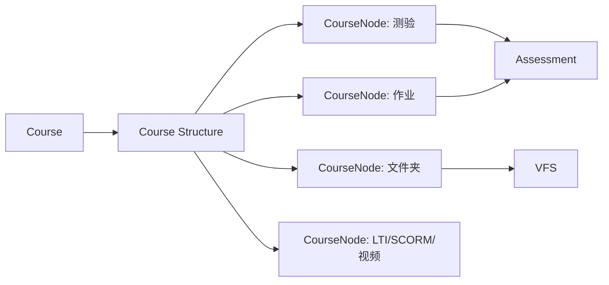

# OpenOLAT 模块与扩展机制反向文档

## 1. 不是 Moodle 式插件，但有多种扩展点

OpenOLAT 没有像 Moodle 那样把插件分成 `mod/auth/enrol/repository/qtype` 的目录体系。它的扩展更分散在 Java 架构内部：

- 课程节点扩展：`org.olat.course.nodes` 下不同节点类型。
- 业务模块扩展：`org.olat.modules.*` 下的主题、讲座、质量、课程体系、作品集、视频等。
- Spring Bean 扩展：`_spring/*.xml` 或注解注册服务。
- UI 扩展：Controller + Velocity + i18n 共置。
- REST 扩展：JAX-RS Resource 类。
- Repository/VFS 扩展：学习资源类型、文件资源、内容资源。
- 外部标准扩展：LTI、QTI、SCORM、WebDAV、会议系统。

## 2. 细分包分布

| 细分包前缀 | Java文件数 | 反推业务域 |
|---|---|---|
| org.olat.course.nodes | 1097 | 课程引擎 |
| org.olat.core.gui | 833 | 核心框架 |
| org.olat.core.commons | 805 | 核心框架 |
| org.olat.ims.qti21 | 401 | 标准协议/IMS |
| org.olat.modules.curriculum | 383 | 业务模块 |
| org.olat.course.assessment | 349 | 课程引擎 |
| org.olat.modules.lecture | 344 | 业务模块 |
| org.olat.modules.quality | 335 | 业务模块 |
| org.olat.core.util | 311 | 核心框架 |
| org.olat.modules.forms | 283 | 业务模块 |
| org.olat.modules.ceditor | 253 | 业务模块 |
| org.olat.modules.project | 217 | 业务模块 |
| org.olat.resource.accesscontrol | 213 | 资源标识 |
| org.olat.modules.qpool | 211 | 业务模块 |
| org.olat.modules.portfolio | 200 | 业务模块 |
| org.olat.repository.ui | 193 | 资源仓库 |
| org.olat.modules.video | 177 | 业务模块 |
| org.olat.modules.topicbroker | 144 | 业务模块 |
| org.olat.modules.coach | 141 | 业务模块 |
| org.olat.modules.certificationprogram | 141 | 业务模块 |
| org.olat.group.ui | 134 | 群组 |
| org.olat.modules.cemedia | 129 | 业务模块 |
| org.olat.modules.taxonomy | 123 | 业务模块 |
| org.olat.modules.catalog | 117 | 业务模块 |
| org.olat.search.service | 117 | 搜索 |
| org.olat.modules.oaipmh | 116 | 业务模块 |
| org.olat.user.ui | 116 | 用户 |
| org.olat.modules.openbadges | 111 | 业务模块 |
| org.olat.modules.bigbluebutton | 106 | 业务模块 |
| org.olat.ims.lti13 | 96 | 标准协议/IMS |
| org.olat.modules.grading | 93 | 业务模块 |
| org.olat.course.run | 92 | 课程引擎 |
| org.olat.commons.calendar | 91 | 通用服务 |
| org.olat.course.condition | 89 | 课程引擎 |
| org.olat.modules.fo | 85 | 业务模块 |

## 3. 功能包共置模式

典型功能包结构如下：

```text
org/olat/modules/example/
  manager/          业务服务与 DAO
  model/            JPA 实体或模型
  ui/               Controller
    _content/       Velocity 模板
    _i18n/          多语言文案
  _spring/          Spring 配置
```

这种模式的优点是查找成本低：一个功能的页面、文案、服务和模型常常在相邻目录里。缺点是如果模块边界没有显式清单，随着代码增长，跨包调用关系会变得不易治理。

## 4. 课程节点扩展思想

课程不是由一个固定页面组成，而是由一组 CourseNode 组合。不同节点可以代表测验、任务、文件夹、页面、论坛、LTI、SCORM、视频、预约等学习活动。



## 5. 对本项目的启发

对赛事系统来说，OpenOLAT 的课程节点比 Moodle 插件更接近“可配置流程节点”：赛事可以由报名节点、评审节点、资源预约节点、现场核验节点、证件发放节点等组成。短期不用做完整插件平台，但可以先做模块/节点注册和生命周期治理。
