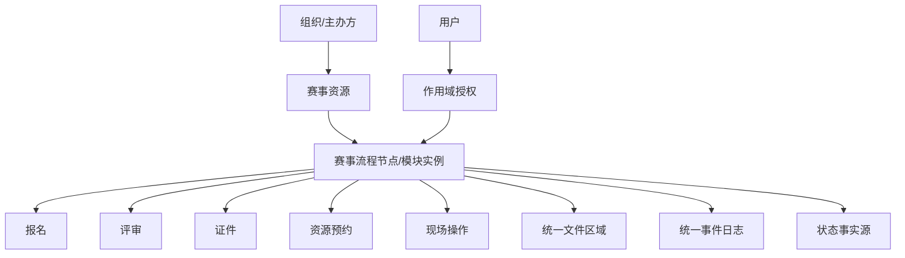

# OpenOLAT、Moodle、Canvas 对比分析

## 1. 总体差异

| 维度 | OpenOLAT | Moodle | Canvas |
|---|---|---|---|
| 技术形态 | Java 单体 WAR | PHP 模块化单体 | Ruby/Rails 大型应用 |
| 核心强项 | 服务端 UI、课程节点、资源仓库 | 插件生态、上下文权限、活动插件 | 多租户/account 组织、API、课程运营 |
| 扩展方式 | Java 包、Spring Bean、CourseNode、REST | 插件目录 `mod/auth/enrol/qtype` | Rails engines/services/LTI/API |
| UI 思路 | 服务端组件树 + Velocity + AJAX | 服务端页面 + Mustache/JS | Rails views + API/前端增强 |
| 数据建模 | JPA 实体 + SQL 脚本 | XMLDB + 插件表 | Rails migrations |
| 权限/组织 | Identity/Group/Organisation/Grant | Context/Role/Capability | Account/Sub-account/Course 权限 |

## 2. 对当前项目的组合借鉴

- 从 Moodle 借鉴：插件声明、统一文件池、context 权限、API 注册。
- 从 OpenOLAT 借鉴：资源仓库主轴、流程节点化、服务端管理 UI、功能包共置。
- 从 Canvas 借鉴：多租户组织树、课程/账户边界、API 优先和运营型数据模型。

## 3. 最适合当前赛事系统的折中方案

不要完整照搬任何一个系统。更适合的设计是：

这个方案结合了 OpenOLAT 的节点化、Moodle 的模块声明和 Canvas 的组织边界。
