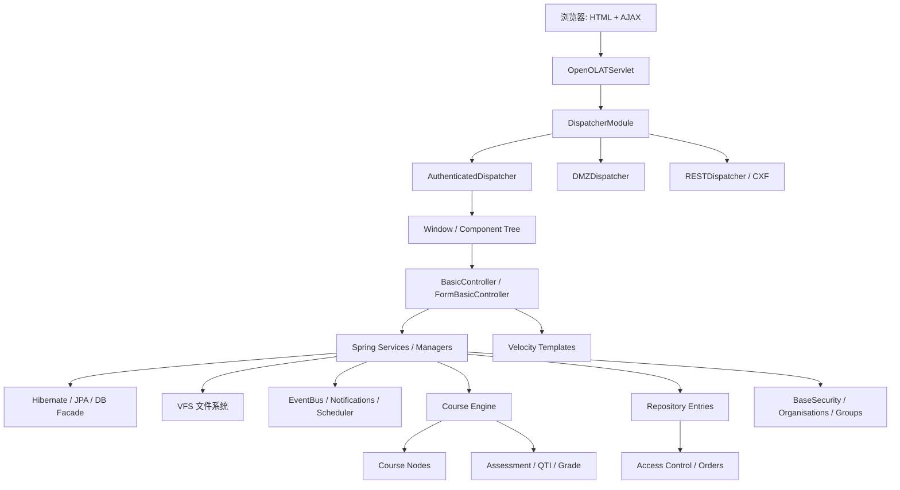

# OpenOLAT 反向设计总体概览

## 1. 总体判断

OpenOLAT 是一个成熟的 Java 单体 LMS。它和 Moodle 一样是教育平台，但架构重心不同：Moodle 更强调目录级插件生态；OpenOLAT 更强调服务端状态 UI 框架、Java 包内业务模块、Spring 服务层、JPA 实体和课程节点体系。

从代码证据看，OpenOLAT 的主轴是：核心框架、用户与权限、资源仓库、课程引擎、业务模块、服务端 UI、REST/API、文件/VFS、测评、课程节点、质量管理和外部标准集成。

## 2. 扫描规模

| 指标 | 数量 |
|---|---:|
| Java 文件 | 12246 |
| 测试 Java 文件 | 1151 |
| JPA 实体 | 381 |
| Controller 类 | 2941 |
| Service/Manager 类 | 1086 |
| REST/JAX-RS 相关类 | 119 |
| Spring XML | 128 |
| Velocity 模板 | 2376 |
| PostgreSQL 初始建表 | 339 |

## 3. 顶层包分布

| 包前缀 | Java文件数 | 反推业务域 |
|---|---|---|
| org.olat.modules | 4907 | 业务模块 |
| org.olat.course | 2347 | 课程引擎 |
| org.olat.core | 2068 | 核心框架 |
| org.olat.ims | 543 | 标准协议/IMS |
| org.olat.repository | 363 | 资源仓库 |
| org.olat.user | 287 | 用户 |
| org.olat.resource | 223 | 资源标识 |
| org.olat.group | 216 | 群组 |
| org.olat.admin | 184 | 系统管理 |
| org.olat.commons | 162 | 通用服务 |
| org.olat.search | 138 | 搜索 |
| org.olat.restapi | 130 | REST API |
| org.olat.login | 129 | 认证登录 |
| org.olat.basesecurity | 120 | 用户与权限 |
| org.olat.gui | 70 | 其他 |
| org.olat.instantMessaging | 58 | 即时消息 |
| org.olat.registration | 57 | 注册 |
| org.olat.upgrade | 57 | 其他 |
| org.olat.shibboleth | 33 | 其他 |
| de.bps.course | 30 | 其他 |
| org.olat.fileresource | 24 | 其他 |
| org.olat.ldap | 23 | 其他 |
| de.tuchemnitz.wizard | 12 | 其他 |
| org.olat.home | 12 | 其他 |
| de.bps.olat | 11 | 其他 |

## 4. 系统结构图

## 5. 核心设计结论

1. OpenOLAT 是服务端状态 UI：浏览器主要接收 HTML 片段，完整 UI 组件树保存在服务器会话中。
2. 功能模块以 Java 包组织，并把 Controller、模板、语言包、Spring 配置放在同一功能附近。
3. 核心业务主轴不是“课程表 + 插件表”，而是 `RepositoryEntry + Course + CourseNode + Assessment` 的组合。
4. 用户权限模型中包含 Identity、Group、Organisation、Membership、Grant、Policy 等概念，比简单 RBAC 更细。
5. 业务扩展不是 Moodle 式 `mod/enrol/auth` 插件目录，而是课程节点、Spring Bean、模块包、REST Resource、VFS/Repository 类型等扩展点。
6. OpenOLAT 对 UI 生命周期控制非常强，但这也意味着服务端会话内存、组件生命周期和并发控制复杂度较高。

## 6. 关键证据

| 证据 | 反推含义 | 位置 |
|---|---|---|
| OpenOLATServlet | Servlet 总入口 | `src/main/java/org/olat/core/servlets/OpenOLATServlet.java:60` |
| DispatcherModule | 请求分发模块 | `src/main/java/org/olat/core/dispatcher/DispatcherModule.java:53` |
| AuthenticatedDispatcher | 已登录用户主 UI 分发 | `src/main/java/org/olat/dispatcher/AuthenticatedDispatcher.java:83` |
| DMZDispatcher | 未登录区/登录注册分发 | `src/main/java/org/olat/dispatcher/DMZDispatcher.java:69` |
| RESTDispatcher | REST 深链/接口分发 | `src/main/java/org/olat/dispatcher/RESTDispatcher.java:86` |
| BaseSecurity | 基础安全接口 | `src/main/java/org/olat/basesecurity/BaseSecurity.java:48` |
| BaseSecurityManager | 用户与权限管理实现 | `src/main/java/org/olat/basesecurity/BaseSecurityManager.java:98` |
| RepositoryService | 学习资源仓库服务接口 | `src/main/java/org/olat/repository/RepositoryService.java:61` |
| RepositoryServiceImpl | 学习资源仓库服务实现 | `src/main/java/org/olat/repository/manager/RepositoryServiceImpl.java:140` |
| CourseFactory | 课程装载/访问核心工厂 | `src/main/java/org/olat/course/CourseFactory.java:166` |
| BasicController | 服务端 UI 控制器基类 | `src/main/java/org/olat/core/gui/control/controller/BasicController.java:71` |
| FormBasicController | 表单控制器基类 | `src/main/java/org/olat/core/gui/components/form/flexible/impl/FormBasicController.java:77` |
