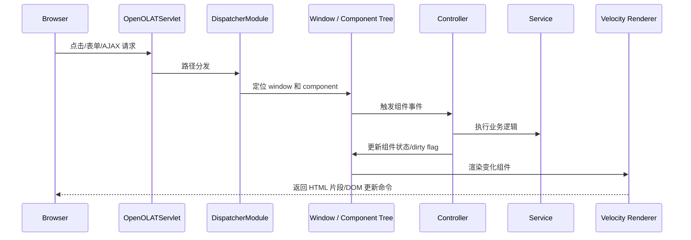

# OpenOLAT 服务端 UI 与前端模型

## 1. 核心特点

OpenOLAT 的 UI 是服务端状态模型。浏览器没有 React/Vue/Angular 这类完整前端状态框架，主要接收服务端渲染的 HTML 和 AJAX 局部更新。项目内 `doc/openolat-frontend.md` 明确说明使用 Velocity、Bootstrap/SASS、Font Awesome、jQuery 和自定义 AJAX 管线。

## 2. 请求与 UI 生命周期

## 3. Controller 模式

- `BasicController`：常用控制器基类，负责事件和生命周期。
- `FormBasicController`：表单控制器基类，规范表单初始化、校验和提交。
- Velocity 模板在 `_content` 目录，使用 `$r.render(...)` 渲染子组件。
- 多语言文案在 `_i18n/LocalStrings_*.properties`。

## 4. 优点

1. 服务端掌控状态和权限，安全边界清晰。
2. 后端开发可以完成完整页面，不强依赖大型前端团队。
3. 页面组件生命周期统一，复杂后台表单和管理界面效率高。
4. 多语言和模板与功能代码共置，维护定位直接。

## 5. 风险

1. 服务端会话内存压力更大。
2. 组件树生命周期复杂，Controller 没有正确释放会产生内存问题。
3. UI 并发和浏览器多窗口需要框架级处理。
4. 前后端分离、移动端复用和现代交互体验会受限制。

## 6. 对本项目的判断

如果当前系统主要是管理后台、赛事配置、评审、资源预约、证件管理，OpenOLAT 的服务端 UI 思想有参考价值：先保证流程和权限清楚，不必过早转向复杂前端架构。但如果未来要有大量移动端和小程序交互，后端应同时建立清晰 API 层。
