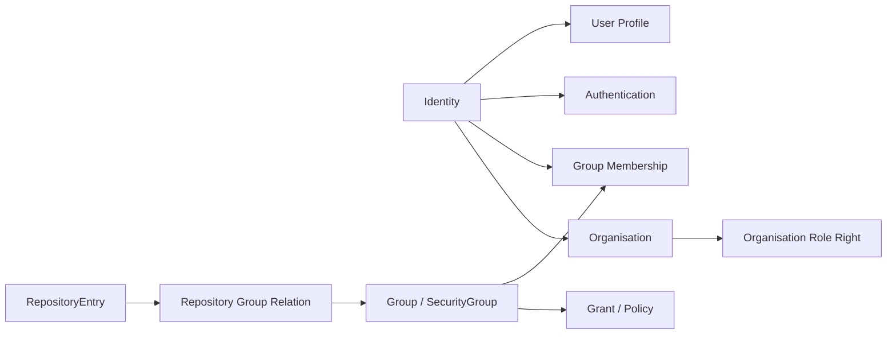

# OpenOLAT 用户、组织与权限模型

## 1. 用户身份主轴

OpenOLAT 把身份和用户资料拆开建模。`o_bs_identity` 表示登录身份/平台身份，`o_user` 保存用户资料字段，`o_bs_authentication` 保存认证方式。代码层存在 `BaseSecurity`、`BaseSecurityManager`、`IdentityDAO`、`AuthenticationDAO`、`OrganisationService` 等。

## 2. 组织和组

OpenOLAT 不只是简单用户角色字段。它存在 Organisation、Group、SecurityGroup、BusinessGroup、RepositoryEntry group 关系等多种组织/群组概念。

## 3. 权限特点

- 权限更接近“身份 + 组 + 组织 + 资源授权”的组合。
- RepositoryEntry 通过组关系承接拥有者、参与者、教练等角色。
- Organisation 引入组织维度，有利于多机构/多部门治理。
- BaseSecurity 集中处理身份、安全组、策略和认证相关能力。

## 4. 对多租户的判断

OpenOLAT 比 Moodle 更明显地引入了 Organisation 相关模型，但它仍不是典型 SaaS 租户库隔离。它更像单应用中的多组织治理：组织、组、资源权限和成员关系共同决定访问范围。

对赛事系统的启发是：如果未来存在多个主办方、学校、赛区、承办单位，不应只靠 `role_code`。可以设计 Organisation/Scope/Grant 体系，把人、组织、赛事、资源和权限明确关联。
