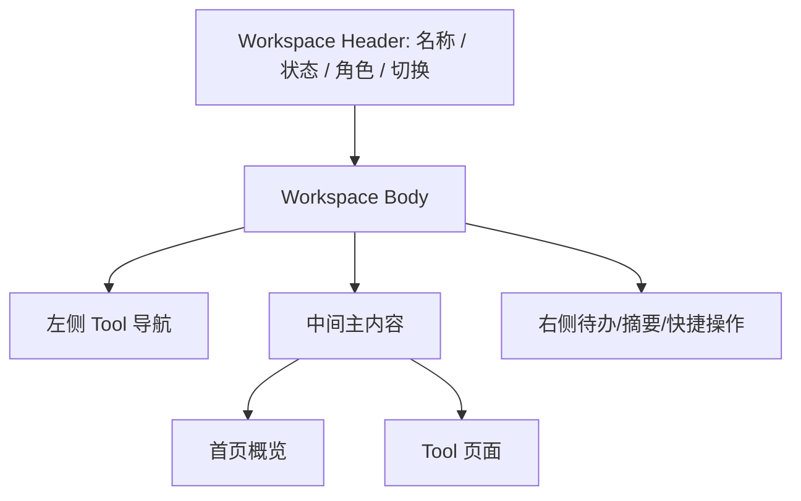

# 参考平台前端页面设计特点总结

## 1. 总体判断

几个参考项目的前端设计不是同一代技术路线，但它们都围绕一个共同目标：让不同角色在不同业务空间中高效完成任务。

对我们当前平台来说，真正值得借鉴的不是某个框架，而是这些平台如何组织页面：

```text
用户进入平台
  选择组织 / 业务空间
    进入工作台
      使用某个 Tool
        查看/创建/审批/处理业务 Record
```

因此，我们自己的前端不应从“菜单堆功能”开始，而应从以下几个对象开始：

```text
Tenant
Organization
Workspace
Tool
Record
Task
```

## 2. 各平台前端设计对比

| 平台 | 前端形态 | 页面组织核心 | 典型布局 | 适合借鉴 |
|---|---|---|---|---|
| Canvas | 现代前端功能包 + Rails 页面 + React/GraphQL 等 | Account / Course / Feature | 全局导航 + 课程导航 + 功能页面 | 多角色工作台、课程/组织切换、复杂评分界面 |
| Moodle | 服务端渲染 + Mustache + AMD JS + Theme | Course / Activity / Block | 顶部/侧边导航 + 课程内容区 + 区块 | 插件化页面、统一主题、活动页一致性 |
| OpenOLAT | 服务端组件树 + Velocity + AJAX 局部刷新 | RepositoryEntry / CourseNode / Controller | 顶栏 + 树形导航 + 主内容 + 工具栏 | 复杂后台表单、流程型页面、树形节点操作 |
| ILIAS | PHP GUI 类 + 模板 + Repository Tree | Object / Ref / Tree | 仓库树 + 对象页面 + 标签页/工具栏 | 对象详情页、路径权限、对象状态操作 |
| Sakai | Portal + Site / Page / Tool | Site / Page / Tool Placement | 门户框架 + 站点页签 + 工具 iframe/页面 | Workspace 挂 Tool、面向角色的站点入口 |

## 3. Canvas 前端特点

### 3.1 页面布局

Canvas 的页面通常围绕三个层次：

```text
全局平台导航
  Account / Course 导航
    Feature 页面
```

典型元素：

- 全局导航：Dashboard、Courses、Calendar、Inbox、Admin 等。
- 业务空间导航：课程菜单、账户管理菜单。
- 主内容区：作业、评分、模块、人员、文件等功能页面。
- 右侧辅助区：待办、近期事件、上下文操作。
- 模态框/抽屉：添加人员、外部工具配置、评分发布等。

### 3.2 流程走向

Canvas 前端流程常见模式：

```text
Dashboard
  进入 Course / Account
    选择功能 Feature
      列表页
        详情页 / 编辑页 / 批量操作页
```

评分和作业类流程更强调连续处理：

```text
作业列表
  作业详情
    提交列表
      SpeedGrader
        上一个/下一个学生
        评分
        评语
        发布成绩
```

### 3.3 主要页面对象

| 页面对象 | 说明 |
|---|---|
| Dashboard Card | 用户进入平台后的业务入口 |
| Course Navigation | 课程内功能导航 |
| Assignment Page | 作业编辑、提交、评分入口 |
| Gradebook Grid | 大量学生和成绩项的表格化操作 |
| SpeedGrader | 单个对象连续评分工作台 |
| People/Roster | 成员、角色、分组管理 |
| Files/Modules | 内容组织和学习路径 |

### 3.4 对我们的借鉴

我们可以借鉴 Canvas 的“角色工作台 + 业务空间入口”：

```text
平台首页
  我的赛事
  我的产业学院
  我的课程项目
  我的评审任务
  我的资源预约
  我的待办
```

赛事评审可以借鉴 SpeedGrader：

```text
评审任务列表
  进入评分工作台
    左侧参赛对象列表
    中间材料预览
    右侧评分表/评语/提交
    支持上一个/下一个
```

## 4. Moodle 前端特点

### 4.1 页面布局

Moodle 前端以课程为中心，使用主题、Mustache 模板、区块和活动插件组织页面。

典型布局：

```text
顶部导航 / 用户菜单
  课程页
    课程章节 / Topic
      活动卡片 / 资源链接
  侧边抽屉 / 区块
```

### 4.2 流程走向

Moodle 的典型流程是：

```text
课程首页
  章节
    活动
      活动详情
        提交 / 查看反馈 / 评分 / 完成状态
```

教师编辑课程时：

```text
打开编辑模式
  添加活动或资源
    配置表单
      保存后回到课程章节
```

### 4.3 主要页面对象

| 页面对象 | 说明 |
|---|---|
| Course Section | 课程章节或主题区 |
| Activity Item | 作业、测验、论坛、资源等活动入口 |
| Block | 时间线、日历、最近访问、导航等辅助区块 |
| Activity Settings Form | 插件配置表单 |
| Gradebook | 成绩表和评分视图 |
| File Picker | 统一文件选择/上传入口 |

### 4.4 对我们的借鉴

Moodle 适合借鉴“Tool 页面一致性”：

```text
Workspace 首页
  Section / 阶段
    Tool 卡片
      Tool 详情页
        配置 / 列表 / 详情 / 处理
```

例如赛事：

```text
赛事首页
  报名阶段
    报名 Tool
  评审阶段
    评审 Tool
  现场阶段
    证件 Tool
    扫码 Tool
```

## 5. OpenOLAT 前端特点

### 5.1 页面布局

OpenOLAT 是服务端状态 UI，页面由服务器端 Controller 和组件树驱动。它的典型页面更像复杂后台系统。

典型布局：

```text
顶部导航
  左侧树形导航 / 课程节点
    主工作区
      工具栏
      表单 / 表格 / 详情
      局部刷新区域
```

### 5.2 流程走向

OpenOLAT 的流程更偏“节点进入 + 表单操作 + 局部刷新”：

```text
资源仓库
  课程 / 项目
    节点树
      节点详情
        编辑 / 配置 / 运行 / 评价
```

复杂后台表单常见流程：

```text
列表
  选择对象
    弹窗 / 抽屉 / 子控制器
      表单提交
        父页面刷新
```

### 5.3 主要页面对象

| 页面对象 | 说明 |
|---|---|
| Repository Entry | 资源入口，例如课程、项目、内容 |
| Course Node | 流程或内容节点 |
| Controller | 页面控制器，处理事件和状态 |
| Velocity Template | 页面模板 |
| FlexiForm | 表单体系 |
| FlexiTable | 表格体系 |
| Modal / Callout | 局部交互 |

### 5.4 对我们的借鉴

OpenOLAT 特别适合产业学院和后台管理：

```text
产业学院 Workspace
  左侧：专业方向 / 项目 / 课程 / 实训节点
  中间：当前节点详情
  右侧或顶部：操作工具栏
```

资源预约、证件审核、评审配置等复杂后台页面，也可以借鉴它的“表格 + 过滤 + 批量操作 + 表单弹窗”模式。

## 6. ILIAS 前端特点

### 6.1 页面布局

ILIAS 强调 Repository Tree 和 Object 页面。页面围绕对象本体和对象在树中的位置展开。

典型布局：

```text
仓库路径 / 面包屑
  对象页面
    标签页
      内容区
    工具栏 / 操作菜单
```

对象可能是课程、文件夹、测试、文件、学习模块、论坛等。

### 6.2 流程走向

ILIAS 的典型流程：

```text
Repository
  进入目录 / 对象
    查看对象详情
      根据权限显示操作
        编辑 / 移动 / 复制 / 权限 / 状态 / 成员
```

权限和对象状态会影响页面上能看到的操作。

### 6.3 主要页面对象

| 页面对象 | 说明 |
|---|---|
| Repository Tree | 对象层级树 |
| Object Page | 对象详情页 |
| Ref / Path | 对象位置和路径 |
| Tabs | 对象功能分区 |
| Toolbar | 当前对象操作 |
| Permission View | 对象权限配置 |
| Status Indicator | 在线/离线、可访问、条件不满足等状态 |

### 6.4 对我们的借鉴

ILIAS 对我们最有价值的是“对象页”设计：

```text
资源对象页
证件对象页
课程项目对象页
评审任务对象页
赛事对象页
产业学院对象页
```

每个对象页应有一致结构：

```text
标题 + 状态
路径 / 所属空间
关键摘要
标签页
  基本信息
  成员/参与者
  文件
  流程状态
  权限
  日志
  关联对象
操作按钮
```

## 7. Sakai 前端特点

### 7.1 页面布局

Sakai 的前端核心是 Portal + Site + Tool。

典型布局：

```text
Portal 外壳
  站点导航
    页面 / 工具入口
      Tool 页面
```

一个 Site 可以挂多个 Tool，Portal 负责统一外框，Tool 负责自己的功能页面。

### 7.2 流程走向

Sakai 的典型流程：

```text
进入 Portal
  选择 Site
    选择 Tool
      Tool 内部完成列表、详情、编辑、提交等流程
```

这对我们非常适合，因为 Workspace/Tool 是当前平台构想的核心。

### 7.3 主要页面对象

| 页面对象 | 说明 |
|---|---|
| Portal | 平台外壳 |
| Site | 业务空间 |
| Page | 站点页面或栏目 |
| Tool Placement | 工具挂载实例 |
| Tool Page | 工具自己的业务页面 |
| Realm-aware UI | 根据权限显示工具和操作 |

### 7.4 对我们的借鉴

我们可以直接借鉴其页面信息架构：

```text
平台 Portal
  Workspace 切换器
    Workspace 首页
      Tool 导航
        Tool 页面
```

赛事和产业学院都用同一套外壳：

```text
左侧：Workspace 内 Tool 导航
顶部：Workspace 标题、状态、角色、切换入口
中间：Tool 主页面
右侧/顶部：待办、消息、快捷操作
```

## 8. 对我们平台的前端对象设计

### 8.1 页面对象层级

建议我们自己的前端对象层级如下：

```text
PortalLayout
  TenantSwitcher
  OrganizationContext
  WorkspaceSwitcher
  WorkspaceShell
    WorkspaceHeader
    WorkspaceNav
    WorkspaceDashboard
    ToolContainer
      ToolListPage
      ToolDetailPage
      ToolEditPage
      ToolTaskPage
```

### 8.2 核心页面类型

| 页面类型 | 作用 | 典型来源参考 |
|---|---|---|
| 平台首页 | 展示我的工作空间、待办、消息、最近访问 | Canvas Dashboard |
| Workspace 首页 | 展示业务空间概况、启用工具、关键指标 | Sakai Site / Moodle Course |
| Tool 列表页 | 业务对象列表、筛选、批量操作 | OpenOLAT FlexiTable / ILIAS Object List |
| Tool 详情页 | 单个业务对象详情、状态、文件、日志 | ILIAS Object Page |
| 流程任务页 | 审核、评审、确认、处理 | Canvas SpeedGrader / OpenOLAT Form |
| 配置页 | Tool 配置、规则、字段、权限 | Moodle Activity Settings |
| 资源页 | 文件、材料、资源台账、预约时段 | Moodle File Picker / Sakai Content |
| 报表页 | 统计、评分、预约、参与情况 | Canvas Gradebook / Sakai Sitestats |

### 8.3 Workspace 页面布局建议



建议默认结构：

```text
顶部：平台导航、租户/组织/Workspace 切换、用户入口
左侧：当前 Workspace 的 Tool 导航
中间：当前 Tool 的主操作页面
右侧：待办、状态摘要、AI 建议、最近日志
```

### 8.4 Tool 页面标准结构

每个 Tool 尽量遵循一致结构：

```text
Tool Header
  标题
  状态
  关键操作按钮

Filter / Search
  关键词
  状态
  组织
  时间
  标签

Record Table / Card List
  业务对象列表
  状态
  负责人
  时间
  操作

Record Detail
  基本信息
  文件
  流程
  评价
  权限
  日志
```

## 9. 对我们平台的主要页面建议

### 9.1 平台首页

面向所有用户，显示：

- 我的 Workspace；
- 我的待办；
- 我的消息；
- 我的近期操作；
- 我的资源预约；
- 我的评审任务；
- 我的证书/证件；
- AI 提醒和风险提示。

借鉴：

- Canvas Dashboard；
- Sakai Portal；
- Moodle Timeline。

### 9.2 赛事 Workspace 首页

显示：

- 赛事基本信息；
- 当前阶段；
- 报名人数、团队数；
- 评审进度；
- 赛场安排；
- 证件发放情况；
- 资源预约情况；
- 待处理任务；
- 已启用 Tool。

### 9.3 产业学院 Workspace 首页

显示：

- 产业学院基本信息；
- 组织成员；
- 课程项目；
- 实训项目；
- 企业导师；
- 资源使用；
- 评价进度；
- 证书发放；
- 待处理任务。

### 9.4 评审工作台

借鉴 Canvas SpeedGrader：

```text
左侧：待评对象列表
中间：材料预览 / 文件 / 提交内容
右侧：评分表 / 评语 / AI 草稿 / 提交按钮
顶部：任务进度、筛选、上一个/下一个
```

### 9.5 资源预约工作台

借鉴日历/时段类界面：

```text
左侧：资源筛选
中间：日历 / 时段 / 容量
右侧：预约详情 / 冲突提示 / 审批
```

### 9.6 证件/证书对象页

借鉴 ILIAS Object Page：

```text
顶部：对象名称、状态、二维码/编号
标签页：
  基本信息
  授权/权限
  文件
  使用记录
  验证日志
  撤销/补发记录
```

## 10. 前端设计原则

### 10.1 先区分用户角色

不同用户看到的首页不应一样：

| 用户 | 首页重点 |
|---|---|
| 平台管理员 | 租户、组织、工作空间、系统配置 |
| 赛事管理员 | 赛事进度、报名、评审、证件、资源 |
| 产业学院管理员 | 成员、课程、项目、导师、评价 |
| 教师/导师 | 学生、项目、评价、资源 |
| 评审专家 | 待评任务、材料、评分 |
| 学生/参赛者 | 我的报名、课程、项目、证件、证书 |
| 企业用户 | 项目、导师、资源、学生表现 |

### 10.2 统一 Workspace Shell

赛事、产业学院、实训项目、资源中心都使用统一外壳：

```text
Workspace Header
Workspace Nav
Tool Container
Task/Message Aside
```

### 10.3 Tool 内部可以差异化

Tool 外壳统一，但内部页面可以按业务优化：

- 评审 Tool 用评分工作台；
- 资源 Tool 用日历/时段；
- 课程 Tool 用节点/目录；
- 证件 Tool 用对象详情和验证记录；
- 报名 Tool 用表单、材料和审核流。

### 10.4 AI 放在辅助区域

AI 不应抢占主流程。建议放在：

```text
右侧建议栏
表单字段旁提示
材料预览摘要
评分评语草稿
冲突风险提示
```

AI 输出必须有“采纳/忽略/编辑后采纳”。

## 11. 我们应避免的前端风险

1. 不要把所有功能堆到一个左侧菜单中。
2. 不要让赛事和产业学院使用两套完全不同的页面框架。
3. 不要让每个 Tool 自己设计权限、文件、日志、状态展示。
4. 不要过早做复杂可视化大屏，先保证工作流页面可用。
5. 不要把 AI 做成全局聊天入口后就算智能化，AI 应嵌入具体任务节点。
6. 不要照搬 OpenOLAT 的重服务端会话组件树。
7. 不要照搬 Sakai 的 iframe/工具割裂感。

## 12. 推荐落地顺序

### 阶段 1：统一外壳

先做：

```text
PortalLayout
WorkspaceSwitcher
WorkspaceShell
WorkspaceNav
ToolContainer
```

### 阶段 2：两个样板首页

先做：

```text
赛事 Workspace 首页
产业学院 Workspace 首页
```

### 阶段 3：四个样板 Tool

先做：

```text
报名 Tool
评审 Tool
课程项目 Tool
资源预约 Tool
```

### 阶段 4：统一对象页

统一：

```text
Record Detail Page
File Panel
Workflow Panel
Permission Panel
Operation Log Panel
AI Suggestion Panel
```

## 13. 最终建议

我们的前端应采用“统一平台外壳 + Workspace 工作空间 + Tool 工具页面 + Record 对象详情”的设计路线。

不要从页面菜单开始设计，而要从用户工作流开始：

```text
用户是谁？
他在哪个 Workspace？
他要使用哪个 Tool？
他要处理哪个 Record？
当前 Record 状态是什么？
他能做什么操作？
AI 能提供什么辅助？
```

这条线能同时覆盖赛事、产业学院、实训项目、资源中心和后续扩展业务。
