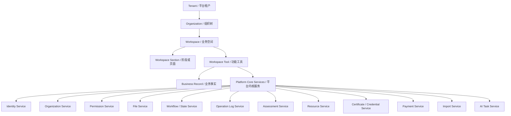

# 平台核心需求建模 v0.1

## 1. 建模目标

本文档用于把“多租户教育产业协同平台”的核心抽象落到开发可理解的需求模型中。当前平台不应只围绕赛事建模，也不应把产业学院作为赛事附属模块，而应形成统一骨架：

```text
Tenant / Account
  Organization / Sub-account
    Workspace
      Tool
        Business Object / Record
```

对应业务语言：

```text
租户/平台客户
  学校/企业/产业学院/主办方/承办方
    赛事/产业学院/培训项目/实训项目/资源中心
      报名/评审/课程/证件/资源/支付/证书/现场工具
        团队/学生/课程/资源/证件/评分/订单等业务对象
```

这套模型要解决四个问题：

1. 多个租户、多类组织、多种业务空间如何统一管理。
2. 赛事和产业学院如何共享身份、组织、权限、文件、流程、日志、评价等公共能力。
3. 报名、评审、课程、资源、证件、证书等功能如何作为 Tool 挂接到不同 Workspace。
4. 哪些能力属于确定性数据库/流程，哪些能力可由 AI 辅助但不直接成为事实源。

## 2. 总体对象层级



## 3. 第一层：Tenant / Account

### 3.1 核心内涵

Tenant 是平台级运营和数据边界。它不是具体赛事，也不是具体产业学院，而是平台上的一个客户、运营主体或管理边界。

典型 Tenant：

- 区域教育平台；
- 某学校集团；
- 某产业学院运营主体；
- 某大型赛事主办体系；
- 某校企合作平台客户。

### 3.2 业务逻辑

1. 一个 Tenant 下可以有多个 Organization。
2. 一个 Tenant 下可以有多个 Workspace。
3. 用户可以在多个 Tenant 下拥有不同身份，但初期可以先限制一个用户主要归属一个 Tenant。
4. Tenant 是配置、权限、数据隔离、统计口径、品牌设置的第一层边界。
5. 赛事和产业学院通常不是 Tenant，而是 Tenant 下的 Workspace。

### 3.3 开发需求模型

建议核心实体：

```text
tenant
tenant_config
tenant_feature
tenant_branding
```

`tenant` 关键字段：

```text
id
tenant_code
tenant_name
tenant_type
status
owner_org_id
created_at
updated_at
```

`tenant_type` 可选：

```text
REGIONAL_PLATFORM
SCHOOL_GROUP
INDUSTRY_COLLEGE_OPERATOR
COMPETITION_OPERATOR
ENTERPRISE_PARTNER
```

### 3.4 开发约束

- 所有核心业务表原则上应能追溯到 `tenant_id`，至少通过 Workspace 或 Organization 间接追溯。
- 不建议把 `competition_id` 当作租户边界。
- 不建议把 `college_id` 当作租户边界。

## 4. 第二层：Organization / Sub-account

### 4.1 核心内涵

Organization 是租户内部的组织树，用来表达学校、学院、企业、产业学院、主办方、承办方、赛区、部门等关系。

它借鉴 Canvas 的 Account/Sub-account 思路，但不把课程作为唯一核心对象。

### 4.2 业务逻辑

1. 一个 Tenant 下有一棵或多棵 Organization 树。
2. Organization 可以有父子关系。
3. 用户通过 Organization Member 加入组织。
4. 一个用户可以属于多个 Organization。
5. Organization 可以作为 Workspace 的主办方、承办方、参与方、企业合作方。
6. 外部导入数据时，应记录外部系统的组织编号和用户编号。

### 4.3 开发需求模型

建议核心实体：

```text
organization
organization_relation
organization_member
external_identity_mapping
```

`organization` 关键字段：

```text
id
tenant_id
org_code
org_name
org_type
parent_id
path
status
external_source
external_id
created_at
updated_at
```

`org_type` 可选：

```text
SCHOOL
COLLEGE
DEPARTMENT
ENTERPRISE
INDUSTRY_COLLEGE
COMPETITION_ORGANIZER
COMPETITION_CO_ORGANIZER
VENUE_OPERATOR
REGION
```

`organization_member` 关键字段：

```text
id
tenant_id
organization_id
user_id
member_type
role_code
status
joined_at
left_at
```

`member_type` 可选：

```text
STUDENT
TEACHER
ENTERPRISE_MENTOR
EXPERT
ADMIN
STAFF
CONTACT
```

### 4.4 典型业务例子

```text
某区域平台 Tenant
  A 学校 Organization
    信息工程学院 Organization
  B 企业 Organization
  C 产业学院 Organization
  D 赛事组委会 Organization
```

同一个用户可以是：

```text
A 学校学生
C 产业学院学员
某赛事参赛队长
某实训项目成员
```

这些身份不应该压成用户表上的一个 `role_code`。

## 5. 第三层：Workspace

### 5.1 核心内涵

Workspace 是业务空间，是平台真正承载业务运行的容器。赛事、产业学院、培训项目、实训项目、课程项目、资源中心都可以是 Workspace。

这是防止系统分裂的关键抽象：

```text
赛事不是独立系统；
产业学院也不是独立系统；
它们都是平台上的 Workspace 类型。
```

### 5.2 业务逻辑

1. 一个 Workspace 属于一个 Tenant。
2. 一个 Workspace 可以关联多个 Organization。
3. 一个 Workspace 可以启用多个 Tool。
4. 一个 Workspace 有自己的成员、权限、配置、状态和业务数据。
5. Workspace 可以有阶段、栏目或页面，即 Workspace Section。
6. 不同类型 Workspace 启用的 Tool 不同。

### 5.3 开发需求模型

建议核心实体：

```text
workspace
workspace_member
workspace_section
workspace_tool
```

`workspace` 关键字段：

```text
id
tenant_id
workspace_code
workspace_name
workspace_type
owner_org_id
status
start_time
end_time
created_at
updated_at
```

`workspace_type` 可选：

```text
COMPETITION
INDUSTRY_COLLEGE
TRAINING_PROGRAM
PRACTICE_PROJECT
COURSE_PROJECT
RESOURCE_CENTER
CERTIFICATION_PROGRAM
```

`workspace_member` 关键字段：

```text
id
tenant_id
workspace_id
user_id
organization_id
role_code
member_type
status
joined_at
left_at
```

`workspace_section` 关键字段：

```text
id
tenant_id
workspace_id
section_code
section_name
section_type
sort_order
status
```

### 5.4 样板 Workspace：赛事

```text
Competition Workspace
  Signup Tool
  Team Tool
  Review Tool
  Credential Tool
  Resource Reservation Tool
  Onsite Operation Tool
  Payment Tool
```

赛事 Workspace 典型 Record：

```text
报名记录
团队记录
成员记录
评审任务
评分记录
赛场安排
证件记录
授权记录
资源预约
支付订单
现场操作记录
```

### 5.5 样板 Workspace：产业学院

```text
Industry College Workspace
  Organization Member Tool
  Course Project Tool
  Practice Project Tool
  Enterprise Mentor Tool
  Resource Tool
  Assessment Tool
  Certificate Tool
```

产业学院 Workspace 典型 Record：

```text
学生记录
教师记录
企业导师记录
专业方向
课程项目
实训项目
企业项目
资源使用记录
过程评价
能力认证
证书记录
```

## 6. 第四层：Tool

### 6.1 核心内涵

一个业务空间不是一堆固定功能，而是挂接多个 Tool。Tool 是 Workspace 内可启用、可配置、可授权、可产生日志和业务事实的功能模块。

Tool 借鉴 Sakai 的 Site/Tool 思路，但初期不要求工程插件化，只要求业务逻辑模块化。

### 6.2 业务逻辑

1. Tool 有定义，称为 `tool_definition`。
2. Workspace 启用某个 Tool，形成 `workspace_tool`。
3. 同一个 Tool 可以挂在不同类型 Workspace 下。
4. Tool 可以有实例配置，称为 `tool_instance_config`。
5. Tool 必须声明它产生的 Record、状态、权限、文件区域和日志类型。
6. Tool 不应私自实现用户、权限、文件、日志、通知等公共能力，应调用平台服务。

### 6.3 开发需求模型

建议核心实体：

```text
tool_definition
workspace_tool
tool_instance_config
platform_service_registry
```

`tool_definition` 关键字段：

```text
id
tool_code
tool_name
tool_category
supported_workspace_types
main_record_type
status
version
```

`workspace_tool` 关键字段：

```text
id
tenant_id
workspace_id
tool_code
tool_name
enabled
section_id
sort_order
config_id
created_at
updated_at
```

`tool_instance_config` 关键字段：

```text
id
tenant_id
workspace_id
tool_code
config_json
effective_from
effective_to
status
```

### 6.4 Tool 描述模板

每个 Tool 必须回答 10 个问题：

```text
1. Tool code 是什么？
2. 支持哪些 Workspace 类型？
3. 产生哪些业务 Record？
4. 主状态字段是什么？
5. 需要哪些权限码？
6. 需要哪些文件区域？
7. 产生哪些操作日志？
8. 是否需要流程节点？
9. 是否允许 AI 辅助？
10. 是否有支付、证书、资源预约等外部依赖？
```

### 6.5 赛事 Tool 示例

| Tool | 主 Record | 主要状态 | 主要文件区域 | 典型权限 |
|---|---|---|---|---|
| Signup Tool | signup_record | draft/submitted/approved/rejected | signup_material | signup.submit/signup.review |
| Team Tool | team_record | active/disbanded/locked | team_attachment | team.manage/team.member.manage |
| Review Tool | review_task/review_score | pending/scoring/done | review_material | review.assign/review.score |
| Credential Tool | credential_record/grant | valid/revoked/expired | credential_photo | credential.issue/credential.verify |
| Resource Reservation Tool | reservation_record | pending/confirmed/canceled/completed | reservation_attachment | resource.reserve/resource.approve |
| Onsite Operation Tool | operation_state/operation_log | not_done/done/canceled | onsite_evidence | onsite.scan/onsite.verify |
| Payment Tool | order/payment_record | unpaid/paid/refunded/closed | payment_voucher | payment.create/payment.audit |

### 6.6 产业学院 Tool 示例

| Tool | 主 Record | 主要状态 | 主要文件区域 | 典型权限 |
|---|---|---|---|---|
| Organization Member Tool | workspace_member | active/disabled/left | member_import | member.manage |
| Course Project Tool | course_project | draft/published/archived | courseware | course.manage/course.learn |
| Practice Project Tool | practice_project | recruiting/running/completed | project_report | project.manage/project.submit |
| Enterprise Mentor Tool | mentor_assignment | active/inactive | mentor_material | mentor.assign |
| Resource Tool | resource_usage_ref | active/disabled | resource_attachment | resource.manage |
| Assessment Tool | assessment_record | pending/confirmed/final | assessment_material | assessment.score/assessment.confirm |
| Certificate Tool | certificate_issue_record | pending/issued/revoked | certificate_template | certificate.issue |

## 7. 第五层：Platform Core Services

平台内核服务是所有 Tool 共享的确定性能力。它的职责是让业务模块不要重复造轮子。

### 7.1 Identity Service

#### 核心内涵

管理平台用户、登录身份、外部身份映射。

#### 业务逻辑

- 用户是平台主体，不直接等于学生、教师、专家。
- 学生、教师、专家、企业导师是用户在 Organization 或 Workspace 中的身份。
- 同一用户可以在不同 Workspace 中有不同角色。

#### 核心实体

```text
user
identity_account
external_identity_mapping
```

### 7.2 Organization Service

#### 核心内涵

管理租户下的组织树、组织成员、组织关系。

#### 核心实体

```text
organization
organization_relation
organization_member
```

### 7.3 Permission Service

#### 核心内涵

统一判断“谁在什么范围内可以做什么操作”。

#### 业务逻辑

权限判断至少包含：

```text
user
tenant
organization
workspace
tool
scope
permission_code
object_state
business_condition
```

#### 核心实体

```text
scope
permission_code
role_definition
permission_grant
```

建议权限码：

```text
competition.signup.submit
competition.signup.review
competition.review.score
competition.credential.issue
industry.course.manage
industry.project.evaluate
resource.reservation.approve
certificate.issue
```

### 7.4 File Service

#### 核心内涵

统一管理文件本体、版本、归属和权限。

#### 业务逻辑

- 文件本体和文件归属分开。
- 同一个文件可以关联多个业务对象。
- 文件必须知道属于哪个 Tenant、Workspace、Tool、Record。

#### 核心实体

```text
file_object
file_version
file_relation
file_access_policy
```

`file_area` 示例：

```text
signup_material
credential_photo
review_material
resource_attachment
courseware
project_report
certificate_template
import_source
```

### 7.5 Workflow / State Service

#### 核心内涵

管理流程定义、流程实例、当前状态事实源。

#### 业务逻辑

- 当前状态是事实源。
- 状态变更必须有日志。
- AI 可以建议状态，但不能直接改最终状态。

#### 核心实体

```text
workflow_template
workflow_node
workflow_instance
workflow_task
workflow_state
```

### 7.6 Operation Log Service

#### 核心内涵

统一记录谁在什么时候对什么对象做了什么操作。

#### 核心实体

```text
operation_log
operation_log_detail
```

关键字段：

```text
tenant_id
workspace_id
tool_code
object_type
object_id
action_code
operator_id
before_state
after_state
created_at
```

### 7.7 Notification Service

#### 核心内涵

统一处理站内信、短信、邮件、微信/小程序通知、待办提醒。

#### 核心实体

```text
notification_template
notification_task
notification_record
```

### 7.8 Assessment Service

#### 核心内涵

统一支撑赛事评审、课程评价、实训评价、企业导师评价、证书达标评价。

#### 核心实体

```text
assessment_item
assessment_subject
assessment_score
assessment_result
assessment_comment
```

### 7.9 Resource Service

#### 核心内涵

统一管理资源台账、资源部署、资源时段、预约和占用。

#### 核心实体

```text
resource_entry
resource_deployment
resource_slot
reservation_record
reservation_occupancy
reservation_log
```

### 7.10 Certificate / Credential Service

#### 核心内涵

统一管理证书、现场证件、资质证明。

#### 业务逻辑

- Credential 更偏现场通行或资格。
- Certificate 更偏结果证明或能力证明。
- 两者可以共享模板、发放记录、撤销记录、验证记录。

#### 核心实体

```text
credential_record
credential_grant
credential_verification_log
certificate_template
certificate_rule
certificate_issue_record
```

### 7.11 Payment Service

#### 核心内涵

管理订单、支付、退款、对账。

#### 核心实体

```text
order_record
payment_record
refund_record
payment_notify_log
```

### 7.12 Import Service

#### 核心内涵

管理外部数据导入、原始数据、解析结果、确认结果。

#### 核心实体

```text
import_batch
import_raw_record
import_parse_result
import_confirm_record
```

### 7.13 AI Task Service

#### 核心内涵

AI 是建议层，不是事实源。

#### 业务逻辑

AI 负责：

```text
识别
建议
生成草稿
风险提示
匹配推荐
摘要归纳
```

AI 不直接负责：

```text
最终审核通过
最终评分
最终授权
最终支付状态
最终证书发放
最终预约确认
```

#### 核心实体

```text
ai_task
ai_input
ai_output
ai_suggestion
ai_review_decision
ai_feedback
```

## 8. 确定性工作与非确定性工作边界

| 工作类型 | 主导系统 | 入库位置 | 例子 |
|---|---|---|---|
| 确定性事实 | 数据库/流程 | 正式业务表 | 报名状态、评分结果、预约状态、证件状态 |
| 非确定性建议 | AI | AI 建议表 | 材料风险提示、专家匹配建议、评语草稿 |
| 混合工作 | AI + 人工确认 | AI 表 + 正式表 | OCR 识别后人工确认，确认后写入正式记录 |

核心原则：

```text
AI 生成建议；
人工或规则确认；
流程写入事实；
日志记录全过程。
```

## 9. 开发落地优先级

### 阶段 1：平台骨架

优先建模：

```text
tenant
organization
organization_member
workspace
workspace_member
workspace_tool
tool_definition
```

目标：

- 支持多个租户；
- 支持组织树；
- 支持赛事和产业学院都作为 Workspace；
- 支持 Workspace 启用 Tool。

### 阶段 2：公共能力

优先建模：

```text
permission_grant
file_object
file_relation
workflow_state
operation_log
```

目标：

- 统一权限；
- 统一文件；
- 统一状态；
- 统一日志。

### 阶段 3：两个样板 Workspace

先跑通：

```text
赛事 Workspace
产业学院 Workspace
```

每个 Workspace 先选 2 个 Tool：

```text
赛事：Signup Tool + Review Tool
产业学院：Course Project Tool + Assessment Tool
```

### 阶段 4：AI 辅助层

先做低风险场景：

```text
材料摘要
缺项提醒
评语草稿
专家匹配建议
资源冲突提示
```

不直接改业务事实状态。

## 10. 开发验收标准

任何新模块进入平台前，必须回答：

```text
1. 属于哪个 Tenant？
2. 属于哪个 Organization？
3. 属于哪个 Workspace？
4. 是哪个 Tool？
5. 产生什么 Record？
6. Record 的状态事实源是什么？
7. 使用哪些 Permission？
8. 使用哪些 File Area？
9. 产生哪些 Operation Log？
10. 是否允许 AI 辅助？AI 输出是否需要人工确认？
```

如果一个模块无法回答这些问题，说明它还没有完成平台化建模。
