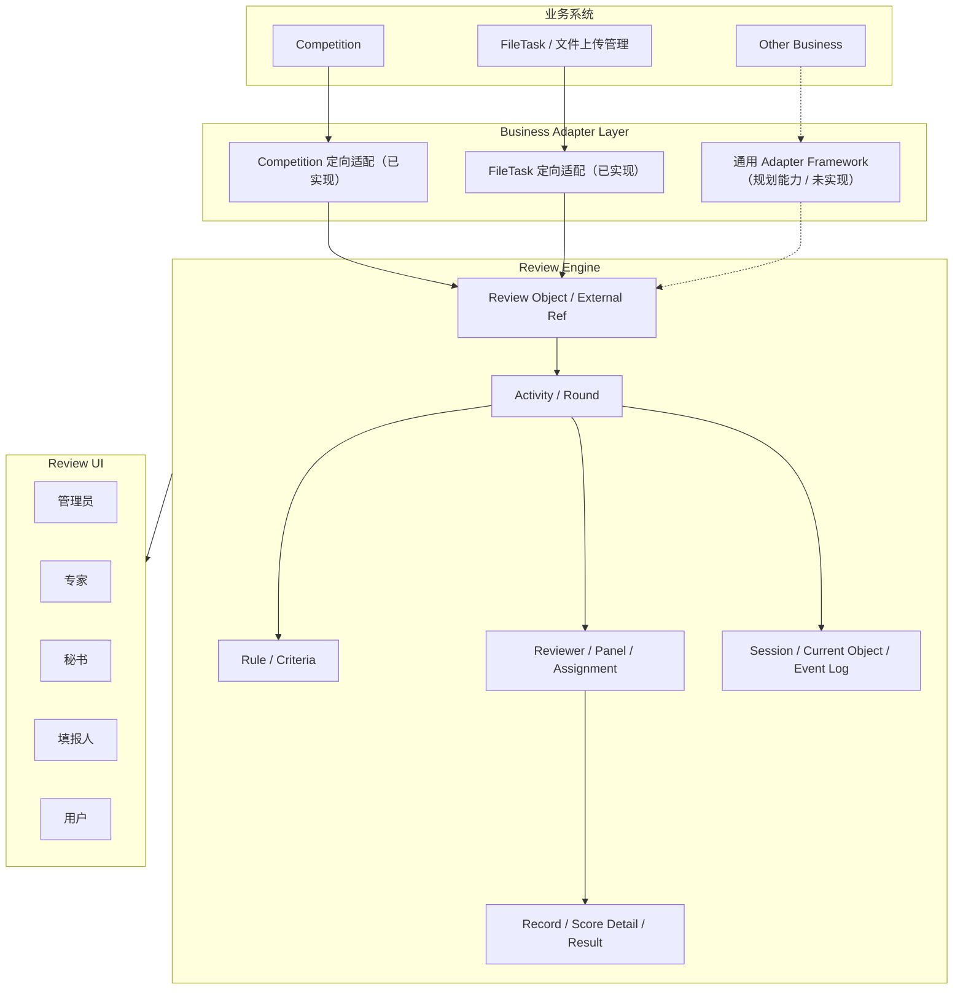
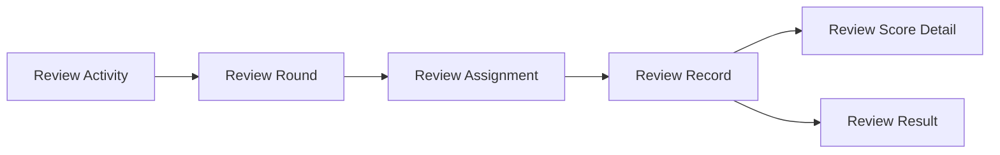

# Review Engine V1.0 总体架构说明

## 1. 模块定位

Review Engine 是面向多业务的通用评审引擎，不把评审对象限定为竞赛项目。它负责统一承载活动、轮次、对象、评分规则、专家任务、评分记录、现场控制和结果发布；外部业务只负责提供被评数据和接收结果。

当前已落地的主要场景：

- 竞赛项目/团队评审；
- 材料评审；
- 现场答辩评审；
- 文件上传任务导入评审对象及材料。

未来可扩展：

- 科研项目评审；
- 教师成果评审；
- 课程资源评审；
- 案例评审；
- 其他可映射为 Review Object 的业务对象。

## 2. 总体架构

当前代码中的“Business Adapter Layer”不是独立包：Competition 和 FileTask 的适配逻辑集中在 `ReviewObjectServiceImpl`，并直接依赖竞赛 Mapper/领域对象与远程文件任务服务。因此图中的通用 Adapter Framework 是目标架构，不是已完成组件。

## 3. 核心领域模型

### 3.1 Review Object，而不是 Project

`ReviewObject` 是引擎面对的统一被评对象。Project 只是对象类型 `PROJECT` 的一种；引擎同时定义 `TEAM`、`PERSON`、`WORK`、`OTHER`。这样评分、分配、现场控制和结果计算不需要依赖某个业务的项目表，也能复用于科研项目、教师成果或课程资源。

Review Object 保存评审所需的稳定快照，外部业务身份通过 `source_*` 字段和 `review_object_external_ref` 维护。业务详情仍属于来源系统，引擎不应反向成为业务主数据系统。

### 3.2 Activity / Round 模型

- Activity 是评审工作的顶层边界，定义对象类型、填报窗口、评审窗口、匿名和发布模式。
- Round 表达一项活动内的多轮评审，并绑定评分规则；同一活动可混合材料评审和现场答辩。
- Assignment 把某轮、某对象分配给某专家，可附加专家组。
- Record 是单个专家对单个任务的评分事实；Score Detail 保存评分项快照。
- Result 是按活动、轮次、对象汇总出的派生结果。

### 3.3 外部业务关联

`review_object_external_ref` 是 Review Engine 与外部业务的标准关联表，组合记录：

- `source_module`：来源模块；
- `source_biz_type`：来源业务类型；
- `source_biz_id` / `source_biz_code`：来源主键与编码；
- `source_team_id` / `source_registration_id`：竞赛团队、报名等扩展引用；
- `relation_type`：关系类型；
- `extra_data`：兼容性扩展快照。

`review_object` 上仍保留一组 `source_*` 字段，便于高频过滤；`review_object_external_ref` 支持一个对象关联多个来源记录。材料导入后由 `review_object_material.source_*` 记录来源追踪，参赛证由 `review_object_certificate_ref` 关联。

### 3.4 评分不可篡改原则

管理员可以：

- 在评分开始前配置、校验、启停和绑定评分规则；
- 查看专家已提交的评分记录；
- 根据已提交评分生成或重新生成汇总结果；
- 填写发布性评价结论；
- 发布或撤回结果。

管理员不能：

- 通过结果接口修改专家的 `review_record` 或 `review_score_detail`；
- 直接写入 `review_result.calculated_score`；
- 使用旧的通用评分写入接口代替专家任务端接口。

代码保障包括：旧 `/review/record/draft`、`/submit` 写接口被显式禁用；专家评分必须基于本人 `review_assignment`；已提交评分关联的规则禁止修改核心字段或删除；`calculated_score` 只由结果汇总逻辑根据 `SUBMITTED` 记录计算。数据库层尚未提供防篡改触发器或不可变事件存储，仍依赖应用服务与权限配置。

## 4. 部署与运行形态

当前 Review Engine 位于 `old-code/teaching-modules/teaching-competition`，共享 competition 服务的数据源、鉴权、分页、日志和部分业务 Mapper。管理 UI 位于 `old-code-admin`。因此 V1.0 是“模块化内嵌引擎”，不是独立微服务。

若独立部署，需要先抽离业务适配接口、文件存储/预览、用户与权限上下文、审计实现和外部业务 DTO，并建立清晰的跨服务事务与幂等协议。
