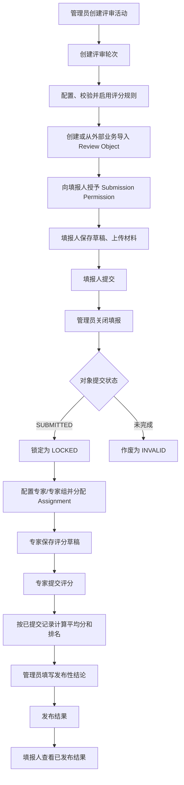
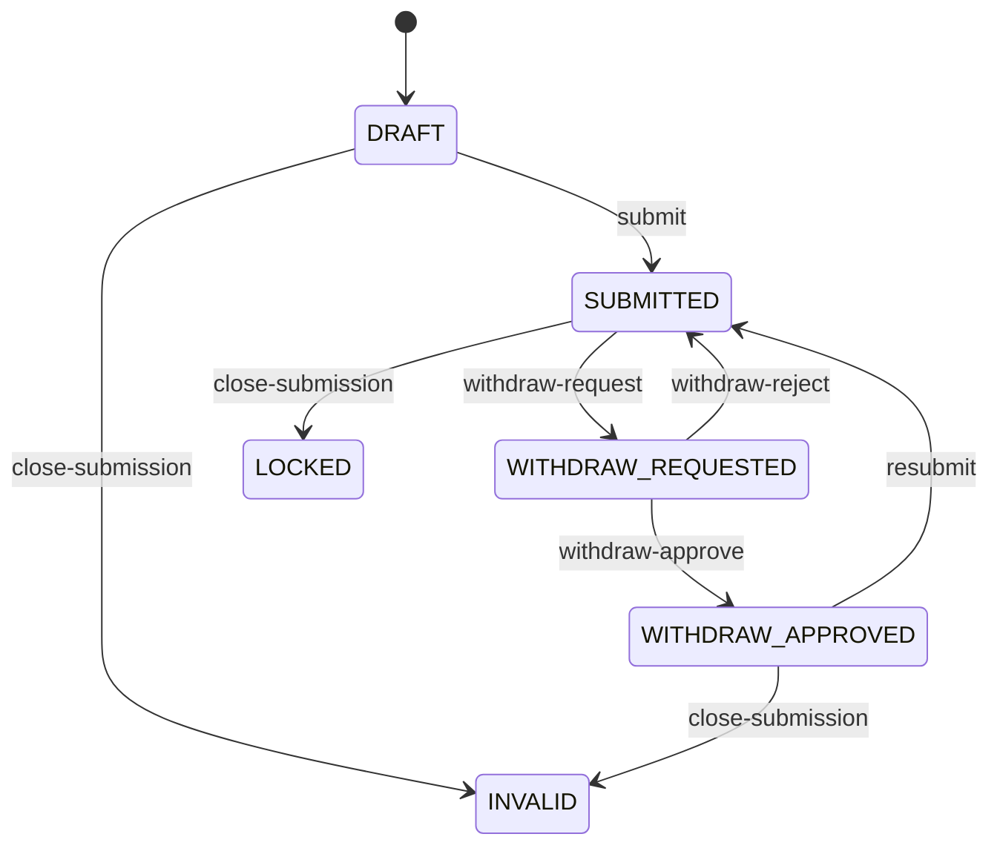
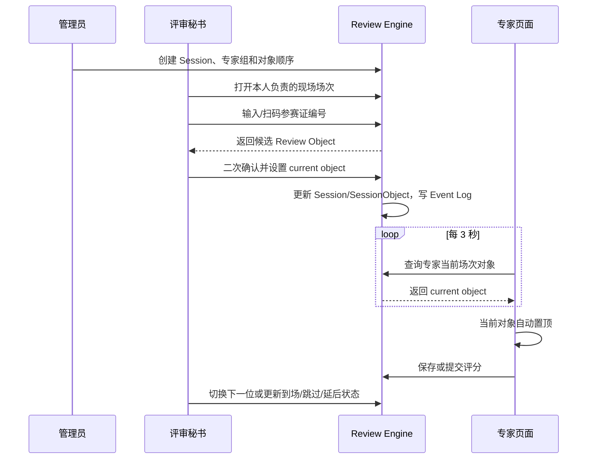
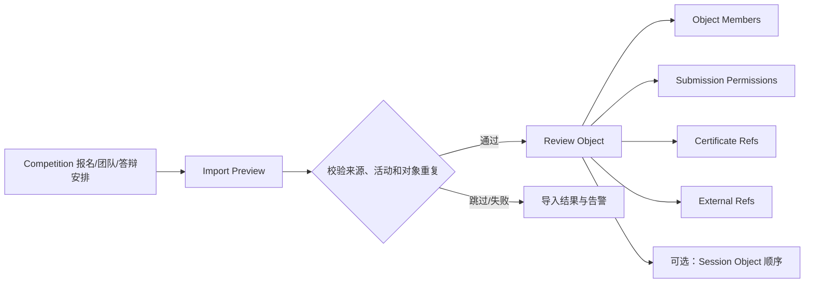
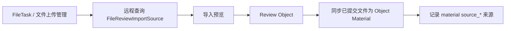

# Review Engine V1.0 业务流程

## 1. 标准评审流程

关键约束：

- 评分必须从本人 Assignment 进入；任务、活动、轮次、对象和评分规则必须一致。
- 提交时校验必填项、评分类型、选项值、上下限以及规则总分。
- 结果按 `SUBMITTED` 评分记录汇总；评分未全部完成时仍可生成当前平均分，但返回警告。
- 已发布结果必须先撤回才能重新生成。
- 管理员只能填写 `evaluation_conclusion`，不能改专家分或 `calculated_score`。

## 2. 填报与撤回流程

V1.0 的撤回驳回实现会把状态写回 `SUBMITTED`；枚举中的 `WITHDRAW_REJECTED` 没有在该流程中落库。

## 3. 现场评审流程

秘书必须是 `review_session.secretary_user_id`、专家组的 `secretary_user_id`，或活动内启用的 `SECRETARY/ADMIN/OPERATOR`。专家的轮询接口还会验证其在当前活动、轮次和专家组中的任务分配。

## 4. Competition 外部业务导入

当前实现识别 `TEAM`、`REGISTRATION`、`REGISTRATION_TEAM_CODE`、`DEFENSE_SCHEDULE` 等竞赛来源，支持预览、覆盖控制、权限用户策略、证件同步和初始状态控制。

## 5. 文件任务导入

V1.0 已有定向接口：

- `POST /competition/review/activity/{activityId}/file-task/{fileTaskId}/import-preview`
- `POST /competition/review/activity/{activityId}/file-task/{fileTaskId}/import`
- `POST /competition/review/object/sync-file-task-materials`

这不是通用适配框架：实现仍直接依赖文件任务远程服务和专用 DTO。将 FileTask、Competition 和其他业务统一为可插拔 Business Adapter Framework 属于规划能力。
