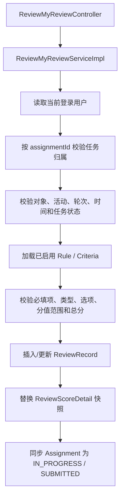
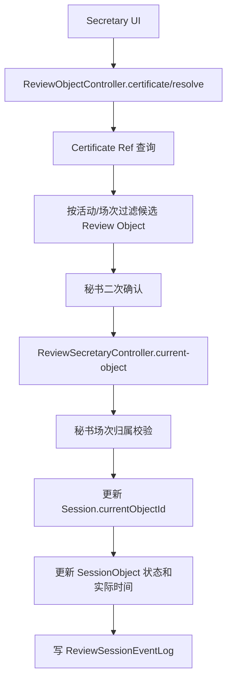
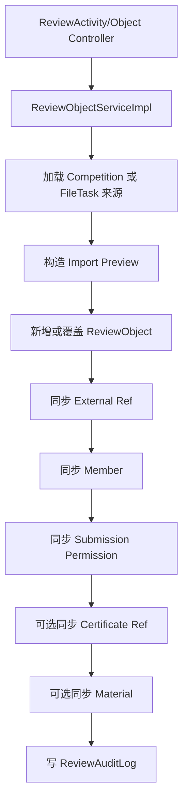
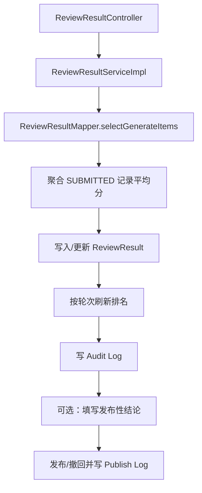

# Review Engine V1.0 代码结构说明

## 1. 后端结构

后端根目录：

`old-code/teaching-modules/teaching-competition/src/main/java/com/teaching/competition/review`

|目录|职责|示例|
|-|-|-|
|`controller`|HTTP 路由、权限注解、分页与统一响应|`ReviewMyReviewController`、`ReviewSecretaryController`|
|`service`|业务服务接口|`IReviewMyReviewService`、`IReviewResultService`|
|`service/impl`|业务校验、事务、状态流转、聚合与外部适配|`ReviewObjectServiceImpl`、`ReviewResultServiceImpl`|
|`mapper`|MyBatis Mapper 接口|`ReviewAssignmentMapper`|
|`domain`|表实体及公共基类|`ReviewObject`、`ReviewBaseEntity`|
|`dto`|写请求和复合查询入参|`ReviewAssignmentBatchDTO`、`ReviewMyReviewScoreDTO`|
|`vo`|聚合、只读和前端展示返回值|`ReviewMyReviewTaskVO`、`ReviewSecretarySessionVO`|
|`enums`|活动、对象、轮次、评分、现场和结果状态|`ReviewActivityStatus`、`ReviewRoundType`|
|`constant`|通用常量|`ReviewConstants`|
|`config`|材料预览配置绑定|`ReviewPreviewProperties`|
|`support`|通用 CRUD Mapper 契约|`ReviewCrudMapper`|

Mapper XML：

`old-code/teaching-modules/teaching-competition/src/main/resources/mapper/review`

数据库迁移：

`db/migration/20260703_review_module_phase1.sql` 至后续 `review_*` 增量脚本。

### 公共 CRUD 机制

简单实体 Service 通过 `IReviewCrudService<T>`、`AbstractReviewCrudService<T>` 和 `ReviewCrudMapper<T>` 复用增删改查。活动、轮次、规则、对象、分配、场次等关键实体对基础 CRUD 进行了覆盖，以限制状态字段和核心字段的任意修改。

## 2. 前端结构

管理前端根目录：`old-code-admin/src/views/review`

|页面|目录/文件|主要角色|
|-|-|-|
|评审活动|`activity/index.vue`|管理员|
|评审对象|`object/index.vue`、`object/detail.vue`|管理员|
|外部导入|`import/index.vue`|管理员|
|任务分配|`assignment/index.vue`|管理员|
|评分规则|`rule/index.vue`|管理员|
|现场场次/专家组|`session/index.vue`|管理员|
|结果汇总与发布|`result/index.vue`|管理员|
|我的填报|`my-submission/index.vue`、`detail.vue`|填报人|
|我的评审|`my-review/index.vue`、`components/ReviewMaterialPreview.vue`|专家|
|秘书控制台|`secretary/session.vue`|评审秘书|

API 封装位于 `old-code-admin/src/api/review`，按 `activity.js`、`object.js`、`myReview.js`、`secretary.js` 等领域拆分。路由主要由 `sys_menu.component = review/**` 动态生成。

## 3. 关键调用链

### 3.1 专家评分

专家任务列表先由 `ReviewAssignmentMapper.selectMyReviewTaskList` 关联活动、轮次、对象和记录，再由 Service 根据 `sessionId` 标记/排序现场当前对象。活动轮次卡片仅从当前专家已有 Assignment 聚合。

### 3.2 秘书扫码与切换

### 3.3 外部业务导入

### 3.4 结果生成与发布

## 4. 外部依赖

- 统一登录用户与权限：`teaching-common-security`；
- Web 统一响应、分页和基础实体：`teaching-common-core`；
- 操作日志注解：`teaching-common-log`；
- Competition 报名、团队、证件和赛程 Mapper/领域对象；
- FileTask 远程服务 `FileUploadManagerService`；
- 本地文件存储路径与 LibreOffice 转 PDF（材料预览）。

这些依赖是未来独立部署时需要抽象的边界。
