# Review Engine V1.0 ER 图

下图表达代码与迁移脚本中的逻辑关系。V1.0 迁移脚本未声明数据库外键，连线代表由 Service/Mapper 维护的业务关联。

```mermaid
erDiagram
    REVIEW_ACTIVITY ||--o{ REVIEW_ROUND : contains
    REVIEW_ACTIVITY ||--o{ REVIEW_OBJECT : owns
    REVIEW_ACTIVITY ||--o{ REVIEW_RULE : configures
    REVIEW_ACTIVITY ||--o{ REVIEW_ACTIVITY_USER_ROLE : authorizes
    REVIEW_ACTIVITY ||--o{ REVIEW_PANEL : organizes
    REVIEW_ACTIVITY ||--o{ REVIEW_SESSION : schedules

    REVIEW_ROUND o|--o{ REVIEW_RULE : scopes
    REVIEW_ROUND o|--o{ REVIEW_ASSIGNMENT : assigns
    REVIEW_ROUND o|--o{ REVIEW_SESSION : runs
    REVIEW_RULE ||--o{ REVIEW_CRITERIA : contains

    REVIEW_OBJECT ||--o{ REVIEW_OBJECT_MEMBER : has
    REVIEW_OBJECT ||--o{ REVIEW_OBJECT_MATERIAL : provides
    REVIEW_OBJECT ||--o{ REVIEW_SUBMISSION_PERMISSION : grants
    REVIEW_OBJECT ||--o{ REVIEW_OBJECT_EXTERNAL_REF : links
    REVIEW_OBJECT ||--o{ REVIEW_OBJECT_CERTIFICATE_REF : identifies
    REVIEW_OBJECT ||--o{ REVIEW_ASSIGNMENT : reviewed_by
    REVIEW_OBJECT ||--o{ REVIEW_SESSION_OBJECT : queued_as
    REVIEW_OBJECT ||--o{ REVIEW_RESULT : produces

    REVIEWER_PROFILE o|--o{ REVIEW_ASSIGNMENT : receives
    REVIEW_PANEL ||--o{ REVIEW_PANEL_MEMBER : includes
    REVIEW_PANEL o|--o{ REVIEW_ASSIGNMENT : scopes
    REVIEW_PANEL o|--o{ REVIEW_SESSION : serves

    REVIEW_ASSIGNMENT ||--o| REVIEW_RECORD : creates
    REVIEW_RECORD ||--o{ REVIEW_SCORE_DETAIL : details
    REVIEW_SESSION ||--o{ REVIEW_SESSION_OBJECT : orders
    REVIEW_SESSION ||--o{ REVIEW_SESSION_EVENT_LOG : logs

    REVIEW_ACTIVITY {
        bigint id PK
        varchar activity_code UK
        varchar activity_name
        varchar object_type
        varchar status
    }
    REVIEW_ROUND {
        bigint id PK
        bigint activity_id
        bigint rule_id
        varchar round_type
        varchar status
    }
    REVIEW_RULE {
        bigint id PK
        bigint activity_id
        bigint round_id
        varchar score_mode
        decimal total_score
    }
    REVIEW_CRITERIA {
        bigint id PK
        bigint rule_id
        bigint parent_id
        varchar score_type
        decimal weight
    }
    REVIEW_OBJECT {
        bigint id PK
        bigint activity_id
        varchar object_code UK
        varchar object_type
        varchar submit_status
    }
    REVIEW_OBJECT_MEMBER {
        bigint id PK
        bigint object_id
        bigint user_id
        varchar member_role
    }
    REVIEW_OBJECT_MATERIAL {
        bigint id PK
        bigint object_id
        varchar file_url
        varchar source_biz_id
    }
    REVIEW_SUBMISSION_PERMISSION {
        bigint id PK
        bigint object_id
        bigint user_id
        varchar permission_type
    }
    REVIEW_OBJECT_EXTERNAL_REF {
        bigint id PK
        bigint object_id
        varchar source_module
        varchar source_biz_type
        varchar source_biz_id
    }
    REVIEW_OBJECT_CERTIFICATE_REF {
        bigint id PK
        bigint object_id
        varchar certificate_code
        varchar valid_status
    }
    REVIEWER_PROFILE {
        bigint id PK
        bigint user_id
        varchar reviewer_name
        varchar status
    }
    REVIEW_ACTIVITY_USER_ROLE {
        bigint id PK
        bigint activity_id
        bigint user_id
        varchar role_type
    }
    REVIEW_PANEL {
        bigint id PK
        bigint activity_id
        bigint round_id
        bigint secretary_user_id
    }
    REVIEW_PANEL_MEMBER {
        bigint id PK
        bigint panel_id
        bigint user_id
        bigint reviewer_id
    }
    REVIEW_ASSIGNMENT {
        bigint id PK
        bigint round_id
        bigint object_id
        bigint reviewer_user_id
        varchar status
    }
    REVIEW_RECORD {
        bigint id PK
        bigint assignment_id
        bigint reviewer_user_id
        varchar record_status
        decimal total_score
    }
    REVIEW_SCORE_DETAIL {
        bigint id PK
        bigint record_id
        bigint criteria_id
        decimal score_value
        decimal weight
    }
    REVIEW_SESSION {
        bigint id PK
        bigint round_id
        bigint panel_id
        bigint current_object_id
        varchar status
    }
    REVIEW_SESSION_OBJECT {
        bigint id PK
        bigint session_id
        bigint object_id
        int sequence_no
        varchar review_status
    }
    REVIEW_SESSION_EVENT_LOG {
        bigint id PK
        bigint session_id
        bigint object_id
        varchar event_type
        datetime event_time
    }
    REVIEW_RESULT {
        bigint id PK
        bigint round_id
        bigint object_id
        decimal calculated_score
        varchar result_status
    }
```

为保持主图可读，`review_object_submit_log`、`review_result_publish_log` 和 `review_audit_log` 未在主图展开；它们分别按 `object_id`、`activity_id/round_id/object_id` 和 `biz_type/biz_id` 记录状态与审计事件。
