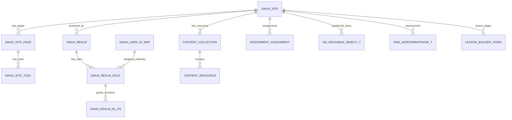

# Sakai 数据模型与 ER 反向文档

## 1. 数据模型概览

Sakai 数据结构来源较分散：Kernel SQL、工具 SQL、Hibernate HBM 映射和部分 JPA 注解共同构成。扫描识别 SQL/HBM 表候选 296 个。

## 2. 数据域分布

| 数据域 | 表数量 |
|---|---|
| 其他工具表 | 139 |
| 测验/题库 Samigo | 53 |
| 沟通协作 | 46 |
| 站点、用户与权限 | 25 |
| 日志统计 | 14 |
| 课程内容 LessonBuilder | 12 |
| 内容与文件 | 7 |

## 3. 核心 ER 图

## 4. 核心表组

| 表组 | 代表表 | 含义 |
|---|---|---|
| 站点 | `SAKAI_SITE`、`SAKAI_SITE_PAGE`、`SAKAI_SITE_TOOL` | Site、页面、工具挂载 |
| 权限 | `SAKAI_REALM`、`SAKAI_REALM_ROLE`、`SAKAI_REALM_RL_FN` | Realm、角色、权限函数 |
| 用户 | `SAKAI_USER_ID_MAP` 等 | 用户标识映射和用户数据 |
| 内容 | `CONTENT_COLLECTION`、`CONTENT_RESOURCE` | Resources/Drop Box 文件与集合 |
| 作业 | assignment 相关表/映射 | Assignment 工具数据 |
| 成绩 | GradebookNG 相关表 | 成绩册、成绩项、评分 |
| 测验 | `SAM_*` | Samigo 测验和题库 |
| 课程内容 | `lesson_builder_*` | LessonBuilder 页面和项目 |

完整清单见 `SAKAI_TABLE_INVENTORY.csv`。
