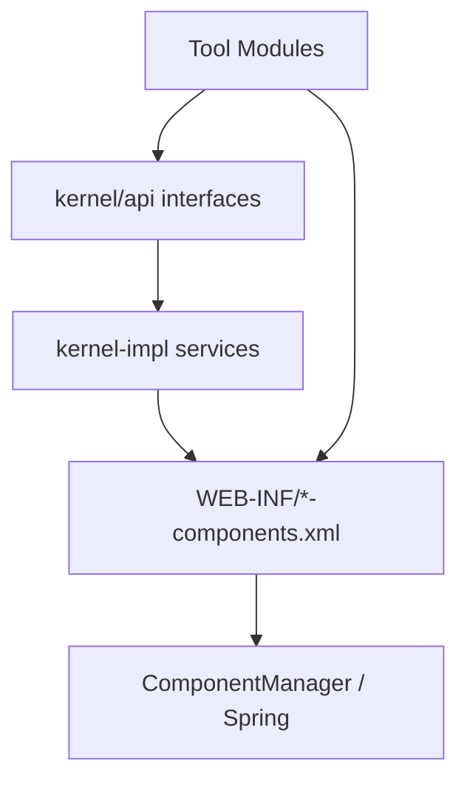

# Sakai Kernel、服务与组件模型

## 1. Kernel 职责

`kernel/README.md` 明确说明 Kernel 包含 Sakai 全局基础服务，API/SPI 在 `kernel/api`，实现和 Spring wiring 在 `kernel/kernel-impl`。

核心服务包括：Alias、Authz、Cluster、Component、Content、DB、Email、Entity、Event、Memory、MessageBundle、Site、Tool、User 等。

## 2. 核心服务证据

| 服务 | 位置 | 含义 |
|---|---|---|
| `SecurityService` | `kernel/api/src/main/java/org/sakaiproject/authz/api/SecurityService.java` | 权限判断 |
| `AuthzGroupService` | `kernel/api/src/main/java/org/sakaiproject/authz/api/AuthzGroupService.java` | Realm/AuthzGroup 管理 |
| `SiteService` | `kernel/api/src/main/java/org/sakaiproject/site/api/SiteService.java` | 站点管理 |
| `ContentHostingService` | `kernel/api/src/main/java/org/sakaiproject/content/api/ContentHostingService.java` | 内容资源服务 |
| `ToolManager` | `kernel/api/src/main/java/org/sakaiproject/tool/api/ToolManager.java` | 工具与 Placement |
| `SessionManager` | `kernel/api/src/main/java/org/sakaiproject/tool/api/SessionManager.java` | 会话管理 |

## 3. components.xml wiring

Sakai 传统服务实现通过 `WEB-INF/components.xml` 或按服务拆分的 `*-components.xml` 声明，Spring 负责组件装配。这和 OpenOLAT 的 Spring 服务层相似，但 Sakai 的组件更分散在多个 Maven 模块中。

