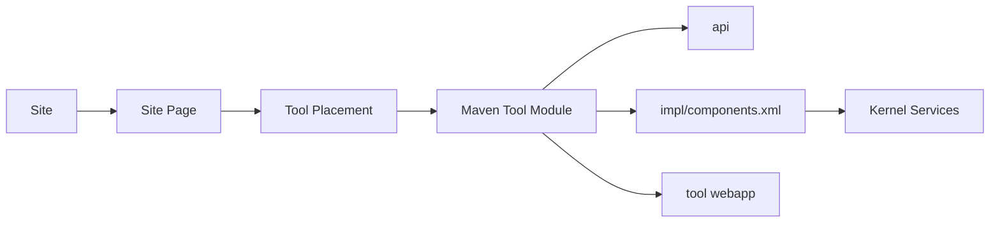

# Sakai 多模块与工具架构

## 1. Maven 多模块体系

Sakai 顶层 POM 通过 profile 声明大量模块。每个工具通常包含 api、impl、tool、hbm、bundle 等子模块。例如：

```text
assignment/
  api/
  impl/
  tool/

gradebookng/
  api/
  impl/
  tool/

lessonbuilder/
  api/
  hbm/
  components/
  tool/
```

## 2. 主要模块

| 模块 | 业务域 | Java文件 | Webapp | SQL文件 |
|---|---|---|---|---|
| kernel | 平台框架与门户 | 871 | False | 48 |
| samigo | 教学工具与协作 | 704 | False | 76 |
| rwiki | 教学工具与协作 | 473 | False | 12 |
| kernel/api | 其他模块 | 442 | False | 0 |
| scormplayer | 教学工具与协作 | 355 | False | 7 |
| lti | 教学工具与协作 | 279 | False | 0 |
| entitybroker | 平台框架与门户 | 267 | False | 0 |
| sitestats | 其他模块 | 262 | False | 8 |
| gradebookng | 教学工具与协作 | 247 | False | 0 |
| samigo/samigo-services | 其他模块 | 205 | False | 0 |
| msgcntr | 教学工具与协作 | 199 | False | 58 |
| lti/tsugi-util | 其他模块 | 184 | False | 0 |
| lessonbuilder | 教学工具与协作 | 171 | False | 12 |
| scormplayer/scorm-api | 其他模块 | 151 | False | 0 |
| jsf | 平台框架与门户 | 144 | False | 0 |
| portal | 平台框架与门户 | 133 | False | 0 |
| signup | 教学工具与协作 | 127 | False | 0 |
| common | 平台框架与门户 | 125 | False | 8 |
| entitybroker/api | 其他模块 | 122 | False | 0 |
| jobscheduler | 平台框架与门户 | 114 | False | 30 |
| site-manage | 用户、站点与权限 | 103 | False | 0 |
| edu-services | 其他模块 | 100 | False | 21 |
| microsoft-integration | 内容、文件与集成 | 98 | False | 0 |
| assignment | 教学工具与协作 | 86 | False | 0 |
| search | 内容、文件与集成 | 82 | False | 6 |
| delegatedaccess | 用户、站点与权限 | 81 | False | 0 |
| jobscheduler/scheduler-component-shared | 其他模块 | 80 | False | 30 |
| jsf2 | 平台框架与门户 | 79 | False | 0 |
| sitestats/sitestats-api | 其他模块 | 78 | False | 0 |
| calendar | 教学工具与协作 | 74 | False | 6 |

## 3. 工具接入模型



## 4. 与 Moodle/ILIAS 的差异

- Moodle 是插件目录体系，插件按类型放置。
- ILIAS 是组件目录体系，模块/服务通过 XML 声明。
- Sakai 是 Maven 多模块工具体系，工具通过 Kernel 服务、Portal placement 和 components.xml 接入。

## 5. 对本项目的启发

赛事系统可以借鉴“站点挂工具”思想：赛事作为容器，报名、评审、证件、资源预约、现场扫码作为可挂接工具/模块。但不建议直接复制 Maven 多模块粒度，当前系统更适合先做模块边界和服务接口清单。
