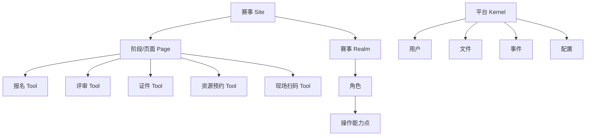

# Sakai 对当前赛事系统的可借鉴点

## 1. 最值得借鉴

1. **Site/Page/Tool 模型**：赛事可类比 Site，业务功能可类比 Tool。
2. **Kernel 服务层**：用户、权限、文件、事件、配置、站点等基础能力应共享，不应每个业务模块各写一套。
3. **Realm/Role/Function 权限**：比单字段角色更适合赛事、赛场、评审任务、资源预约等作用域。
4. **工具独立模块**：Assignment/Samigo/Gradebook/LessonBuilder 的拆分方式可启发报名、评审、证件、资源预约拆分。

## 2. 映射建议

## 3. 需要避坑

- Maven 多模块粒度很细，当前系统不应为了“像 Sakai”而过早拆成大量子工程。
- Sakai 历史包袱较多，SQL/HBM/JPA 混合，当前系统应尽量统一数据访问和迁移规范。
- 工具化必须有统一 Kernel 服务，否则会变成多个小单体互相调用。
- Site/Page/Tool 很适合容器化业务，但需要先定义清楚赛事、阶段、模块、权限之间的边界。

## 4. 建议落地

短期：用“赛事 = Site、业务模块 = Tool”的方式重画系统边界。

中期：建立统一用户、权限、文件、事件、配置、状态服务，相当于轻量 Kernel。

长期：把报名、证件、评审、资源预约、现场核验逐步改造成可挂接工具模块。
