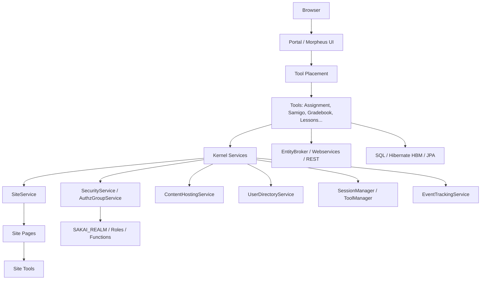

# Sakai 反向设计总体概览

## 1. 总体判断

Sakai 是 Java/Maven 多模块 LMS。它和 OpenOLAT 同属 Java 体系，但组织方式不同：OpenOLAT 是单 WAR 内强服务端 UI 框架；Sakai 是大量 Maven 模块组成的工具平台，核心由 Kernel 提供基础服务，Portal 负责外层 UI，教学工具以独立模块接入站点。

## 2. 扫描规模

| 指标 | 数量 |
|---|---:|
| POM 文件 | 464 |
| Java 文件 | 6530 |
| 模块声明 | 192 |
| 实体 | 168 |
| 服务类 | 502 |
| Controller | 85 |
| REST/Spring Web/JAX-RS 类 | 74 |
| SQL/HBM 表候选 | 296 |

## 3. 模块域分布

| 模块域 | 模块数量 |
|---|---|
| 其他模块 | 124 |
| 教学工具与协作 | 27 |
| 平台框架与门户 | 20 |
| 用户、站点与权限 | 14 |
| 内容、文件与集成 | 7 |

## 4. 系统结构图

## 5. 核心结论

1. Sakai 的基本业务容器是 Site，站点下有 Page，Page 上挂 Tool。
2. Kernel 提供跨工具共享服务，工具通过服务接口而不是直接拥有所有基础能力。
3. 权限通过 Realm/AuthzGroup/Role/Function 表达，和 Site/Tool placement 结合。
4. 教学能力高度工具化：Assignment、Samigo、GradebookNG、LessonBuilder、Rubrics、Content、LTI 等都是独立模块族。
5. 数据模型混合使用 SQL 初始化、Hibernate HBM、JPA 注解，历史演进痕迹明显。
