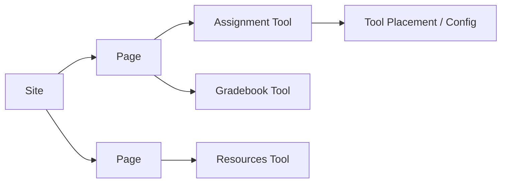
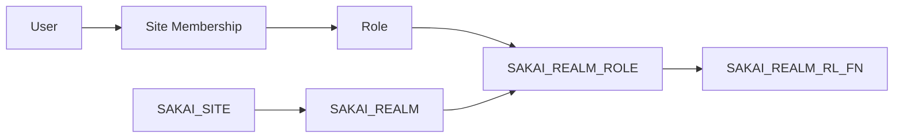

# Sakai 站点、工具与权限模型

## 1. Site 是业务容器

Sakai 的核心容器是 Site。一个 Site 下有多个 Page，一个 Page 上挂多个 Tool。Portal 负责把这些工具组织成用户可访问的页面。

## 2. Realm 权限

Sakai 权限模型通过 Realm/AuthzGroup 组织。角色拥有 function 权限，用户通过站点成员关系或 realm 角色获得能力。

## 3. 对赛事系统的启发

赛事可以类比 Sakai Site：

- Competition = Site
- 赛事页面/阶段 = Page
- 报名/评审/证件/资源/现场扫码 = Tool
- 权限函数 = 操作能力点
- Realm = 赛事或赛场作用域权限集合

这种模型对当前系统很有借鉴意义，尤其适合把报名、资源、评审、现场功能从一个大业务里拆成可治理工具。
