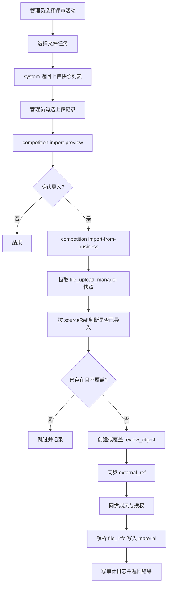

# 评审模块导入文件任务管理上传文件方案报告

生成日期：2026-07-08  
适用范围：评审模块、文件任务管理模块、文件上传管理、评审材料管理

## 1. 背景与目标

现有评审模块已经形成了较完整的活动、对象、材料、成员、授权、分配、评分、结果发布链路。现有系统中另有“文件任务管理”模块，主要承担运维侧与用户之间的交互式文件收集能力。

本次目标是在新评审模块中增加一项能力：支持将文件任务管理中交互式任务已上传的文件一键导入评审模块，使这些上传文件作为后续评审材料使用，同时尽量同步已有结构化信息，减少管理员重复录入。

本报告给出推荐的数据对应关系、系统边界、接口方案、导入流程、幂等策略、风险点与实施步骤。

## 2. 当前系统现状

### 2.1 文件任务管理模块

相关入口：

- `old-code/teaching-modules/teaching-system/src/main/java/com/teaching/system/controller/FileDistributeTaskController.java`
- `old-code/teaching-modules/teaching-system/src/main/java/com/teaching/system/controller/FileUploadManagerController.java`
- `old-code/teaching-modules/teaching-system/src/main/java/com/teaching/system/controller/FileUploadRecordController.java`

核心表与实体：

- `file_task` / `FileTask`：文件任务主表，包含任务名称、用户组、任务状态等。
- `file_task_config` / `FileTaskConfig`：任务配置表，包含任务类型、允许上传时间、文件类型、模板文件等。
- `file_upload_manager` / `FileUploadManager`：文件上传管理表，是每个用户或队伍在某个文件任务下的当前上传快照。
- `file_upload_record` / `FileUploadRecord`：文件上传日志表，记录上传、重新上传、删除等历史操作。

关键判断：

- 导入评审模块的主数据源应选择 `file_upload_manager`。
- `file_upload_record` 更适合审计追溯，不适合作为导入主来源。
- `file_task` 和 `file_task_config` 可作为筛选、校验和导入上下文。

### 2.2 新评审模块

相关入口：

- `old-code/teaching-modules/teaching-competition/src/main/java/com/teaching/competition/review/controller/ReviewActivityController.java`
- `old-code/teaching-modules/teaching-competition/src/main/java/com/teaching/competition/review/controller/ReviewObjectController.java`
- `old-code/teaching-modules/teaching-competition/src/main/java/com/teaching/competition/review/controller/ReviewSubmissionController.java`

核心表与实体：

- `review_activity` / `ReviewActivity`：评审活动。
- `review_object` / `ReviewObject`：评审对象。
- `review_object_material` / `ReviewObjectMaterial`：评审材料。
- `review_object_member` / `ReviewObjectMember`：评审对象成员。
- `review_submission_permission` / `ReviewSubmissionPermission`：填报授权。
- `review_object_external_ref` / `ReviewObjectExternalRef`：外部业务来源关联。

关键判断：

- 新评审模块已经有通用的业务导入框架：`ReviewObjectServiceImpl#importPreview` 和 `ReviewObjectServiceImpl#importFromBusiness`。
- `ReviewObject` 已有 `sourceModule`、`sourceBizType`、`sourceBizId`、`sourceTeamId`、`sourceRegistrationId`、`extraData` 等来源追踪字段。
- `ReviewObjectMaterial` 已有材料文件字段，可直接承接文件任务上传文件。

因此，本能力应复用现有“业务导入评审对象”框架，新增一种业务来源类型，而不是新建一套独立导入链路。

## 3. 总体设计建议

### 3.1 推荐方案

在评审模块中复用现有接口：

- `POST /review/object/import-preview`
- `POST /review/object/import-from-business`

新增来源类型：

```text
sourceModule = system
sourceBizType = FILE_UPLOAD_MANAGER
sourceBizIds = file_upload_manager.id 列表
```

导入逻辑：

1. 管理员在评审活动下选择一个文件任务。
2. 前端调用 system 侧查询接口，列出该文件任务下已上传的 `file_upload_manager` 记录。
3. 管理员勾选待导入记录。
4. 前端调用评审模块 `import-preview` 进行预览。
5. 管理员确认后调用 `import-from-business`。
6. competition 服务通过内部 API 拉取文件上传快照。
7. 创建或覆盖 `review_object`。
8. 同步 `review_object_external_ref`。
9. 同步 `review_object_member` 和 `review_submission_permission`。
10. 解析 `file_info`，写入 `review_object_material`。

### 3.2 系统边界

当前 `teaching-competition` 不应直接依赖 `teaching-system` 的 mapper 或 domain。推荐由 system 侧提供内部查询 API，由 competition 侧通过 Feign 或已有 API 模块调用。

理由：

- 避免跨模块直接访问表和实体造成强耦合。
- 保持文件任务管理的数据解释权在 system 服务内。
- 便于后续兼容历史数据、补充用户姓名、带队老师、指导老师、文件名解析等逻辑。

## 4. 数据对应关系

### 4.1 评审活动

文件任务不建议自动生成评审活动。推荐由管理员先创建评审活动，再把文件任务上传记录导入该活动下。

原因：

- 评审规则、轮次、专家组、分配方式、发布策略都属于评审活动自身配置。
- 文件任务只提供“被评审对象”和“材料”来源。
- 避免一个文件任务被多个评审活动复用时出现活动重复创建。

### 4.2 评审对象字段映射

| 文件任务管理字段 | 评审模块字段 | 说明 |
| --- | --- | --- |
| `file_upload_manager.id` | `review_object.source_biz_id` | 导入幂等主键 |
| 固定 `system` | `review_object.source_module` | 表示来源服务 |
| 固定 `FILE_UPLOAD_MANAGER` | `review_object.source_biz_type` | 表示来源业务类型 |
| `fileTaskId` | `extraData.fileTaskId` | 原文件任务 ID |
| `fileTaskName` | `extraData.fileTaskName` | 原文件任务名称 |
| `teamCode` | `source_team_id` | 队伍编码 |
| `teamCode` | `object_code` 的组成部分 | 建议格式 `FILE_UPLOAD_MANAGER-{id}` 或 `FT-{fileTaskId}-{teamCode}` |
| `teamName` | `object_name` | 优先作为评审对象名称 |
| `userName` | `object_name` 兜底 | 无队伍名称时使用 |
| `competitionTrackCode` | `subject_code_1` | 赛道编码 |
| `secondLevelCode` | `subject_code_2` | 组别或赛项编码 |
| `competitionName` | `extraData.competitionName` | 赛事名称 |
| `competitionStageId` | `extraData.competitionStageId` | 阶段 ID |
| `competitionStageName` | `extraData.competitionStageName` | 阶段名称 |
| `competitionTrackName` | `extraData.competitionTrackName` | 赛道名称 |
| `secondLevelName` | `extraData.secondLevelName` | 组别或赛项名称 |
| `guideTeacher` | `extraData.guideTeacher` 或成员表 | 指导老师 |
| `leaderTeacherId` | 成员表或授权参考 | 带队老师用户 ID |
| `orgId` | `review_submission_permission.org_id` | 授权组织 |
| `uploadTime` | `extraData.uploadTime` | 原上传时间 |
| `totalSize` | `extraData.totalSize` | 原上传总大小 |

### 4.3 评审材料字段映射

`file_upload_manager.file_info` 是 JSON 数组。现有代码已按如下字段解析：

```json
[
  {
    "fileName": "作品申报书.pdf",
    "downloadLink": "https://..."
  }
]
```

建议映射：

| `file_info` 字段 | `review_object_material` 字段 | 说明 |
| --- | --- | --- |
| `fileName` | `file_name` | 原文件名 |
| `fileName` | `material_name` | 材料名称，默认等于文件名 |
| `downloadLink` | `file_url` | 直接复用原文件地址 |
| 文件后缀 | `file_ext` | 例如 `pdf`、`docx` |
| 文件后缀 | `material_type` | 映射为 `PDF/DOC/PPT/VIDEO/IMAGE/ZIP/OTHER` |
| 单文件大小字段，如存在 | `file_size` | 若 JSON 中不存在则为空 |
| `userId` | `upload_by` | 原上传用户 |
| `uploadTime` | `upload_time` | 原上传时间 |
| 固定 `Y` | `visible_to_reviewer` | 默认专家可见 |
| 固定 `NORMAL` | `status` | 正常材料 |

建议不复制文件、不重新上传文件。只复用 `downloadLink`，避免文件迁移成本、存储重复和导入耗时。

### 4.4 成员与授权映射

可采用两层策略：

1. 若 `teamCode` 存在，优先复用现有竞赛报名数据同步成员、负责人、指导教师和证件。
2. 若无法找到报名数据，则使用文件任务上传记录兜底生成最小成员：
   - `userId/userName` 作为联系人或负责人。
   - `leaderTeacherId/leaderTeacherName` 作为联系人或指导教师。
   - `guideTeacher` 如无法拆分为用户 ID，可仅放入 `extraData`。

授权建议：

| 模式 | 说明 |
| --- | --- |
| `LEADER` | 默认模式，授权负责人或联系人编辑提交 |
| `CONTACT` | 只授权联系人 |
| `ALL_MEMBERS` | 授权全部可识别成员 |
| `SPECIFIED` | 管理员指定用户 |

文件任务导入场景推荐默认 `LEADER`，无法识别负责人时授权 `file_upload_manager.user_id`。

## 5. 导入状态策略

导入状态需要产品确认。建议支持配置，不写死。

### 5.1 草稿导入

导入后状态为：

```text
review_object.submit_status = DRAFT
```

优点：

- 符合现有填报流程。
- 用户或管理员可补充摘要、联系方式等结构化字段后再提交。
- 风险最低。

缺点：

- 不能立即进入普通线上评审流程。

### 5.2 导入即锁定

导入后状态为：

```text
review_object.submit_status = LOCKED
```

优点：

- 更符合“一键导入后供后续评审使用”的运维场景。
- 后续可直接分配专家并评分。

缺点：

- 会绕过现有普通填报校验。
- 需要在导入界面明确提示管理员确认。

### 5.3 推荐结论

推荐实现为可选参数：

```json
{
  "initialSubmitStatus": "DRAFT | LOCKED"
}
```

默认建议使用 `DRAFT`；若业务侧明确文件任务上传已经等同于正式提交，可在界面上提供“导入后直接锁定进入评审”的选项。

## 6. 接口设计

### 6.1 system 侧内部查询接口

建议新增内部 Controller，例如：

```text
GET /inner/file-upload-manager/review-import/list?fileTaskId={fileTaskId}
POST /inner/file-upload-manager/review-import/list-by-ids
```

返回 DTO 示例：

```json
{
  "id": 1001,
  "fileTaskId": 88,
  "fileTaskName": "作品材料上传",
  "userId": 123,
  "userName": "张三",
  "orgId": 10,
  "competitionSeriesId": "2026",
  "competitionName": "教学能力大赛",
  "competitionStageId": "stage-1",
  "competitionStageName": "初赛",
  "competitionTrackCode": "track-a",
  "competitionTrackName": "公共基础课程",
  "secondLevelCode": "group-1",
  "secondLevelName": "高职组",
  "teamCode": "T20260001",
  "teamName": "智能教学团队",
  "leaderTeacherId": "123,456",
  "leaderTeacherName": "张三,李四",
  "guideTeacher": "王五",
  "uploadTime": "2026-07-08 10:00:00",
  "totalSize": "25.4",
  "fileInfo": "[{\"fileName\":\"申报书.pdf\",\"downloadLink\":\"https://...\"}]",
  "submitStatus": true
}
```

注意：

- 只返回 `del_flag = '0'` 的上传快照。
- 可按 `submitStatus` 或文件非空过滤。
- 该接口只供内部服务调用，需要使用 `SecurityConstants.INNER` 或同等内部鉴权方式。

### 6.2 competition 侧导入接口

复用现有接口，扩展 DTO：

```json
{
  "activityId": 10,
  "sourceModule": "system",
  "sourceBizType": "FILE_UPLOAD_MANAGER",
  "sourceBizIds": ["1001", "1002"],
  "defaultObjectType": "PROJECT",
  "permissionUserMode": "LEADER",
  "overwriteExisting": false,
  "syncCertificate": true,
  "syncMaterial": true,
  "initialSubmitStatus": "DRAFT"
}
```

建议新增字段：

| 字段 | 类型 | 说明 |
| --- | --- | --- |
| `syncMaterial` | Boolean | 是否同步文件任务上传材料 |
| `initialSubmitStatus` | String | 导入后的对象状态，`DRAFT` 或 `LOCKED` |
| `materialOverwriteMode` | String | 材料覆盖策略，建议 `SKIP_EXISTING` 或 `REPLACE_BY_SOURCE` |

## 7. 处理流程



## 8. 幂等与覆盖策略

### 8.1 评审对象幂等

幂等键：

```text
activity_id + source_module + source_biz_type + source_biz_id
```

对应：

```text
activity_id + "system" + "FILE_UPLOAD_MANAGER" + file_upload_manager.id
```

现有 `ReviewObjectMapper.selectBySourceRef` 已支持该模式，可直接复用。

### 8.2 材料幂等

当前 `review_object_material` 没有来源字段，建议补充来源字段：

```sql
alter table review_object_material
  add column source_module varchar(64) null comment '来源模块',
  add column source_biz_type varchar(64) null comment '来源业务类型',
  add column source_biz_id varchar(64) null comment '来源业务ID',
  add column source_file_url varchar(1024) null comment '来源文件地址';
```

推荐唯一约束或逻辑唯一：

```text
object_id + source_module + source_biz_type + source_biz_id + source_file_url
```

如果短期不改表，则采用：

```text
object_id + file_url
```

作为材料去重依据。

### 8.3 覆盖导入

推荐策略：

- `overwriteExisting=false`：对象已存在则跳过。
- `overwriteExisting=true`：更新对象结构化字段，重建成员与授权。
- `materialOverwriteMode=SKIP_EXISTING`：已有同 URL 材料则跳过。
- `materialOverwriteMode=REPLACE_BY_SOURCE`：删除旧来源材料，再插入最新文件列表。

默认推荐：

```text
overwriteExisting = false
materialOverwriteMode = SKIP_EXISTING
```

## 9. 权限与状态控制

### 9.1 权限

建议复用现有权限：

```text
competition:review:object:import
```

如果希望更细，可以新增：

```text
competition:review:object:import:fileTask
```

### 9.2 活动状态限制

建议仅允许以下活动状态导入：

- `DRAFT`
- `SUBMITTING`
- `SUBMIT_CLOSED`

不建议在以下状态导入：

- `REVIEWING`
- `SUMMARYING`
- `PUBLISHED`
- `ARCHIVED`

原因：评审中或发布后追加对象会破坏专家分配、评分汇总和结果发布的一致性。

### 9.3 对象状态限制

覆盖导入只允许覆盖以下对象：

- `DRAFT`
- `WITHDRAW_APPROVED`
- `WITHDRAW_REJECTED`

不建议覆盖：

- `SUBMITTED`
- `LOCKED`
- `REVIEWING`
- `REVIEWED`
- `ARCHIVED`

## 10. 文件处理策略

### 10.1 不复制文件

推荐直接复用 `downloadLink`。

优点：

- 导入速度快。
- 不增加存储成本。
- 文件任务管理仍保持原始文件归属。
- 评审模块材料预览可直接基于 URL 使用。

### 10.2 文件类型推断

建议按扩展名映射：

| 后缀 | materialType |
| --- | --- |
| `.pdf` | `PDF` |
| `.doc`, `.docx` | `DOC` |
| `.ppt`, `.pptx` | `PPT` |
| `.mp4`, `.mov`, `.avi` | `VIDEO` |
| `.jpg`, `.jpeg`, `.png`, `.gif` | `IMAGE` |
| `.zip`, `.rar`, `.7z` | `ZIP` |
| 其他 | `OTHER` |

### 10.3 PDF 处理结果

system 侧存在 PDF 截页或处理后的 `ProcessedRelation`。如果后续评审要求使用处理后的 PDF，则可以增加一个导入选项：

```text
materialSource = ORIGINAL | PROCESSED
```

初期建议使用 `ORIGINAL`，即原始上传文件。

## 11. 审计与可追溯

建议导入时写入：

- `review_audit_log`
- `review_object_external_ref`
- `review_object.extra_data`

审计内容包含：

- 导入来源：文件任务管理。
- 文件任务 ID。
- 上传管理 ID。
- 上传人。
- 原上传时间。
- 导入材料数量。
- 跳过或失败原因。
- 覆盖导入时旧数据处理方式。

## 12. 前端交互建议

新增“从文件任务导入”入口，建议放在评审活动详情的“评审对象”页。

页面流程：

1. 选择文件任务。
2. 展示上传列表：
   - 任务名称
   - 上传人
   - 队伍编码
   - 队伍名称
   - 赛事
   - 赛道
   - 组别
   - 上传时间
   - 文件数量
   - 是否已导入
3. 支持筛选：
   - 上传人
   - 队伍名称
   - 赛道
   - 组别
   - 是否已导入
   - 是否有文件
4. 勾选记录。
5. 预览导入结果：
   - 可导入
   - 已导入将跳过
   - 文件缺失
   - 未识别负责人
   - 未识别证件
6. 确认导入。
7. 展示导入汇总。

## 13. 异常场景与处理

| 场景 | 处理建议 |
| --- | --- |
| `file_upload_manager` 不存在 | 标记失败 |
| `file_info` 为空 | 可导入对象，但提示无材料；也可按参数禁止导入 |
| `downloadLink` 为空 | 跳过该材料并记录警告 |
| 文件名为空 | 使用 `未命名材料-{序号}` |
| 队伍信息为空 | 使用上传人作为对象名称兜底 |
| 用户 ID 为空 | 不生成填报授权，提示管理员指定授权用户 |
| 已导入对象 | 默认跳过 |
| 覆盖导入对象已进入评审 | 禁止覆盖 |
| 文件 URL 已存在 | 跳过或按覆盖策略替换 |
| system 内部接口失败 | 当前记录失败，不影响其他记录 |

## 14. 实施步骤

### 阶段一：system 侧导入源 API

1. 在 `teaching-api-system` 增加 DTO：
   - `FileReviewImportSourceDTO`
   - `FileReviewImportMaterialDTO`
2. 在 system 服务增加内部查询接口：
   - 按 `fileTaskId` 查询上传快照。
   - 按 `fileUploadManagerIds` 查询上传快照。
3. 复用现有 `FileUploadManagerServiceImpl.selectFileUploadManagerList` 的文件名解析和教师名称补全逻辑。

### 阶段二：competition 侧扩展业务导入

1. 扩展 `ReviewObjectImportDTO`：
   - `syncMaterial`
   - `initialSubmitStatus`
   - `materialOverwriteMode`
2. 扩展 `ReviewObjectServiceImpl`：
   - 新增 `SOURCE_BIZ_TYPE_FILE_UPLOAD_MANAGER`
   - 新增 `loadFileUploadManagerSource`
   - 扩展 `BusinessImportSource`，增加材料列表。
   - 新增 `syncMaterials`
3. 引入 system 内部查询 Feign 客户端。
4. 写入材料、审计和外部关联。

### 阶段三：前端入口

1. 在评审对象管理页增加“从文件任务导入”按钮。
2. 增加选择文件任务弹窗。
3. 增加上传记录列表、预览和确认导入。
4. 展示导入汇总结果。

### 阶段四：测试与验收

1. 单条导入。
2. 批量导入。
3. 重复导入跳过。
4. 覆盖导入。
5. 文件为空。
6. 多文件材料导入。
7. 没有队伍信息的个人上传。
8. 活动已进入评审后禁止导入。
9. 导入后专家可查看材料。
10. 导入后分配、评分、汇总流程正常。

## 15. 测试用例建议

| 用例 | 预期 |
| --- | --- |
| 选择一个有 3 个文件的上传记录导入 | 创建 1 个对象，3 条材料 |
| 同一记录重复导入且不覆盖 | 返回跳过，不新增对象和材料 |
| 同一记录覆盖导入 | 更新对象字段，按材料策略处理材料 |
| `file_info` 中一个 URL 为空 | 该材料跳过，其他材料正常导入 |
| 上传记录无 `teamCode` | 对象仍创建，名称用 `teamName/userName/fileTaskName` 兜底 |
| 上传记录有 `teamCode` | 尝试同步竞赛报名成员和证件 |
| 评审活动 `REVIEWING` | 拒绝导入 |
| 导入后状态为 `LOCKED` | 可进入普通线上评审 |
| 导入后状态为 `DRAFT` | 可补充资料，未锁定前普通线上评审不可评分 |

## 16. 风险与注意事项

1. 文件 URL 生命周期  
   若 `downloadLink` 是临时地址，导入后材料可能失效。需要确认文件服务返回的是长期可访问 URL。

2. 数据一致性  
   文件任务上传记录后续可能被用户重新上传。需要明确是否允许重新同步覆盖。

3. 评审状态  
   如果业务希望“一键导入后立即评审”，需要支持 `LOCKED` 导入，并在界面明确提示。

4. 材料来源字段  
   `review_object_material` 当前缺少来源字段。为了材料级幂等和覆盖，建议补字段。

5. 结构化字段不完整  
   文件任务上传记录不一定包含摘要、手机号、邮箱等字段。导入后若走普通填报流程，可能仍需用户或管理员补齐。

6. 模块耦合  
   competition 不应直接引用 system 的 mapper/entity，应通过内部 API 获取 DTO。

## 17. 推荐结论

推荐采用以下落地方案：

1. 以 `file_upload_manager` 作为导入主来源。
2. 复用评审模块现有业务导入框架。
3. 新增来源类型 `FILE_UPLOAD_MANAGER`。
4. system 侧提供内部上传快照查询接口。
5. competition 侧创建或覆盖 `review_object`，并同步 `review_object_material`。
6. 文件不复制，只复用原 `downloadLink`。
7. 默认导入为 `DRAFT`，提供“导入后直接锁定”的可选项。
8. 给材料表补来源字段，保证材料同步可追溯、可幂等、可覆盖。

该方案改动面较小，能最大化复用新评审模块现有能力，同时保留文件任务管理模块的数据边界和运维属性。后续如果还要导入其他业务来源，也可以继续沿用同一套 `sourceModule + sourceBizType + sourceBizId` 模型扩展。

## 18. 当前实现结果

截至 2026-07-08，已按本方案完成一版后端与管理端入口实现。

### 18.1 后端实现

system 侧已新增文件任务导入源内部接口：

- `GET /system/fileUploadManager/review-import/by-task/{fileTaskId}`
- `POST /system/fileUploadManager/review-import/by-ids`

competition 侧已扩展现有评审对象导入框架：

- 支持 `sourceBizType = FILE_UPLOAD_MANAGER`。
- 支持通过 `fileTaskId` 一次性导入文件任务下已提交上传记录。
- 支持通过 `sourceBizIds = file_upload_manager.id` 精确导入上传记录。
- 支持 `syncMaterial`、`initialSubmitStatus`、`materialOverwriteMode`。
- 上传文件写入 `review_object_material`，并记录 `source_module/source_biz_type/source_biz_id/source_material_key`。
- 正式导入会拦截已进入评审中、汇总中、已发布或已归档的评审活动。

新增评审活动便捷入口：

- `POST /competition/review/activity/{activityId}/file-task/{fileTaskId}/import-preview`
- `POST /competition/review/activity/{activityId}/file-task/{fileTaskId}/import`

通用导入入口也可直接使用：

```json
{
  "activityId": 1,
  "sourceModule": "system",
  "sourceBizType": "FILE_UPLOAD_MANAGER",
  "fileTaskId": 88,
  "submittedOnly": true,
  "syncMaterial": true,
  "initialSubmitStatus": "DRAFT"
}
```

### 18.2 管理端实现

管理端已补齐三个入口：

- `评审管理 / 导入评审对象`：新增“文件任务上传”匹配方式。
- `文件任务管理 / 文件任务列表`：交互任务行增加“导入评审”按钮，自动带入 `fileTaskId`。
- `文件任务管理 / 上传管理`：增加“导入选中到评审”按钮，自动带入选中的上传记录 ID。

评审对象列表也已支持按 `FILE_UPLOAD_MANAGER` 来源类型筛选。

### 18.3 数据库迁移

新增迁移脚本：

- `db/migration/20260708_review_file_task_import.sql`

该脚本为 `review_object_material` 增加材料级来源追踪字段：

- `source_module`
- `source_biz_type`
- `source_biz_id`
- `source_material_key`

### 18.4 验证记录

已通过以下验证：

- `mvn -q -pl teaching-modules/teaching-system -am -DskipTests compile`
- `mvn -q -pl teaching-modules/teaching-competition -am -DskipTests compile`
- `npm run build:prod`
- `git diff --check`
